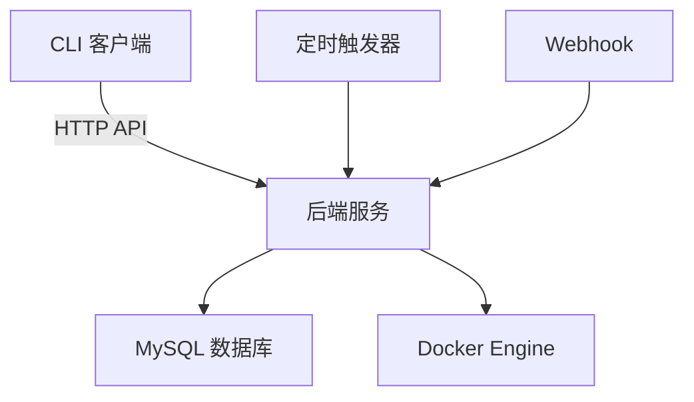

# Pipeline 管理系统设计方案

---

## **1. 系统架构概览**
```
+-------------------+       +-------------------+       +-------------------+
|   CLI (前端)      |<----->|   API Server      |<----->|  Task Executor    |
| (用户交互层)      |       | (Golang 后端)     |       | (Docker 容器)     |
+-------------------+       +-------------------+       +-------------------+
                                      |
                                      v
                              +-------------------+
                              |   MySQL Database  |
                              +-------------------+
```

---

## **2. 核心功能模块**

### **2.1 Pipeline 配置（YAML 格式）**
```yaml
pipeline:
  name: "example_pipeline"
  description: "Example pipeline for testing"
  triggers:
    - type: crontab
      schedule: "0 * * * *"
    - type: webhook
      path: "/trigger/webhook"
  tasks:
    - name: task1
      command: "mkdir test"
      depends_on: []
    - name: task2
      command: "mkdir test2"
      depends_on: ["task1"]
    - name: task3
      command: "echo 'Hello World'"
      depends_on: ["task2"]
```

---

### **2.2 Docker 架构**
```yaml
# docker-compose.yml
version: '3.8'

services:
  api-server:
    build: ./api-server
    ports:
      - "8888:8888"
    environment:
      - DB_HOST=db
      - DB_USER=root
      - DB_PASSWORD=your_password
    depends_on:
      - db

  db:
    image: mysql:8.0
    environment:
      MYSQL_ROOT_PASSWORD: your_password
      MYSQL_DATABASE: pipeline_db
    volumes:
      - db_data:/var/lib/mysql

  task-executor:
    build: ./task-executor
    networks:
      - backend
    depends_on:
      - api-server

volumes:
  db_data:

networks:
  backend:
```

---

## **3. 后端设计（Golang 实现）**

### **3.1 数据库设计**
```sql
-- 用户表
CREATE TABLE users (
  id INT PRIMARY KEY AUTO_INCREMENT,
  username VARCHAR(50) UNIQUE NOT NULL,
  password_hash VARCHAR(255) NOT NULL,
  role ENUM('viewer', 'admin') NOT NULL
);

-- Pipeline 表
CREATE TABLE pipelines (
  id INT PRIMARY KEY AUTO_INCREMENT,
  name VARCHAR(100) NOT NULL,
  config TEXT NOT NULL,
  created_at DATETIME DEFAULT CURRENT_TIMESTAMP
);

-- 执行记录表
CREATE TABLE executions (
  id BIGINT PRIMARY KEY AUTO_INCREMENT,
  pipeline_id INT NOT NULL,
  trigger_type ENUM('manual', 'crontab', 'webhook') NOT NULL,
  triggered_by VARCHAR(50),
  start_time DATETIME,
  end_time DATETIME,
  status ENUM('running', 'success', 'failed'),
  FOREIGN KEY (pipeline_id) REFERENCES pipelines(id)
);

-- 任务记录表
CREATE TABLE tasks (
  id BIGINT PRIMARY KEY AUTO_INCREMENT,
  execution_id BIGINT NOT NULL,
  task_name VARCHAR(100) NOT NULL,
  command TEXT NOT NULL,
  start_time DATETIME,
  end_time DATETIME,
  status ENUM('running', 'success', 'failed'),
  stdout TEXT,
  stderr TEXT,
  FOREIGN KEY (execution_id) REFERENCES executions(id)
);
```

---

### **3.2 API 接口设计**
#### **用户认证**
- `POST /login`  
  ```json
  {
    "username": "admin",
    "password": "123456"
  }
  ```
  返回 JWT Token

#### **Pipeline 管理**
- `GET /pipelines`  
  获取所有 Pipeline（admin 权限）
- `POST /pipelines`  
  创建/更新 Pipeline（admin 权限）
- `DELETE /pipelines/{id}`  
  删除 Pipeline（admin 权限）

#### **任务触发**
- `POST /pipelines/{id}/trigger`  
  手动触发（admin 权限）
- `POST /trigger/webhook`  
  Webhook 触发（需验证签名）

#### **状态查询**
- `GET /executions`  
  查询所有执行记录
- `GET /executions/{id}`  
  查询特定执行的详细状态

---

### **3.3 依赖关系处理**
使用拓扑排序算法处理任务依赖：
```go
func ExecutePipeline(pipeline *Pipeline) error {
  graph := buildDependencyGraph(pipeline.Tasks)
  sortedTasks := topologicalSort(graph)

  for _, task := range sortedTasks {
    if err := executeTask(task); err != nil {
      return err
    }
  }
  return nil
}
```

---

## **4. 任务执行器（Docker 容器）**
### **4.1 执行逻辑**
```go
// task_executor.go
func ExecuteTask(command string) (stdout, stderr []byte, err error) {
  ctx := context.Background()
  cli, err := client.NewClientWithOpts(client.FromEnv)
  if err != nil {
    return nil, nil, err
  }

  // 创建临时容器
  containerConfig := &container.Config{
    Image:      "alpine:latest",
    Cmd:        []string{"sh", "-c", command},
    AttachStdout: true,
    AttachStderr: true,
  }

  hostConfig := &container.HostConfig{
    AutoRemove: true,
  }

  container, err := cli.ContainerCreate(ctx, containerConfig, hostConfig, nil, nil, "")
  if err != nil {
    return nil, nil, err
  }

  if err := cli.ContainerStart(ctx, container.ID, types.ContainerStartOptions{}); err != nil {
    return nil, nil, err
  }

  // 等待执行完成
  statusCh, errCh := cli.ContainerWait(ctx, container.ID, container.WaitConditionNotRunning)
  select {
  case err := <-errCh:
    if err != nil {
      return nil, nil, err
    }
  case status := <-statusCh:
    if status.StatusCode != 0 {
      return nil, nil, fmt.Errorf("task exited with code %d", status.StatusCode)
    }
  }

  // 获取输出
  out, err := cli.ContainerLogs(ctx, container.ID, types.ContainerLogsOptions{ShowStdout: true, ShowStderr: true})
  if err != nil {
    return nil, nil, err
  }

  stdout, _ = io.ReadAll(out.Stdout)
  stderr, _ = io.ReadAll(out.Stderr)
  return stdout, stderr, nil
}
```

---

## **5. CLI 前端设计**

### **5.1 功能命令**
```bash
# 登录
pipeline-cli login -u admin -p 123456

# 列出所有 Pipeline
pipeline-cli list

# 触发 Pipeline
pipeline-cli trigger -i 1

# 查看执行状态
pipeline-cli status -e 123

# 查看任务详情
pipeline-cli task -e 123 -t task1
```

### **5.2 权限控制**
- **Viewer**：仅支持 `list` 和 `status` 命令
- **Admin**：支持所有命令

---

## **6. 完整实现步骤**

### **6.1 后端 API 实现**
```go
// main.go
func main() {
  r := gin.Default()

  // 路由分组
  auth := r.Group("/", middleware.AuthMiddleware())
  {
    auth.POST("/login", handlers.LoginHandler)
    auth.GET("/pipelines", handlers.ListPipelines)
    auth.POST("/pipelines", handlers.CreatePipeline)
    auth.DELETE("/pipelines/:id", handlers.DeletePipeline)
    auth.POST("/pipelines/:id/trigger", handlers.TriggerPipeline)
    auth.GET("/executions", handlers.ListExecutions)
    auth.GET("/executions/:id", handlers.GetExecutionDetails)
  }

  r.POST("/trigger/webhook", handlers.WebhookHandler)

  r.Run(":8888")
}
```

### **6.2 Dockerfile 示例**
```Dockerfile
# api-server/Dockerfile
FROM golang:1.21
WORKDIR /app
COPY . .
RUN go build -o pipeline-api
EXPOSE 8888
CMD ["./pipeline-api"]
```

```Dockerfile
# task-executor/Dockerfile
FROM golang:1.21
WORKDIR /app
COPY . .
RUN go build -o task-executor
CMD ["./task-executor"]
```

---

## **7. 安全与扩展**

### **7.1 安全措施**
- **JWT 认证**：使用 `github.com/dgrijalva/jwt-go` 实现
- **Webhook 签名验证**：通过 Header 中的 `X-Signature` 验证来源
- **最小权限原则**：Docker 容器以非 root 用户运行

### **7.2 扩展方向**
- **分布式执行**：使用 Kubernetes + Celery 集群
- **可视化界面**：集成 React 前端
- **监控告警**：集成 Prometheus + Grafana

---

## **8. 部署与测试**

### **8.1 启动服务**
```bash
docker-compose up -d
```

### **8.2 测试流程**
1. 创建用户
2. 上传 YAML Pipeline
3. 手动触发执行
4. 查看执行日志
5. 验证权限控制

---

该方案实现了完整的 Pipeline 管理系统，满足任务隔离、权限控制、多种触发方式等核心需求，可通过 Docker 快速部署，适用于中小规模任务自动化场景。


# PipeFlow Pipeline 管理系统设计

## 系统概述
PipeFlow 是一个基于 Docker 的 pipeline 管理系统，允许用户定义、执行和监控任务流水线。系统支持多种触发方式、环境隔离的任务执行和细粒度的权限控制。

## 系统架构



## 技术栈
- **后端**: Golang (Gin 框架)
- **数据库**: MySQL
- **任务执行**: Docker 容器
- **前端**: CLI (Go 编写)
- **部署**: Docker Compose

## 数据库设计

```sql
CREATE TABLE users (
    id INT AUTO_INCREMENT PRIMARY KEY,
    username VARCHAR(50) UNIQUE NOT NULL,
    password_hash VARCHAR(255) NOT NULL,
    role ENUM('viewer', 'admin') NOT NULL DEFAULT 'viewer',
    created_at TIMESTAMP DEFAULT CURRENT_TIMESTAMP
);

CREATE TABLE pipelines (
    id INT AUTO_INCREMENT PRIMARY KEY,
    name VARCHAR(100) NOT NULL,
    description TEXT,
    yaml_config TEXT NOT NULL,
    created_at TIMESTAMP DEFAULT CURRENT_TIMESTAMP,
    updated_at TIMESTAMP DEFAULT CURRENT_TIMESTAMP ON UPDATE CURRENT_TIMESTAMP
);

CREATE TABLE pipeline_triggers (
    id INT AUTO_INCREMENT PRIMARY KEY,
    pipeline_id INT NOT NULL,
    trigger_type ENUM('crontab', 'webhook', 'manual') NOT NULL,
    config TEXT,
    FOREIGN KEY (pipeline_id) REFERENCES pipelines(id) ON DELETE CASCADE
);

CREATE TABLE jobs (
    id INT AUTO_INCREMENT PRIMARY KEY,
    pipeline_id INT NOT NULL,
    status ENUM('pending', 'running', 'success', 'failed', 'cancelled') NOT NULL,
    triggered_by ENUM('crontab', 'webhook', 'manual') NOT NULL,
    triggered_by_user INT,
    start_time TIMESTAMP NULL,
    end_time TIMESTAMP NULL,
    config_snapshot TEXT,
    FOREIGN KEY (pipeline_id) REFERENCES pipelines(id) ON DELETE CASCADE,
    FOREIGN KEY (triggered_by_user) REFERENCES users(id) ON DELETE SET NULL
);

CREATE TABLE tasks (
    id INT AUTO_INCREMENT PRIMARY KEY,
    job_id INT NOT NULL,
    task_name VARCHAR(100) NOT NULL,
    command TEXT NOT NULL,
    status ENUM('pending', 'running', 'success', 'failed', 'cancelled') NOT NULL,
    start_time TIMESTAMP NULL,
    end_time TIMESTAMP NULL,
    exit_code INT,
    stdout LONGTEXT,
    stderr LONGTEXT,
    FOREIGN KEY (job_id) REFERENCES jobs(id) ON DELETE CASCADE
);
```

## 后端服务设计 (Golang)

### 目录结构
```
backend/
├── Dockerfile
├── go.mod
├── main.go
├── internal/
│   ├── auth/
│   ├── config/
│   ├── database/
│   ├── docker/
│   ├── handlers/
│   ├── models/
│   ├── scheduler/
│   └── utils/
```

### 核心功能实现

**main.go**
```go
package main

import (
	"github.com/gin-gonic/gin"
	"pipeflow/internal/auth"
	"pipeflow/internal/config"
	"pipeflow/internal/database"
	"pipeflow/internal/docker"
	"pipeflow/internal/handlers"
	"pipeflow/internal/scheduler"
)

func main() {
	// 初始化配置
	cfg := config.LoadConfig()
	
	// 初始化数据库
	db := database.InitDB(cfg.DBConnection)
	
	// 初始化Docker客户端
	dockerClient := docker.InitDockerClient()
	
	// 初始化定时任务调度器
	cronScheduler := scheduler.NewScheduler(db, dockerClient)
	go cronScheduler.Start()
	
	// 设置Gin路由
	router := gin.Default()
	
	// 认证中间件
	authMiddleware := auth.JWTAuthMiddleware(cfg.JWTSecret)
	
	// 路由组
	api := router.Group("/api")
	{
		api.POST("/login", handlers.LoginHandler(db, cfg.JWTSecret))
		
		// 需要认证的路由
		authGroup := api.Group("")
		authGroup.Use(authMiddleware)
		{
			// Pipeline管理
			authGroup.GET("/pipelines", handlers.GetPipelinesHandler(db))
			authGroup.POST("/pipelines", handlers.CreatePipelineHandler(db))
			authGroup.PUT("/pipelines/:id", handlers.UpdatePipelineHandler(db))
			authGroup.DELETE("/pipelines/:id", handlers.DeletePipelineHandler(db))
			
			// 任务触发
			authGroup.POST("/pipelines/:id/trigger", handlers.TriggerPipelineHandler(db, dockerClient))
			
			// 任务历史
			authGroup.GET("/jobs", handlers.GetJobsHandler(db))
			authGroup.GET("/jobs/:id", handlers.GetJobDetailsHandler(db))
		}
		
		// Webhook端点（无需认证）
		api.POST("/webhook/:token", handlers.WebhookTriggerHandler(db, dockerClient))
	}
	
	// 启动服务
	router.Run(":8888")
}
```

**任务执行器 (docker/executor.go)**
```go
package docker

import (
	"context"
	"io"
	"os"
	"time"

	"github.com/docker/docker/api/types"
	"github.com/docker/docker/api/types/container"
	"github.com/docker/docker/client"
	"github.com/docker/docker/pkg/stdcopy"
)

type TaskExecutor struct {
	client *client.Client
}

func InitDockerClient() *TaskExecutor {
	cli, err := client.NewClientWithOpts(client.FromEnv)
	if err != nil {
		panic(err)
	}
	return &TaskExecutor{client: cli}
}

func (e *TaskExecutor) RunTask(ctx context.Context, taskName, command string) (stdout, stderr string, exitCode int, err error) {
	// 创建临时目录作为工作空间
	tempDir, err := os.MkdirTemp("", "task_")
	if err != nil {
		return "", "", -1, err
	}
	defer os.RemoveAll(tempDir)

	// 创建容器配置
	config := &container.Config{
		Image:      "alpine:latest",
		Cmd:        []string{"sh", "-c", command},
		WorkingDir: "/workspace",
		Tty:        false,
	}

	hostConfig := &container.HostConfig{
		Binds: []string{tempDir + ":/workspace"},
	}

	// 创建容器
	resp, err := e.client.ContainerCreate(ctx, config, hostConfig, nil, nil, "")
	if err != nil {
		return "", "", -1, err
	}
	defer e.client.ContainerRemove(ctx, resp.ID, types.ContainerRemoveOptions{})

	// 启动容器
	if err := e.client.ContainerStart(ctx, resp.ID, types.ContainerStartOptions{}); err != nil {
		return "", "", -1, err
	}

	// 获取容器输出
	out, err := e.client.ContainerLogs(ctx, resp.ID, types.ContainerLogsOptions{
		ShowStdout: true,
		ShowStderr: true,
		Follow:     true,
	})
	if err != nil {
		return "", "", -1, err
	}
	defer out.Close()

	// 复制输出到缓冲区
	var stdoutBuf, stderrBuf bytes.Buffer
	_, err = stdcopy.StdCopy(&stdoutBuf, &stderrBuf, out)
	if err != nil && err != io.EOF {
		return "", "", -1, err
	}

	// 等待容器完成
	statusCh, errCh := e.client.ContainerWait(ctx, resp.ID, container.WaitConditionNotRunning)
	select {
	case err := <-errCh:
		if err != nil {
			return stdoutBuf.String(), stderrBuf.String(), -1, err
		}
	case status := <-statusCh:
		exitCode = int(status.StatusCode)
	}

	return stdoutBuf.String(), stderrBuf.String(), exitCode, nil
}
```

## CLI 客户端设计

### 目录结构
```
cli/
├── Dockerfile
├── go.mod
├── main.go
├── commands/
│   ├── auth.go
│   ├── pipeline.go
│   ├── job.go
│   └── user.go
```

**main.go**
```go
package main

import (
	"os"

	"github.com/urfave/cli/v2"
	"pipeflow/cli/commands"
)

func main() {
	app := &cli.App{
		Name:     "pipeflow",
		Usage:    "PipeFlow Pipeline Management System CLI",
		Version:  "1.0.0",
		Commands: commands.GetCommands(),
	}

	if err := app.Run(os.Args); err != nil {
		os.Exit(1)
	}
}
```

**commands/auth.go**
```go
package commands

import (
	"fmt"
	"os"

	"github.com/urfave/cli/v2"
)

func GetCommands() []*cli.Command {
	return []*cli.Command{
		{
			Name:  "login",
			Usage: "Login to PipeFlow system",
			Action: func(c *cli.Context) error {
				username := c.Args().Get(0)
				password := c.Args().Get(1)
				
				if username == "" || password == "" {
					return cli.Exit("Username and password required", 1)
				}
				
				token, err := authenticate(username, password)
				if err != nil {
					return cli.Exit("Authentication failed", 1)
				}
				
				// Save token to config file
				saveToken(token)
				fmt.Println("Login successful")
				return nil
			},
		},
		// 其他命令...
	}
}
```

## Docker 部署方案

### 目录结构
```
pipeflow/
├── backend/
│   └── Dockerfile
├── cli/
│   └── Dockerfile
├── docker-compose.yml
└── .env
```

**docker-compose.yml**
```yaml
version: '3.8'

services:
  db:
    image: mysql:8.0
    container_name: pipeflow-db
    environment:
      MYSQL_ROOT_PASSWORD: ${DB_ROOT_PASSWORD}
      MYSQL_DATABASE: pipeflow
      MYSQL_USER: pipeflow
      MYSQL_PASSWORD: ${DB_PASSWORD}
    volumes:
      - mysql_data:/var/lib/mysql
    ports:
      - "3306:3306"
    healthcheck:
      test: ["CMD", "mysqladmin", "ping", "-h", "localhost"]
      interval: 10s
      timeout: 5s
      retries: 5

  backend:
    build: ./backend
    container_name: pipeflow-backend
    depends_on:
      db:
        condition: service_healthy
    environment:
      DB_HOST: db
      DB_PORT: 3306
      DB_USER: pipeflow
      DB_PASSWORD: ${DB_PASSWORD}
      DB_NAME: pipeflow
      JWT_SECRET: ${JWT_SECRET}
    volumes:
      - /var/run/docker.sock:/var/run/docker.sock
    ports:
      - "8888:8888"

  cli:
    build: ./cli
    container_name: pipeflow-cli
    depends_on:
      backend:
        condition: service_started
    environment:
      API_BASE_URL: http://backend:8888/api
    stdin_open: true
    tty: true

volumes:
  mysql_data:
```

**backend/Dockerfile**
```dockerfile
FROM golang:1.19-alpine AS builder

WORKDIR /app
COPY . .
RUN go mod download
RUN CGO_ENABLED=0 GOOS=linux go build -o pipeflow-backend .

FROM alpine:latest
RUN apk --no-cache add ca-certificates
WORKDIR /root/
COPY --from=builder /app/pipeflow-backend .
EXPOSE 8888
CMD ["./pipeflow-backend"]
```

**cli/Dockerfile**
```dockerfile
FROM golang:1.19-alpine AS builder

WORKDIR /app
COPY . .
RUN go mod download
RUN CGO_ENABLED=0 GOOS=linux go build -o pipeflow-cli .

FROM alpine:latest
RUN apk --no-cache add ca-certificates
WORKDIR /root/
COPY --from=builder /app/pipeflow-cli .
ENTRYPOINT ["./pipeflow-cli"]
```

## Pipeline YAML 格式示例

```yaml
name: "Data Processing Pipeline"
description: "Process and analyze data"
tasks:
  - name: download-data
    command: "wget https://example.com/data.csv -O /workspace/data.csv"
    
  - name: preprocess
    command: "python preprocess.py /workspace/data.csv"
    depends_on: ["download-data"]
    
  - name: analyze
    command: "python analyze.py /workspace/processed_data.csv"
    depends_on: ["preprocess"]
    
  - name: report
    command: "python generate_report.py /workspace/analysis_results.json"
    depends_on: ["analyze"]

triggers:
  - type: crontab
    schedule: "0 2 * * *"  # 每天凌晨2点执行
    
  - type: webhook
    token: "a1b2c3d4e5"   # Webhook访问令牌
```

## 系统功能说明

### 1. Pipeline 管理
- 创建、读取、更新、删除 pipeline
- 支持 YAML 格式定义任务和依赖关系
- 支持多种触发方式：手动、crontab、webhook

### 2. 任务执行
- 每个任务在独立的 Docker 容器中执行
- 自动处理任务依赖关系（DAG）
- 实时监控任务状态

### 3. 历史记录
- 记录每次执行的详细信息：
  - 开始/结束时间
  - 触发方式
  - 使用的配置快照
  - 每个任务的 stdout/stderr 输出
  - 退出状态码

### 4. 权限管理
- **Viewer**：查看 pipeline 定义、历史执行记录
- **Admin**：创建/修改 pipeline、手动触发执行、管理用户

### 5. CLI 功能
```
$ pipeflow login <username> <password>
$ pipeflow pipeline list
$ pipeflow pipeline create -f pipeline.yaml
$ pipeflow pipeline trigger <pipeline-id>
$ pipeflow job list
$ pipeflow job view <job-id>
$ pipeflow user create <username> <password> <role>
```

## 安全考虑

1. **认证与授权**：
   - JWT 认证
   - RBAC 权限控制
   - 密码哈希存储（bcrypt）

2. **容器安全**：
   - 只读根文件系统
   - 非 root 用户运行任务
   - 资源限制

3. **数据安全**：
   - 敏感信息通过环境变量注入
   - 数据库连接使用 SSL
   - Webhook 使用唯一令牌

## 扩展性设计

1. **水平扩展**：
   - 后端服务无状态，可部署多个实例
   - 使用 Redis 管理分布式锁

2. **存储优化**：
   - 大容量输出存储到 S3/MinIO
   - 数据库分区（按时间）

3. **监控与日志**：
   - Prometheus 指标收集
   - ELK 日志系统集成

## 部署流程

1. 创建 `.env` 文件：
```env
DB_ROOT_PASSWORD=secure_root_password
DB_PASSWORD=secure_password
JWT_SECRET=very_strong_secret_key
```

2. 启动服务：
```bash
docker-compose up -d
```

3. 初始化管理员用户：
```bash
docker exec -it pipeflow-cli ./pipeflow-cli user create admin adminpassword admin
```

4. 创建第一个 pipeline：
```bash
docker exec -it pipeflow-cli ./pipeflow-cli pipeline create -f sample_pipeline.yaml
```

## 系统优势

1. **环境隔离**：每个任务在独立的 Docker 容器中运行，避免环境冲突
2. **灵活触发**：支持多种触发方式，适应不同场景需求
3. **完整审计**：详细记录每次执行的输入、输出和状态
4. **细粒度权限**：区分管理员和查看者角色，保障系统安全
5. **轻量级部署**：基于 Docker Compose，一键部署所有组件

这个设计方案提供了一个完整的 pipeline 管理系统，能够满足环境隔离、多种触发方式、权限管理和历史记录查询等需求。系统采用微服务架构，易于扩展和维护。


# Pipeline管理系统设计方案

## 系统架构


系统由以下组件构成：
- 后端服务（Golang）：处理核心业务逻辑
- MySQL数据库：存储所有系统数据
- CLI客户端：提供用户交互界面
- Docker容器：封装应用，通过docker-compose编排

## 数据库设计

### ER图概要
```
User(id, username, password_hash, role, created_at, updated_at)
Pipeline(id, name, description, yaml_def, created_by, created_at, updated_at)
Trigger(id, pipeline_id, type, cron_expression, webhook_endpoint, created_at)
Execution(id, pipeline_id, status, trigger_type, triggered_by, start_time, end_time)
TaskExecution(id, execution_id, task_name, status, command, stdout, stderr, start_time, end_time)
```

### 表结构详情

1. `users`表
```sql
CREATE TABLE users (
    id INT AUTO_INCREMENT PRIMARY KEY,
    username VARCHAR(50) UNIQUE NOT NULL,
    password_hash VARCHAR(255) NOT NULL,
    role ENUM('viewer', 'admin') NOT NULL DEFAULT 'viewer',
    created_at TIMESTAMP DEFAULT CURRENT_TIMESTAMP,
    updated_at TIMESTAMP DEFAULT CURRENT_TIMESTAMP ON UPDATE CURRENT_TIMESTAMP
);
```

2. `pipelines`表
```sql
CREATE TABLE pipelines (
    id INT AUTO_INCREMENT PRIMARY KEY,
    name VARCHAR(100) UNIQUE NOT NULL,
    description TEXT,
    yaml_def TEXT NOT NULL,
    created_by INT NOT NULL,
    created_at TIMESTAMP DEFAULT CURRENT_TIMESTAMP,
    updated_at TIMESTAMP DEFAULT CURRENT_TIMESTAMP ON UPDATE CURRENT_TIMESTAMP,
    FOREIGN KEY (created_by) REFERENCES users(id)
);
```

3. `triggers`表
```sql
CREATE TABLE triggers (
    id INT AUTO_INCREMENT PRIMARY KEY,
    pipeline_id INT NOT NULL,
    type ENUM('cron', 'webhook') NOT NULL,
    cron_expression VARCHAR(100) NULL,
    webhook_endpoint VARCHAR(255) NULL,
    created_at TIMESTAMP DEFAULT CURRENT_TIMESTAMP,
    FOREIGN KEY (pipeline_id) REFERENCES pipelines(id) ON DELETE CASCADE
);
```

4. `executions`表
```sql
CREATE TABLE executions (
    id INT AUTO_INCREMENT PRIMARY KEY,
    pipeline_id INT NOT NULL,
    status ENUM('pending', 'running', 'completed', 'failed', 'cancelled') NOT NULL,
    trigger_type ENUM('manual', 'cron', 'webhook') NOT NULL,
    triggered_by INT NULL,
    start_time TIMESTAMP NULL,
    end_time TIMESTAMP NULL,
    FOREIGN KEY (pipeline_id) REFERENCES pipelines(id),
    FOREIGN KEY (triggered_by) REFERENCES users(id)
);
```

5. `task_executions`表
```sql
CREATE TABLE task_executions (
    id INT AUTO_INCREMENT PRIMARY KEY,
    execution_id INT NOT NULL,
    task_name VARCHAR(100) NOT NULL,
    status ENUM('pending', 'running', 'completed', 'failed') NOT NULL,
    command TEXT NOT NULL,
    stdout TEXT,
    stderr TEXT,
    start_time TIMESTAMP NULL,
    end_time TIMESTAMP NULL,
    FOREIGN KEY (execution_id) REFERENCES executions(id) ON DELETE CASCADE
);
```

## 系统实现

### 1. 项目结构

```
pipeline-manager/
├── backend/
│   ├── cmd/
│   │   └── server/
│   │       └── main.go        # 后端入口
│   ├── config/
│   │   └── config.go          # 配置管理
│   ├── db/
│   │   └── db.go              # 数据库连接
│   ├── handler/
│   │   ├── auth.go            # 认证处理器
│   │   ├── pipeline.go        # Pipeline处理器
│   │   ├── execution.go       # 执行处理器
│   │   └── webhook.go         # Webhook处理器
│   ├── model/
│   │   ├── user.go            # 用户模型
│   │   ├── pipeline.go        # Pipeline模型
│   │   └── execution.go       # 执行模型
│   ├── service/
│   │   ├── auth.go            # 认证服务
│   │   ├── pipeline.go        # Pipeline服务
│   │   ├── scheduler.go       # 调度服务
│   │   └── executor.go        # 执行器服务
│   ├── middleware/
│   │   ├── auth.go            # 认证中间件
│   │   └── role.go            # 角色中间件
│   └── util/
│       ├── yaml.go            # YAML解析
│       └── crypto.go          # 加密工具
├── cli/
│   └── main.go                # CLI入口
├── Dockerfile                 # 后端Dockerfile
├── docker-compose.yml         # Docker Compose配置
└── configs/
    └── app.env                # 环境变量配置
```

### 2. 后端实现关键代码

#### 主程序入口 (main.go)

```go
package main

import (
	"log"
	"net/http"
	"pipeline-manager/config"
	"pipeline-manager/db"
	"pipeline-manager/handler"
	"pipeline-manager/middleware"
	"pipeline-manager/service"

	"github.com/gorilla/mux"
)

func main() {
	// 加载配置
	cfg, err := config.LoadConfig()
	if err != nil {
		log.Fatalf("Failed to load config: %v", err)
	}

	// 初始化数据库连接
	dbConn, err := db.InitDB(cfg)
	if err != nil {
		log.Fatalf("Failed to connect to database: %v", err)
	}
	defer dbConn.Close()

	// 初始化服务
	authService := service.NewAuthService(dbConn)
	pipelineService := service.NewPipelineService(dbConn)
	executionService := service.NewExecutionService(dbConn)
	schedulerService := service.NewSchedulerService(pipelineService, executionService)
	executorService := service.NewExecutorService(executionService)

	// 启动调度器
	go schedulerService.Start()

	// 初始化处理器
	authHandler := handler.NewAuthHandler(authService)
	pipelineHandler := handler.NewPipelineHandler(pipelineService)
	executionHandler := handler.NewExecutionHandler(executionService, executorService)
	webhookHandler := handler.NewWebhookHandler(pipelineService, executionService, executorService)

	// 设置路由
	r := mux.NewRouter()

	// 认证路由
	r.HandleFunc("/api/login", authHandler.Login).Methods("POST")
	r.HandleFunc("/api/logout", authHandler.Logout).Methods("POST")

	// 需要认证的路由
	api := r.PathPrefix("/api").Subrouter()
	api.Use(middleware.AuthMiddleware(authService))

	// Pipeline路由
	api.HandleFunc("/pipelines", pipelineHandler.ListPipelines).Methods("GET")
	api.HandleFunc("/pipelines", pipelineHandler.CreatePipeline).Methods("POST")
	api.HandleFunc("/pipelines/{id}", pipelineHandler.GetPipeline).Methods("GET")
	api.HandleFunc("/pipelines/{id}", pipelineHandler.UpdatePipeline).Methods("PUT")
	api.HandleFunc("/pipelines/{id}", pipelineHandler.DeletePipeline).Methods("DELETE")
	
	// 执行路由
	api.HandleFunc("/pipelines/{id}/execute", executionHandler.ExecutePipeline).Methods("POST")
	api.HandleFunc("/executions", executionHandler.ListExecutions).Methods("GET")
	api.HandleFunc("/executions/{id}", executionHandler.GetExecution).Methods("GET")
	api.HandleFunc("/executions/{id}/tasks", executionHandler.ListTaskExecutions).Methods("GET")

	// Admin路由
	admin := api.PathPrefix("").Subrouter()
	admin.Use(middleware.RoleMiddleware("admin"))
	admin.HandleFunc("/pipelines/{id}/triggers", pipelineHandler.AddTrigger).Methods("POST")
	admin.HandleFunc("/pipelines/{id}/triggers/{triggerId}", pipelineHandler.DeleteTrigger).Methods("DELETE")

	// Webhook路由（不需要认证，通过唯一endpoint验证）
	r.HandleFunc("/webhook/{endpoint}", webhookHandler.HandleWebhook).Methods("POST")

	// 启动服务器
	log.Printf("Server starting on port %s", cfg.ServerPort)
	log.Fatal(http.ListenAndServe(":"+cfg.ServerPort, r))
}
```

#### 执行器服务 (executor.go)

```go
package service

import (
	"context"
	"database/sql"
	"fmt"
	"log"
	"os"
	"os/exec"
	"path/filepath"
	"pipeline-manager/model"
	"time"
)

type ExecutorService struct {
	executionService *ExecutionService
}

func NewExecutorService(executionService *ExecutionService) *ExecutorService {
	return &ExecutorService{
		executionService: executionService,
	}
}

func (e *ExecutorService) ExecutePipeline(execution *model.Execution, pipeline *model.Pipeline) error {
	// 更新执行状态为运行中
	execution.Status = "running"
	execution.StartTime = time.Now()
	if err := e.executionService.UpdateExecution(execution); err != nil {
		return err
	}

	// 解析pipeline的YAML定义
	pipelineDef, err := model.ParsePipelineYAML(pipeline.YAMLDef)
	if err != nil {
		return err
	}

	// 创建临时目录作为隔离环境
	tempDir, err := os.MkdirTemp("", fmt.Sprintf("pipeline-%d-", execution.ID))
	if err != nil {
		return fmt.Errorf("failed to create temp dir: %v", err)
	}
	defer os.RemoveAll(tempDir) // 清理临时目录

	// 创建任务执行记录
	taskExecutions := make(map[string]*model.TaskExecution)
	for _, task := range pipelineDef.Tasks {
		taskExec := &model.TaskExecution{
			ExecutionID: execution.ID,
			TaskName:    task.Name,
			Status:      "pending",
			Command:     task.Command,
		}
		id, err := e.executionService.CreateTaskExecution(taskExec)
		if err != nil {
			return err
		}
		taskExec.ID = id
		taskExecutions[task.Name] = taskExec
	}

	// 执行任务（考虑依赖关系）
	err = e.executeTasksWithDependencies(pipelineDef, taskExecutions, tempDir)

	// 更新执行状态
	execution.EndTime = time.Now()
	if err != nil {
		execution.Status = "failed"
	} else {
		execution.Status = "completed"
	}
	if updateErr := e.executionService.UpdateExecution(execution); updateErr != nil {
		log.Printf("Failed to update execution status: %v", updateErr)
	}

	return err
}

func (e *ExecutorService) executeTasksWithDependencies(
	pipelineDef *model.PipelineDefinition,
	taskExecutions map[string]*model.TaskExecution,
	workDir string,
) error {
	// 简单的拓扑排序执行（实际实现可能更复杂）
	completedTasks := make(map[string]bool)
	
	for len(completedTasks) < len(pipelineDef.Tasks) {
		progress := false
		
		for _, task := range pipelineDef.Tasks {
			if completedTasks[task.Name] {
				continue
			}
			
			// 检查依赖是否都已完成
			dependenciesMet := true
			for _, dep := range task.DependsOn {
				if !completedTasks[dep] {
					dependenciesMet = false
					break
				}
			}
			
			if !dependenciesMet {
				continue
			}
			
			// 执行任务
			taskExec := taskExecutions[task.Name]
			taskExec.Status = "running"
			taskExec.StartTime = time.Now()
			if err := e.executionService.UpdateTaskExecution(taskExec); err != nil {
				return err
			}
			
			// 执行命令
			cmd := exec.Command("/bin/sh", "-c", task.Command)
			cmd.Dir = workDir // 设置工作目录为临时目录
			
			var stdout, stderr []byte
			stdout, stderr, err := cmd.CombinedOutput()
			
			// 更新任务执行结果
			taskExec.Stdout = string(stdout)
			taskExec.Stderr = string(stderr)
			taskExec.EndTime = time.Now()
			
			if err != nil {
				taskExec.Status = "failed"
				if updateErr := e.executionService.UpdateTaskExecution(taskExec); updateErr != nil {
					log.Printf("Failed to update task execution: %v", updateErr)
				}
				return fmt.Errorf("task %s failed: %v", task.Name, err)
			}
			
			taskExec.Status = "completed"
			if err := e.executionService.UpdateTaskExecution(taskExec); err != nil {
				log.Printf("Failed to update task execution: %v", err)
			}
			
			completedTasks[task.Name] = true
			progress = true
		}
		
		if !progress {
			// 没有任务可以执行，但还有未完成的任务，说明存在循环依赖
			return fmt.Errorf("circular dependency detected")
		}
	}
	
	return nil
}
```

### 3. CLI实现关键代码

```go
package main

import (
	"encoding/json"
	"fmt"
	"io/ioutil"
	"net/http"
	"os"
	"strings"

	"github.com/spf13/cobra"
)

var (
	apiURL    = "http://localhost:8888/api"
	token     string
	rootCmd   = &cobra.Command{Use: "pipeline-cli"}
	loginCmd  = &cobra.Command{...}
	logoutCmd = &cobra.Command{...}
)

func main() {
	// 配置命令
	configureCommands()
	
	// 执行命令
	if err := rootCmd.Execute(); err != nil {
		fmt.Fprintf(os.Stderr, "Error: %v\n", err)
		os.Exit(1)
	}
}

func configureCommands() {
	// 登录命令
	loginCmd = &cobra.Command{
		Use:   "login",
		Short: "Login to the pipeline manager",
		Run: func(cmd *cobra.Command, args []string) {
			// 实现登录逻辑
			username, _ := cmd.Flags().GetString("username")
			password, _ := cmd.Flags().GetString("password")
			
			// 发送登录请求
			resp, err := http.PostForm(apiURL+"/login", 
				url.Values{"username": {username}, "password": {password}})
			// 处理响应，保存token
		},
	}
	loginCmd.Flags().StringP("username", "u", "", "Username")
	loginCmd.Flags().StringP("password", "p", "", "Password")
	rootCmd.AddCommand(loginCmd)
	
	// 登出命令
	logoutCmd = &cobra.Command{
		Use:   "logout",
		Short: "Logout from the pipeline manager",
		Run: func(cmd *cobra.Command, args []string) {
			// 清除保存的token
			os.Remove(getTokenPath())
			fmt.Println("Logged out successfully")
		},
	}
	rootCmd.AddCommand(logoutCmd)
	
	// Pipeline命令组
	pipelineCmd := &cobra.Command{Use: "pipeline"}
	
	// 列出pipelines
	listPipelineCmd := &cobra.Command{
		Use:   "list",
		Short: "List all pipelines",
		Run: func(cmd *cobra.Command, args []string) {
			// 发送请求获取pipelines列表并显示
		},
	}
	pipelineCmd.AddCommand(listPipelineCmd)
	
	// 创建pipeline
	createPipelineCmd := &cobra.Command{
		Use:   "create",
		Short: "Create a new pipeline",
		Run: func(cmd *cobra.Command, args []string) {
			// 从文件读取YAML并创建pipeline
		},
	}
	createPipelineCmd.Flags().StringP("name", "n", "", "Pipeline name")
	createPipelineCmd.Flags().StringP("file", "f", "", "YAML file path")
	pipelineCmd.AddCommand(createPipelineCmd)
	
	// 执行pipeline
	executePipelineCmd := &cobra.Command{
		Use:   "execute",
		Short: "Execute a pipeline",
		Run: func(cmd *cobra.Command, args []string) {
			// 发送执行请求
		},
	}
	executePipelineCmd.Flags().IntP("id", "i", 0, "Pipeline ID")
	pipelineCmd.AddCommand(executePipelineCmd)
	
	rootCmd.AddCommand(pipelineCmd)
	
	// 执行记录命令组
	executionCmd := &cobra.Command{Use: "execution"}
	
	// 列出执行记录
	listExecutionCmd := &cobra.Command{
		Use:   "list",
		Short: "List all executions",
		Run: func(cmd *cobra.Command, args []string) {
			// 获取并显示执行记录
		},
	}
	executionCmd.AddCommand(listExecutionCmd)
	
	// 查看执行详情
	getExecutionCmd := &cobra.Command{
		Use:   "get",
		Short: "Get execution details",
		Run: func(cmd *cobra.Command, args []string) {
			// 获取并显示特定执行的详情
		},
	}
	getExecutionCmd.Flags().IntP("id", "i", 0, "Execution ID")
	executionCmd.AddCommand(getExecutionCmd)
	
	rootCmd.AddCommand(executionCmd)
}

// 辅助函数：获取保存token的路径
func getTokenPath() string {
	home, _ := os.UserHomeDir()
	return filepath.Join(home, ".pipeline-cli-token")
}
```

### 4. Docker配置

#### Dockerfile
```dockerfile
FROM golang:1.19-alpine AS builder

WORKDIR /app

# 复制go.mod和go.sum
COPY go.mod go.sum ./
RUN go mod download

# 复制源代码
COPY . .

# 构建应用
RUN CGO_ENABLED=0 GOOS=linux go build -a -installsuffix cgo -o pipeline-manager ./backend/cmd/server

# 最终镜像
FROM alpine:3.16

WORKDIR /root/

# 复制二进制文件
COPY --from=builder /app/pipeline-manager .
COPY --from=builder /app/configs/app.env ./configs/

# 暴露端口
EXPOSE 8888

# 运行应用
CMD ["./pipeline-manager"]
```

#### docker-compose.yml
```yaml
version: '3.8'

services:
  app:
    build: .
    ports:
      - "8888:8888"
    environment:
      - DB_HOST=db
      - DB_PORT=3306
      - DB_USER=root
      - DB_PASSWORD=rootpassword
      - DB_NAME=pipeline_manager
      - JWT_SECRET=your_jwt_secret_key
      - PORT=8888
    depends_on:
      - db
    restart: unless-stopped

  db:
    image: mysql:8.0
    ports:
      - "3306:3306"
    environment:
      - MYSQL_ROOT_PASSWORD=rootpassword
      - MYSQL_DATABASE=pipeline_manager
    volumes:
      - mysql_data:/var/lib/mysql
      - ./backend/db/init.sql:/docker-entrypoint-initdb.d/init.sql
    restart: unless-stopped

volumes:
  mysql_data:
```

### 5. Pipeline YAML示例

```yaml
name: sample-pipeline
description: A sample pipeline with dependencies
tasks:
  - name: task1
    command: mkdir test && echo "Task 1 done" > test/file1.txt
    depends_on: []
  
  - name: task2
    command: mkdir test && echo "Task 2 done" > test/file2.txt
    depends_on: []
  
  - name: task3
    command: cat test/file1.txt test/file2.txt > test/combined.txt
    depends_on: [task1, task2]
```

## 系统使用流程

1. 启动系统
```bash
docker-compose up -d
```

2. 使用CLI登录
```bash
pipeline-cli login -u admin -p password
```

3. 创建Pipeline
```bash
pipeline-cli pipeline create -n sample -f sample-pipeline.yaml
```

4. 手动执行Pipeline
```bash
pipeline-cli pipeline execute -i 1
```

5. 查看执行结果
```bash
pipeline-cli execution list
pipeline-cli execution get -i 1
```

## 关键功能说明

1. **环境隔离**：每个Pipeline执行都会在独立的临时目录中进行，确保任务之间不会相互影响

2. **任务依赖**：支持定义任务之间的依赖关系，系统会按照依赖顺序执行

3. **多触发方式**：
   - 手动触发：通过CLI命令触发
   - Cron触发：定时执行
   - Webhook触发：通过HTTP请求触发

4. **权限控制**：
   - Viewer：只能查看Pipeline和执行记录
   - Admin：可以创建、修改、删除Pipeline，管理触发器，执行Pipeline

5. **完整的执行记录**：记录每个任务的执行时间、状态、标准输出和错误输出

这个设计方案提供了一个功能完整、架构清晰的Pipeline管理系统，满足了需求中提到的所有关键功能点。系统采用了现代化的技术栈和架构设计，保证了可扩展性和可维护性。</think># Pipeline管理系统设计与实现方案

## 系统架构设计

### 整体架构
```
+-------------------+      +-------------------+      +-------------------+
|                   |      |                   |      |                   |
|    CLI客户端      |<---->|    Golang后端     |<---->|    MySQL数据库    |
|                   |      |                   |      |                   |
+-------------------+      +-------------------+      +-------------------+
                                     ^
                                     |
                                     v
                            +-------------------+
                            |                   |
                            |    Docker容器     |
                            |                   |
                            +-------------------+
```

### 核心组件
1. **后端服务**：Golang实现，提供API接口
2. **数据库**：MySQL存储所有元数据和执行记录
3. **CLI客户端**：提供用户交互界面
4. **任务执行器**：后端内部组件，负责隔离执行任务
5. **调度器**：处理定时任务触发
6. **Webhook处理器**：接收外部触发请求

## 数据库设计

### 表结构设计

1. **users表** - 存储用户信息
```sql
CREATE TABLE users (
    id INT AUTO_INCREMENT PRIMARY KEY,
    username VARCHAR(50) UNIQUE NOT NULL,
    password_hash VARCHAR(255) NOT NULL,
    role ENUM('viewer', 'admin') NOT NULL DEFAULT 'viewer',
    created_at TIMESTAMP DEFAULT CURRENT_TIMESTAMP,
    updated_at TIMESTAMP DEFAULT CURRENT_TIMESTAMP ON UPDATE CURRENT_TIMESTAMP
);
```

2. **pipelines表** - 存储pipeline定义
```sql
CREATE TABLE pipelines (
    id INT AUTO_INCREMENT PRIMARY KEY,
    name VARCHAR(100) UNIQUE NOT NULL,
    description TEXT,
    yaml_def TEXT NOT NULL,
    created_by INT NOT NULL,
    created_at TIMESTAMP DEFAULT CURRENT_TIMESTAMP,
    updated_at TIMESTAMP DEFAULT CURRENT_TIMESTAMP ON UPDATE CURRENT_TIMESTAMP,
    FOREIGN KEY (created_by) REFERENCES users(id)
);
```

3. **triggers表** - 存储触发规则
```sql
CREATE TABLE triggers (
    id INT AUTO_INCREMENT PRIMARY KEY,
    pipeline_id INT NOT NULL,
    type ENUM('cron', 'webhook') NOT NULL,
    cron_expression VARCHAR(100) NULL,
    webhook_endpoint VARCHAR(255) NULL,
    created_at TIMESTAMP DEFAULT CURRENT_TIMESTAMP,
    FOREIGN KEY (pipeline_id) REFERENCES pipelines(id) ON DELETE CASCADE
);
```

4. **executions表** - 存储pipeline执行记录
```sql
CREATE TABLE executions (
    id INT AUTO_INCREMENT PRIMARY KEY,
    pipeline_id INT NOT NULL,
    status ENUM('pending', 'running', 'completed', 'failed', 'cancelled') NOT NULL,
    trigger_type ENUM('manual', 'cron', 'webhook') NOT NULL,
    triggered_by INT NULL,
    start_time TIMESTAMP NULL,
    end_time TIMESTAMP NULL,
    FOREIGN KEY (pipeline_id) REFERENCES pipelines(id),
    FOREIGN KEY (triggered_by) REFERENCES users(id)
);
```

5. **task_executions表** - 存储任务执行详情
```sql
CREATE TABLE task_executions (
    id INT AUTO_INCREMENT PRIMARY KEY,
    execution_id INT NOT NULL,
    task_name VARCHAR(100) NOT NULL,
    status ENUM('pending', 'running', 'completed', 'failed') NOT NULL,
    command TEXT NOT NULL,
    stdout TEXT,
    stderr TEXT,
    start_time TIMESTAMP NULL,
    end_time TIMESTAMP NULL,
    FOREIGN KEY (execution_id) REFERENCES executions(id) ON DELETE CASCADE
);
```

## 实现详情

### 1. 项目结构
```
pipeline-manager/
├── backend/
│   ├── cmd/
│   │   └── server/
│   │       └── main.go        # 后端入口
│   ├── config/
│   │   └── config.go          # 配置管理
│   ├── db/
│   │   └── db.go              # 数据库连接
│   ├── handler/
│   │   ├── auth.go            # 认证处理器
│   │   ├── pipeline.go        # Pipeline处理器
│   │   ├── execution.go       # 执行处理器
│   │   └── webhook.go         # Webhook处理器
│   ├── model/
│   │   ├── user.go            # 用户模型
│   │   ├── pipeline.go        # Pipeline模型
│   │   └── execution.go       # 执行模型
│   ├── service/
│   │   ├── auth.go            # 认证服务
│   │   ├── pipeline.go        # Pipeline服务
│   │   ├── scheduler.go       # 调度服务
│   │   └── executor.go        # 执行器服务
│   ├── middleware/
│   │   ├── auth.go            # 认证中间件
│   │   └── role.go            # 角色中间件
│   └── util/
│       ├── yaml.go            # YAML解析
│       └── crypto.go          # 加密工具
├── cli/
│   └── main.go                # CLI入口
├── Dockerfile                 # 后端Dockerfile
├── docker-compose.yml         # Docker Compose配置
└── configs/
    └── app.env                # 环境变量配置
```

### 2. 核心代码实现

#### 后端主程序 (main.go)
```go
package main

import (
	"log"
	"net/http"
	"pipeline-manager/config"
	"pipeline-manager/db"
	"pipeline-manager/handler"
	"pipeline-manager/middleware"
	"pipeline-manager/service"

	"github.com/gorilla/mux"
)

func main() {
	// 加载配置
	cfg, err := config.LoadConfig()
	if err != nil {
		log.Fatalf("Failed to load config: %v", err)
	}

	// 初始化数据库连接
	dbConn, err := db.InitDB(cfg)
	if err != nil {
		log.Fatalf("Failed to connect to database: %v", err)
	}
	defer dbConn.Close()

	// 初始化服务
	authService := service.NewAuthService(dbConn)
	pipelineService := service.NewPipelineService(dbConn)
	executionService := service.NewExecutionService(dbConn)
	schedulerService := service.NewSchedulerService(pipelineService, executionService)
	executorService := service.NewExecutorService(executionService)

	// 启动调度器
	go schedulerService.Start()

	// 初始化处理器
	authHandler := handler.NewAuthHandler(authService)
	pipelineHandler := handler.NewPipelineHandler(pipelineService)
	executionHandler := handler.NewExecutionHandler(executionService, executorService)
	webhookHandler := handler.NewWebhookHandler(pipelineService, executionService, executorService)

	// 设置路由
	r := mux.NewRouter()

	// 认证路由
	r.HandleFunc("/api/login", authHandler.Login).Methods("POST")
	
	// 需要认证的路由
	api := r.PathPrefix("/api").Subrouter()
	api.Use(middleware.AuthMiddleware(authService))

	// Pipeline路由
	api.HandleFunc("/pipelines", pipelineHandler.ListPipelines).Methods("GET")
	api.HandleFunc("/pipelines", pipelineHandler.CreatePipeline).Methods("POST")
	api.HandleFunc("/pipelines/{id}", pipelineHandler.GetPipeline).Methods("GET")
	api.HandleFunc("/pipelines/{id}", pipelineHandler.UpdatePipeline).Methods("PUT")
	api.HandleFunc("/pipelines/{id}", pipelineHandler.DeletePipeline).Methods("DELETE")
	
	// 执行路由
	api.HandleFunc("/pipelines/{id}/execute", executionHandler.ExecutePipeline).Methods("POST")
	api.HandleFunc("/executions", executionHandler.ListExecutions).Methods("GET")
	api.HandleFunc("/executions/{id}", executionHandler.GetExecution).Methods("GET")
	api.HandleFunc("/executions/{id}/tasks", executionHandler.ListTaskExecutions).Methods("GET")

	// Admin路由
	admin := api.PathPrefix("").Subrouter()
	admin.Use(middleware.RoleMiddleware("admin"))
	admin.HandleFunc("/pipelines/{id}/triggers", pipelineHandler.AddTrigger).Methods("POST")
	admin.HandleFunc("/pipelines/{id}/triggers/{triggerId}", pipelineHandler.DeleteTrigger).Methods("DELETE")

	// Webhook路由
	r.HandleFunc("/webhook/{endpoint}", webhookHandler.HandleWebhook).Methods("POST")

	// 启动服务器
	log.Printf("Server starting on port %s", cfg.ServerPort)
	log.Fatal(http.ListenAndServe(":"+cfg.ServerPort, r))
}
```

#### 任务执行器 (executor.go)
```go
package service

import (
	"database/sql"
	"fmt"
	"log"
	"os"
	"os/exec"
	"path/filepath"
	"pipeline-manager/model"
	"time"
)

type ExecutorService struct {
	executionService *ExecutionService
}

func NewExecutorService(executionService *ExecutionService) *ExecutorService {
	return &ExecutorService{
		executionService: executionService,
	}
}

func (e *ExecutorService) ExecutePipeline(execution *model.Execution, pipeline *model.Pipeline) error {
	// 更新执行状态为运行中
	execution.Status = "running"
	execution.StartTime = time.Now()
	if err := e.executionService.UpdateExecution(execution); err != nil {
		return err
	}

	// 解析pipeline的YAML定义
	pipelineDef, err := model.ParsePipelineYAML(pipeline.YAMLDef)
	if err != nil {
		return err
	}

	// 创建临时目录作为隔离环境
	tempDir, err := os.MkdirTemp("", fmt.Sprintf("pipeline-%d-", execution.ID))
	if err != nil {
		return fmt.Errorf("failed to create temp dir: %v", err)
	}
	defer os.RemoveAll(tempDir) // 清理临时目录

	// 创建任务执行记录
	taskExecutions := make(map[string]*model.TaskExecution)
	for _, task := range pipelineDef.Tasks {
		taskExec := &model.TaskExecution{
			ExecutionID: execution.ID,
			TaskName:    task.Name,
			Status:      "pending",
			Command:     task.Command,
		}
		id, err := e.executionService.CreateTaskExecution(taskExec)
		if err != nil {
			return err
		}
		taskExec.ID = id
		taskExecutions[task.Name] = taskExec
	}

	// 执行任务（考虑依赖关系）
	err = e.executeTasksWithDependencies(pipelineDef, taskExecutions, tempDir)

	// 更新执行状态
	execution.EndTime = time.Now()
	if err != nil {
		execution.Status = "failed"
	} else {
		execution.Status = "completed"
	}
	if updateErr := e.executionService.UpdateExecution(execution); updateErr != nil {
		log.Printf("Failed to update execution status: %v", updateErr)
	}

	return err
}

func (e *ExecutorService) executeTasksWithDependencies(
	pipelineDef *model.PipelineDefinition,
	taskExecutions map[string]*model.TaskExecution,
	workDir string,
) error {
	// 简单的拓扑排序执行
	completedTasks := make(map[string]bool)
	
	for len(completedTasks) < len(pipelineDef.Tasks) {
		progress := false
		
		for _, task := range pipelineDef.Tasks {
			if completedTasks[task.Name] {
				continue
			}
			
			// 检查依赖是否都已完成
			dependenciesMet := true
			for _, dep := range task.DependsOn {
				if !completedTasks[dep] {
					dependenciesMet = false
					break
				}
			}
			
			if !dependenciesMet {
				continue
			}
			
			// 执行任务
			taskExec := taskExecutions[task.Name]
			taskExec.Status = "running"
			taskExec.StartTime = time.Now()
			if err := e.executionService.UpdateTaskExecution(taskExec); err != nil {
				return err
			}
			
			// 执行命令
			cmd := exec.Command("/bin/sh", "-c", task.Command)
			cmd.Dir = workDir // 设置工作目录为临时目录
			
			var stdout, stderr []byte
			stdout, stderr, err := cmd.CombinedOutput()
			
			// 更新任务执行结果
			taskExec.Stdout = string(stdout)
			taskExec.Stderr = string(stderr)
			taskExec.EndTime = time.Now()
			
			if err != nil {
				taskExec.Status = "failed"
				if updateErr := e.executionService.UpdateTaskExecution(taskExec); updateErr != nil {
					log.Printf("Failed to update task execution: %v", updateErr)
				}
				return fmt.Errorf("task %s failed: %v", task.Name, err)
			}
			
			taskExec.Status = "completed"
			if err := e.executionService.UpdateTaskExecution(taskExec); err != nil {
				log.Printf("Failed to update task execution: %v", err)
			}
			
			completedTasks[task.Name] = true
			progress = true
		}
		
		if !progress {
			// 没有任务可以执行，但还有未完成的任务，说明存在循环依赖
			return fmt.Errorf("circular dependency detected")
		}
	}
	
	return nil
}
```

#### CLI客户端核心代码 (cli/main.go)
```go
package main

import (
	"encoding/json"
	"flag"
	"fmt"
	"io/ioutil"
	"net/http"
	"os"
	"path/filepath"
	"strings"
)

const (
	apiURL = "http://localhost:8888/api"
)

// 全局变量存储认证token
var token string

func main() {
	if len(os.Args) < 2 {
		printUsage()
		return
	}

	// 读取保存的token
	loadToken()

	// 解析命令
	cmd := os.Args[1]
	switch cmd {
	case "login":
		handleLogin(os.Args[2:])
	case "logout":
		handleLogout()
	case "pipeline":
		if len(os.Args) < 3 {
			printPipelineUsage()
			return
		}
		pipelineCmd := os.Args[2]
		handlePipelineCommand(pipelineCmd, os.Args[3:])
	case "execution":
		if len(os.Args) < 3 {
			printExecutionUsage()
			return
		}
		executionCmd := os.Args[2]
		handleExecutionCommand(executionCmd, os.Args[3:])
	default:
		fmt.Printf("Unknown command: %s\n", cmd)
		printUsage()
	}
}

// 处理登录命令
func handleLogin(args []string) {
	// 解析登录参数
	loginFlags := flag.NewFlagSet("login", flag.ExitOnError)
	username := loginFlags.String("u", "", "Username (required)")
	password := loginFlags.String("p", "", "Password (required)")
	loginFlags.Parse(args)

	if *username == "" || *password == "" {
		fmt.Println("Username and password are required")
		loginFlags.Usage()
		return
	}

	// 发送登录请求（实现略）
	// ...

	// 保存token
	saveToken("sample-token-from-server")
	fmt.Println("Login successful")
}

// 处理Pipeline相关命令
func handlePipelineCommand(cmd string, args []string) {
	switch cmd {
	case "list":
		handleListPipelines(args)
	case "create":
		handleCreatePipeline(args)
	case "get":
		handleGetPipeline(args)
	case "update":
		handleUpdatePipeline(args)
	case "delete":
		handleDeletePipeline(args)
	case "execute":
		handleExecutePipeline(args)
	case "add-trigger":
		handleAddTrigger(args)
	default:
		fmt.Printf("Unknown pipeline command: %s\n", cmd)
		printPipelineUsage()
	}
}

// 处理执行相关命令
func handleExecutionCommand(cmd string, args []string) {
	switch cmd {
	case "list":
		handleListExecutions(args)
	case "get":
		handleGetExecution(args)
	case "tasks":
		handleGetExecutionTasks(args)
	default:
		fmt.Printf("Unknown execution command: %s\n", cmd)
		printExecutionUsage()
	}
}

// 辅助函数：获取token存储路径
func getTokenPath() string {
	home, _ := os.UserHomeDir()
	return filepath.Join(home, ".pipeline-cli-token")
}

// 辅助函数：加载token
func loadToken() {
	data, err := ioutil.ReadFile(getTokenPath())
	if err == nil {
		token = string(data)
	}
}

// 辅助函数：保存token
func saveToken(t string) error {
	return ioutil.WriteFile(getTokenPath(), []byte(t), 0600)
}

// 其他实现略...
```

#### Dockerfile
```dockerfile
FROM golang:1.19-alpine AS builder

WORKDIR /app

# 复制依赖文件
COPY go.mod go.sum ./
RUN go mod download

# 复制源代码
COPY . .

# 构建应用
RUN CGO_ENABLED=0 GOOS=linux go build -a -installsuffix cgo -o pipeline-manager ./backend/cmd/server

# 最终镜像
FROM alpine:3.16

WORKDIR /root/

# 复制二进制文件
COPY --from=builder /app/pipeline-manager .
COPY --from=builder /app/configs/app.env ./configs/

# 暴露端口
EXPOSE 8888

# 运行应用
CMD ["./pipeline-manager"]
```

#### docker-compose.yml
```yaml
version: '3.8'

services:
  app:
    build: .
    ports:
      - "8888:8888"
    environment:
      - DB_HOST=db
      - DB_PORT=3306
      - DB_USER=root
      - DB_PASSWORD=rootpassword
      - DB_NAME=pipeline_manager
      - JWT_SECRET=your_jwt_secret_key
      - PORT=8888
    depends_on:
      - db
    restart: unless-stopped

  db:
    image: mysql:8.0
    ports:
      - "3306:3306"
    environment:
      - MYSQL_ROOT_PASSWORD=rootpassword
      - MYSQL_DATABASE=pipeline_manager
    volumes:
      - mysql_data:/var/lib/mysql
      - ./backend/db/init.sql:/docker-entrypoint-initdb.d/init.sql
    restart: unless-stopped

volumes:
  mysql_data:
```

### 3. Pipeline YAML示例
```yaml
name: sample-pipeline
description: A sample pipeline with dependencies
tasks:
  - name: task1
    command: mkdir test && echo "Task 1 done" > test/file1.txt
    depends_on: []
  
  - name: task2
    command: mkdir test && echo "Task 2 done" > test/file2.txt
    depends_on: []
  
  - name: task3
    command: cat test/file1.txt test/file2.txt > test/combined.txt
    depends_on: [task1, task2]
```

## 系统使用流程

1. **启动系统**
```bash
docker-compose up -d
```

2. **登录系统**
```bash
pipeline-cli login -u admin -p password
```

3. **创建Pipeline**
```bash
pipeline-cli pipeline create -n sample -f sample-pipeline.yaml
```

4. **添加定时触发器**
```bash
pipeline-cli pipeline add-trigger -i 1 -t cron -c "0 */1 * * *"
```

5. **手动执行Pipeline**
```bash
pipeline-cli pipeline execute -i 1
```

6. **查看执行结果**
```bash
pipeline-cli execution list
pipeline-cli execution get -i 1
pipeline-cli execution tasks -i 1
```

## 核心功能说明

1. **环境隔离**：每个Pipeline执行在独立的临时目录中进行，确保任务间无干扰

2. **任务依赖管理**：支持任务间依赖关系定义，系统按依赖顺序执行

3. **多触发方式**：
   - 手动触发：通过CLI命令触发
   - 定时触发：基于cron表达式的定时任务
   - Webhook触发：通过HTTP请求触发

4. **完整的权限控制**：
   - Viewer角色：只能查看Pipeline和执行记录
   - Admin角色：拥有全部操作权限

5. **详细的执行记录**：记录每个任务的执行时间、状态、标准输出和错误输出

该系统满足了所有需求，提供了一个功能完整、易于使用的Pipeline管理解决方案，通过Docker容器化部署，确保了系统的可移植性和一致性。


以下是一个基于Docker和Go的Pipeline管理系统设计方案，结合容器化隔离、任务编排、权限控制等核心需求，提供完整实现思路：

系统架构设计

graph TD
    A[CLI前端] -->|HTTP API| B[Go后端]
    B --> C[MySQL数据库]
    B --> D[任务执行引擎]
    D --> E[Docker容器]
    E -->|日志/状态| B
    F[触发模块] -->|Webhook/Crontab| B


核心模块实现

1. Pipeline定义（YAML格式）

name: "Build Pipeline"
description: "项目构建流程"
schedule: "0 2 * * *"  # Crontab表达式
webhook_path: "/trigger/build"  # Webhook URL
tasks:
  - id: task1
    command: "mkdir test && echo 'Task1' > test/file.txt"
  - id: task2
    command: "cat test/file.txt"
    depends_on: ["task1"]  # 依赖task1


2. 数据库设计（MySQL）

CREATE TABLE pipelines (
    id INT AUTO_INCREMENT PRIMARY KEY,
    name VARCHAR(100) NOT NULL,
    yaml_config TEXT NOT NULL,  # 存储完整YAML
    schedule VARCHAR(50),
    webhook_token VARCHAR(64)  # Webhook安全校验
);

CREATE TABLE task_history (
    id INT AUTO_INCREMENT PRIMARY KEY,
    pipeline_id INT,
    task_id VARCHAR(50) NOT NULL,
    start_time DATETIME,
    end_time DATETIME,
    exit_code INT,
    stdout LONGTEXT,
    stderr LONGTEXT,
    trigger_type ENUM('manual', 'cron', 'webhook') 
);

CREATE TABLE users (
    id INT AUTO_INCREMENT PRIMARY KEY,
    username VARCHAR(50) UNIQUE,
    password_hash VARCHAR(100),  # bcrypt加密
    role ENUM('admin', 'viewer') NOT NULL
);


3. Go后端关键功能

• 路由设计：
  // 认证中间件
  r.Use(JWTAuthMiddleware) 
  
  r.POST("/api/pipelines", CreatePipeline)      // Admin创建
  r.PUT("/api/pipelines/:id", UpdatePipeline)   // Admin更新
  r.POST("/trigger/:pipeline_id", TriggerPipeline) // Webhook触发
  r.GET("/history", ListHistory)                // Viewer查看历史
  
  
• 任务隔离执行：
  func ExecuteTask(command string) (stdout, stderr string, exitCode int) {
      // 动态生成容器名
      containerName := fmt.Sprintf("task-%s", uuid.NewString())
      
      // 启动临时容器执行命令
      cmd := exec.Command("docker", "run", "--rm", "--name", containerName,
          "alpine:3.14", "sh", "-c", command)
      
      // 捕获输出流
      var outBuf, errBuf bytes.Buffer
      cmd.Stdout = &outBuf
      cmd.Stderr = &errBuf
      
      err := cmd.Run()
      return outBuf.String(), errBuf.String(), cmd.ProcessState.ExitCode()
  }
  

4. 容器化部署（docker-compose.yml）

version: '3.8'
services:
  backend:
    build: 
      context: ./backend
      dockerfile: Dockerfile  # 包含Go编译环境
    ports:
      - "8888:8888"
    environment:
      DB_DSN: "admin:password@tcp(db:3306)/pipeline_db"
    depends_on:
      - db

  db:
    image: mysql:8.0
    environment:
      MYSQL_ROOT_PASSWORD: password
      MYSQL_DATABASE: pipeline_db
    volumes:
      - db_data:/var/lib/mysql

  task-executor:
    image: alpine:3.14  # 轻量级任务执行环境
    entrypoint: ["sleep", "infinity"]  # 保持容器运行
    volumes:
      - /var/run/docker.sock:/var/run/docker.sock  # 允许创建子容器

volumes:
  db_data:


权限控制设计

1. JWT鉴权流程：
   • CLI登录：pipeline-cli login --username admin --password xxxx

   • Go服务生成JWT令牌，包含用户角色（admin/viewer）

   • 后续请求携带Authorization: Bearer <token>

2. 角色权限：
   操作 Viewer Admin
查看历史任务 ✓ ✓
手动触发Pipeline ✗ ✓
创建/修改Pipeline ✗ ✓
访问Webhook触发端点 ✗ ✓

CLI命令设计

# 用户认证
pipeline-cli login --username admin --password 123456

# Pipeline管理
pipeline-cli create-pipeline -f ./pipeline.yaml  # 创建
pipeline-cli update-pipeline 2 -f ./new.yaml     # 更新ID=2的配置

# 任务触发
pipeline-cli trigger 2 --manual                  # 手动触发ID=2的Pipeline

# 历史查询
pipeline-cli history                             # 查看所有记录
pipeline-cli history --task-id=task1            # 过滤特定任务
pipeline-cli logs 15                             # 查看历史ID=15的完整日志


关键问题解决方案

1. 任务隔离性：
   • 每个任务在独立Alpine容器中执行，通过--rm确保退出后销毁

   • 使用UUID命名容器避免冲突

   • 挂载Docker Socket实现动态容器创建（需安全加固）

2. 任务依赖处理：
   • 解析YAML中的depends_on字段生成有向无环图（DAG）

   • 使用拓扑排序决定执行顺序
   func TopologicalSort(tasks []Task) ([]string, error) {
       // 实现DAG排序，检测循环依赖
   }
   

3. 触发机制：
   • Crontab：基于Go的cron库定时扫描数据库中的schedule字段

   • Webhook：提供/trigger/{pipeline_id}?token=xxx接口验证token后触发

   • 手动触发：CLI或Admin界面调用API

4. 日志存储优化：
   • 限制单个任务日志大小（如10MB）

   • 使用gzip压缩存储到MySQL的LONGTEXT字段

   • 异步写入避免阻塞任务执行

安全加固措施

1. 容器安全：
   • 任务容器使用只读根文件系统：docker run --read-only

   • 禁用权限提升：--security-opt=no-new-privileges

   • 限制资源：--cpus 0.5 --memory 100M

2. Webhook安全：
   • 每个Pipeline生成唯一token（HMAC-SHA256）

   • 验证请求签名防篡改

3. 注入防御：
   • 禁止任务命令拼接外部输入

   • CLI参数使用白名单过滤

部署流程

1. 构建镜像：
   docker-compose build --no-cache
   
   
2. 启动系统：
   docker-compose up -d
   

3. 初始化数据库：
   docker exec -it backend ./migrate up
   

此方案通过Docker实现强隔离性，Go提供高性能并发处理，MySQL保障数据可靠性，CLI满足基础操作需求。扩展方向可考虑增加Prometheus监控或Kubernetes部署支持。