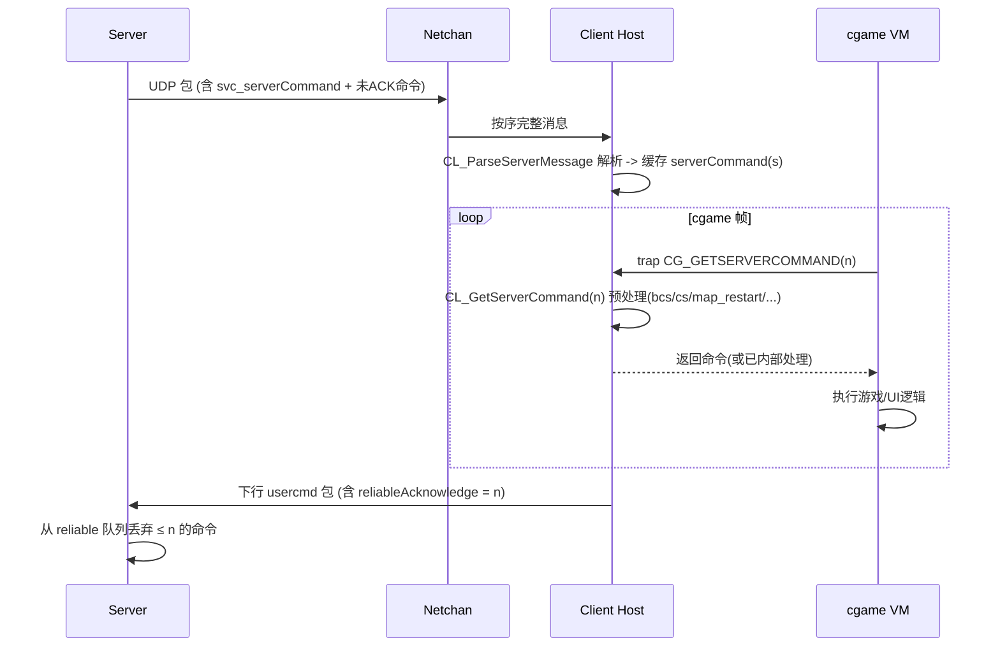
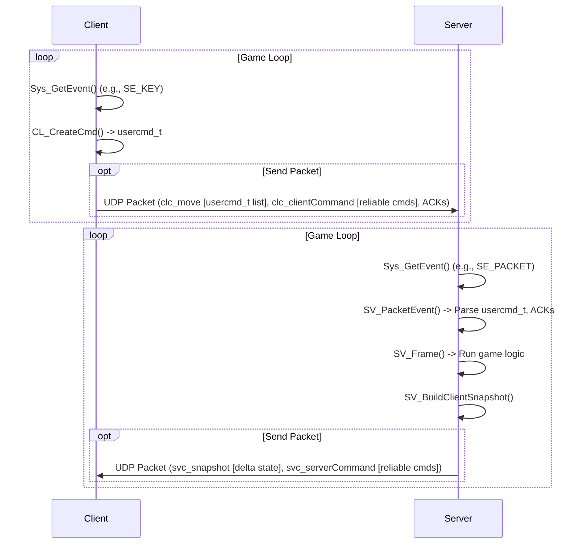
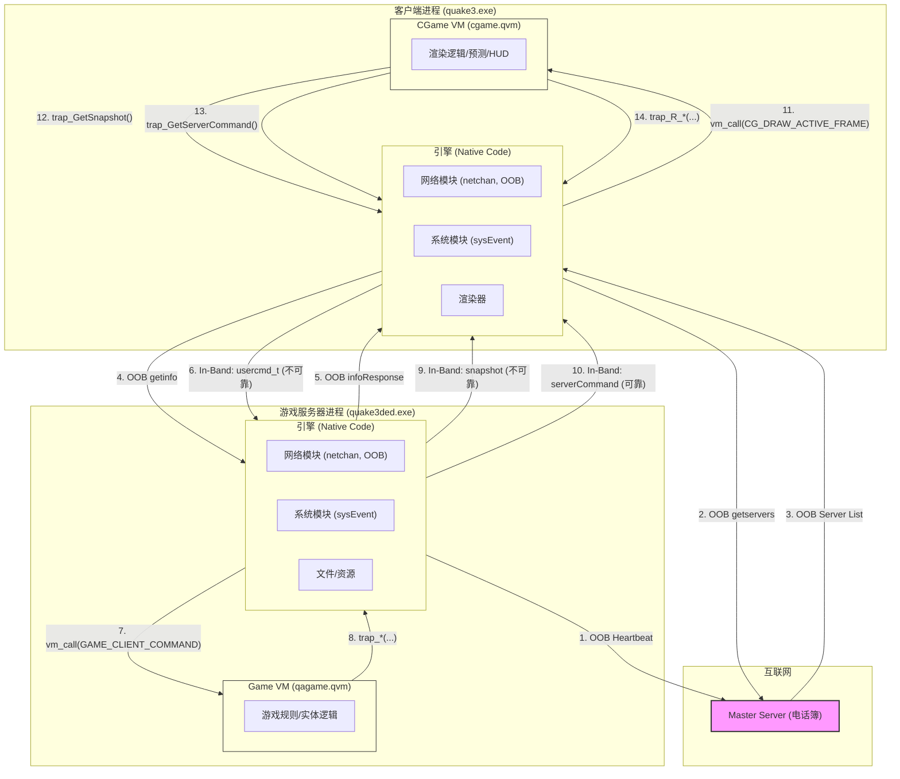

## Message

Quake III 中“服务器侧发往客户端的可靠(reliable)消息/命令”类型——这里把“可靠”限定为：具有 投递保证（最终一定会收到，除非连接被判定失效） + 顺序保证（按服务器发出的顺序被客户端处理）。并对比那些只有“有序”但不保证“必达”的内容（如 snapshot）。

--------------------------------
第一部分：协议中两层概念
1. 包级顺序（netchan 序号）  
   - 每个 UDP 包带一个递增的 sequence（in/out）。乱序或重复会被丢弃。  
   - 所有服务器→客户端数据（包括 snapshot、gamestate、serverCommand、download 片段）都“有序”（不会乱序交给解析层），但不意味着全部“可靠”。  

2. 可靠命令层（reliable command ring）  
   - 仅对通过 SV_AddServerCommand / SV_SendServerCommand 放入 client->reliableCommands[] 的 字符串命令 提供“必达 + 按序”。  
   - 机制：服务器为每个 client 维护 reliableSequence；客户端在上行包里回传 reliableAcknowledge（= 已接收/可执行的最后序号）；未被 ACK 的命令会继续被打包进后续 UDP 包，直至确认。队列满即断开（防止永远不 ACK 占满 buffer）。  

--------------------------------
第二部分：可靠与不可靠分类总表

A. 可靠且有序（最终必达 + 语义顺序保持）
- svc_gamestate（初始完整游戏状态包，必要时会重发）
- svc_serverCommand（承载下面列出的各种文本指令：print/chat/cp/cs/bcs*/map_restart/disconnect/tinfo/clientLevelShot/下载控制命令等）
  - 具体命令字见下一节
  - configstring 更新：
    - 作为 gamestate 内的 svc_configstring（初次）  
    - 运行期通过 serverCommand "cs <index> <value>"（可靠）  
    - 超长的通过 bcs0 / bcs1 / bcs2 分片再重组为 "cs"  
  - 大 configstring 分片指令 bcs0 / bcs1 / bcs2（它们自身是可靠 serverCommand）
  - map_restart（serverCommand）
  - disconnect（serverCommand）
  - tinfo（队伍/overlay 信息，serverCommand）
  - clientLevelShot（开发调试用途，serverCommand）
- 下载控制与数据：
  - 实际文件数据传输使用 svc_download（单独消息类型），配合客户端请求“下一块”的往返形成应用层可靠（若块丢失，客户端不会请求下一块，从而阻塞/重发逻辑触发——属于“请求/响应式可靠”，详见后述）

B. 有序但不保证必达（丢了就丢）  
- svc_snapshot（频繁世界/实体增量状态）  
  - 丢失：客户端用后续 snapshot（可能改成非 delta 或基于更旧的 delta）继续；不会重发原 snapshot。  
- 快照中包含的 playerState / entityState / areamask / 时间戳（同 snapshot 命运）

C. “条件可靠 / 通过整体重发间接保证”
- 整个 gamestate（含 baseline、所有 configstrings）：如果客户端没能完成初始化或 delta 基准不匹配，服务器会再次发送完整 gamestate（相当于外层 retry）。  
- 下载（svc_download）块：因为客户端只有按顺序收到当前块才会去要下一块；缺块意味着进程停滞 -> 服务器会在下一次响应继续发送当前块，形成“停等”式可靠。

--------------------------------
第三部分：serverCommand 中的常见命令字（可靠 ring 中的 payload）

以下命令文本是在服务器端通过 SV_AddServerCommand / SV_SendServerCommand 排入 reliable 队列后，被打包为一个 svc_serverCommand 发送。客户端在 CL_ParseServerMessage 里读出整个字符串，放入 clc.serverCommands[]；随后 cgame VM 通过 CG_GETSERVERCOMMAND → CL_GetServerCommand 拉取并执行。

核心集合（基础发行版常见）：
- print <msg>                控制台输出
- chat <msg>                 聊天（含队伍/全局/系统）
- cp <msg>                   Center Print（屏幕中央提示）
- cs <index> <value>         单条 configstring 更新
- bcs0 / bcs1 / bcs2         超长 configstring 分片（组合后递归当作 cs 执行）
- map_restart                地图重启（客户端局部重置而非全断线）
- disconnect [reason]        服务器要求断开（踢人/关服等）
- tinfo ...                  队伍/overlay 信息
- clientLevelShot            生成关卡缩略图（本地服务器时）
- （下载相关）download / nextdl / （具体取决于实现：协调下一块、结束标志；可以 grep "download"）
- 其它 mod 可自由添加（机制上就是任意文本第一 token）

--------------------------------
第四部分：关键代码结构（简化伪代码）

服务器端（code/server）：
```c
// 添加可靠命令
void SV_AddServerCommand( client_t *cl, const char *text ) {
    cl->reliableSequence++;
    cl->reliableCommands[ cl->reliableSequence & (MAX_RELIABLE_COMMANDS-1) ] = strdup(text);
}

// 在发送主循环打包（连同 snapshots 等）
void SV_SendClientSnapshot( client_t *cl ) {
    msg_t msg;
    // 写不可靠部分（snapshot 等）
    // 逐个将 未被 ACK 的 reliableCommands 重新附加为 svc_serverCommand:
    for ( seq = cl->reliableAcknowledge+1; seq <= cl->reliableSequence; ++seq ) {
        MSG_WriteByte(&msg, svc_serverCommand);
        MSG_WriteLong(&msg, seq);           // （或隐式序号，具体实现）
        MSG_WriteString(&msg, cl->reliableCommands[ seq & MASK ]);
    }
    // 发送 msg（netchan 序列包）
}
```

客户端接收（cl_parse.c -> CL_ParseServerMessage）：
```c
case svc_serverCommand:
    s = MSG_ReadString(msg);
    clc.serverCommandSequence++;
    clc.serverCommands[ clc.serverCommandSequence & MASK ] = s;
```

客户端执行（cl_cgame.c -> CL_GetServerCommand）：
```c
qboolean CL_GetServerCommand(int n) {
    s = clc.serverCommands[ n & MASK ];
    clc.lastExecutedServerCommand = n;
    Cmd_TokenizeString(s);
    cmd = Cmd_Argv(0);
    if (!strcmp(cmd,"bcs0")) { ... return qfalse; } // 需要更多分片
    if (!strcmp(cmd,"cs"))   { CL_ConfigstringModified(); return qtrue; }
    if (!strcmp(cmd,"disconnect")) { Com_Error(ERR_SERVERDISCONNECT, ...); }
    // 其它特殊命令预处理
    return qtrue; // 交给 cgame 进一步处理
}
```

ACK（客户端 → 服务器）：
- 在客户端发出的每个 usercmd 包（CL_WritePacket）会写入：
  - messageAcknowledge（最近收到的完整 message 序号）
  - serverCommand 执行/接收序号（等价 reliableAcknowledge）
- 服务器读取后更新 cl->reliableAcknowledge，释放已确认命令槽位。

--------------------------------
第五部分：各“可靠”类型的保障方式对比

| 类型                             | 承载形式                                  | 重发策略                              | 顺序保证来源            | 丢失后影响                                | 说明                           |
| -------------------------------- | ----------------------------------------- | ------------------------------------- | ----------------------- | ----------------------------------------- | ------------------------------ |
| serverCommand（print/cp/cs/...） | svc_serverCommand + reliable ring         | 自动附带到后续所有包，直到 ACK        | reliableSequence / ACK  | 最终一定到达或连接断开                    | 正统“可靠”层                   |
| gamestate                        | svc_gamestate（独立大消息）               | 若客户端未正确进入活动状态，可重发    | netchan 序号 + 单独重发 | 无 gamestate → 不能进入 CA_ACTIVE         | 含 baseline + 全 configstrings |
| configstring 更新                | 1) gamestate 2) serverCommand "cs"/"bcs*" | 同上各自机制                          | 同上                    | 若丢失将导致资源/规则不一致；被可靠层避免 | 运行期只用 serverCommand       |
| 大 configstring 分片             | serverCommand bcs0/1/2                    | 可靠命令机制                          | 同上                    | 分片缺失→无法组合，直到分片全部收到       | 组合后递归处理成 cs            |
| 下载数据块                       | svc_download + 客户端“请求下一块”         | 停等式（下一块请求依赖前块）          | 底层序号 + 块号         | 丢失当前包→卡在该块，继续收重发           | 应用层可靠                     |
| snapshot                         | svc_snapshot                              | 不重发（只发下一帧 delta/或改成完整） | netchan 序号            | 丢一帧：插值/预测补偿                     | 设计成可丢弃                   |

--------------------------------
第六部分：为什么 snapshot 不做“可靠”
- 目标是低延迟实时：与其重发陈旧状态，不如尽快发送最新 delta。  
- 客户端预测 + 插值可平滑丢包影响。  
- 丢包概率叠加时重发旧帧会放大延迟（抖动）。  

第八部分：可靠层的关键状态变量

服务器端 client_t（简略）：
- reliableSequence / reliableAcknowledge
- reliableCommands[MAX_RELIABLE_COMMANDS]
- netchan.outgoingSequence / incomingSequence

客户端 clc（简略）：
- serverCommandSequence / lastExecutedServerCommand
- serverCommands[MAX_RELIABLE_COMMANDS]
- (在上行包中回传) serverCommandSequence / reliableAcknowledge
- messageAcknowledge（最后收到的 message 编号，用于 snapshot delta 基准选择）

--------------------------------
第九部分：Mermaid 概念流程（可复制渲染）



--------------------------------
第十部分：精炼总结
- Quake III 的“可靠消息”集中体现为：serverCommand 可靠环（print/chat/cp/cs/bcs*/map_restart/disconnect/tinfo 等）、初始 gamestate（含 configstrings）、以及应用层停等机制的下载块。  
- 所有这些依靠：netchan 序号（有序）、可靠环序号 + ACK（必达）、或显式请求/响应（下载）。  
- snapshot 及其中实体/玩家状态仅“有序”不“必达”，通过高频发送 + 客户端预测 + 插值弥补。  

## trans

区分：真正意义上的“重传”与“持续附带直到 ACK”两类机制。

--------------------------------
1. 可靠 serverCommand（print / cs / map_restart / disconnect 等）
机制类型：不是单独重发某条，而是在每个即将发送的 server→client 包（快照 / gamestate）里再次附带所有“尚未被客户端 ACK”的可靠命令。

关键代码：
- 写入位置：SV_UpdateServerCommandsToClient(client, &msg)  
  - 被调用于：SV_SendClientSnapshot() 发送快照前；SV_SendClientGameState() 发送初始/重发 gamestate 时。
  -判定循环（伪意图）：for (seq = cl->reliableAcknowledge+1; seq <= cl->reliableSequence; ++seq) 写 svc_serverCommand + 文本。
- ACK 更新位置：SV_ExecuteClientMessage() 中读取
```c
cl->reliableAcknowledge = MSG_ReadLong(msg);
```
触发条件：
- 只要 cl->reliableAcknowledge < cl->reliableSequence（仍有未确认）→ 下一个要发的包再次附带全部未 ACK 命令。
终止条件：
- 客户端上行包携带的 reliableAcknowledge == reliableSequence（全部确认），循环不再写出。
异常：
- 若积压超过窗口：if (cl->reliableAcknowledge < cl->reliableSequence - MAX_RELIABLE_COMMANDS) → 视为异常（潜在恶意或同步乱），SV_DropClient。
本质：
- 这是“piggyback until ACK”，无需额外计时器；发送频率 = 快照发送频率。

--------------------------------
2. Gamestate（svc_gamestate）重发
机制类型：整包再发送（而非内部片段重发）。

发送函数：
- SV_SendClientGameState(client)（首次连接、map load、重发）。
触发点（代码处可 grep）：
1) 初始连接成功 → SV_DirectConnect 之后流程。  
2) Map 重启 / 切换（服务器逻辑调用）。  
3) 丢失 gamestate：SV_ExecuteClientMessage()
```c
if ( serverId != sv.serverId ... ) {
  if ( cl->messageAcknowledge > cl->gamestateMessageNum ) {
      // 客户端确认了比它“最后看到的 gamestate 包”更后的 message，说明 gamestate 包丢了
      SV_SendClientGameState(cl);
  }
  return;
}
```
4) 纯净校验没完成但已进入 ACTIVE 且缺 cp：SV_UserMove()
```c
if (sv_pure && cl->state==CS_ACTIVE && cl->pureAuthentic==0 && !cl->gotCP)
    SV_SendClientGameState(cl);
```
5) 下载完成：SV_DoneDownload_f() 里再次发（确保期间进入的其他改动同步）。
数据结构：
- client->gamestateMessageNum = 发送 gamestate 时记录的 netchan.outgoingSequence（在 SV_SendClientGameState 设置）。
判定逻辑：
- 客户端上行的 messageAcknowledge（最后收到的服务器消息序号）若已越过 gamestateMessageNum，表示它跳过了那包。

--------------------------------
3. Configstring 更新（cs / bcs0/1/2）
机制：
- 初始全部包含在 svc_gamestate（同 gamestate 重发机制保证）。
- 运行期更新通过 serverCommand "cs ..." 或分片 bcs0/bcs1/bcs2 → 归属可靠命令环 → 由第 1 节 piggyback 模式重复发送直到 ACK。
触发重发：
- 与可靠 serverCommand 相同条件：ACK 未到达。

--------------------------------
4. 下载块（svc_download）重发
机制类型：窗口 + “停等超时回卷”式重发。
核心代码：SV_WriteDownloadToClient(client, msg)
关键字段：
- downloadClientBlock：客户端已确认的最后 block 索引（通过客户端的 nextdl 命令 SV_NextDownload_f() 更新）。
- downloadXmitBlock：服务器最近发送（尚未确认）的块号指针。
- downloadSendTime：发送该窗口首块的时间。
重发触发：
```c
if (cl->downloadXmitBlock == cl->downloadCurrentBlock) {
  // 已发送到窗口末尾
  if (svs.time - cl->downloadSendTime > 1000)
      cl->downloadXmitBlock = cl->downloadClientBlock; // 超时 → 回卷，重新从未确认块开始发送
  else
      return;
}
```
解释：
- 若客户端没有按期发送 “nextdl <block>” ACK（SV_NextDownload_f 解析），超过 1 秒（硬编码）则重新从未 ACK 的起点重发窗口。
停止条件：
- 当某块大小==0（EOF 标志）并被客户端 ACK → SV_CloseDownload()。

--------------------------------
5. 大消息分片（netchan fragment）
场景：Netchan_Transmit 发送超出单包阈值的数据（如大 serverCommand 列表、下载控制包等）。
机制：
- netchan 维护 unsentFragments / fragmentBuffer；发送一个 fragment 后，若还有剩余，设置有待发送标志。
重发触发：
- 若包含该 fragment 的 UDP 包整体丢失，接收方不会递进 incomingSequence，发送方在下一帧发现仍有 unsentFragments（状态未被清除），继续用新的 outgoingSequence 发送下一份 fragment（实际是“同序列步进+剩余未清”导致逻辑上重发）。
位置：
- net_chan.c 中 Netchan_Transmit / Netchan_TransmitNextFragment；
- 服务器高层在尝试发快照时若 cl->netchan.unsentFragments 为真，会优先调用 Netchan_TransmitNextFragment 而跳过新的 snapshot（确保 fragment 序列完整）。
触发条件摘要：
- unsentFragments 标志仍存在（上次片未完成全部发送）；与 ACK 无关（底层依赖 netchan 有序序号丢弃旧/乱序包，继续发直到完成）。
特点：
- 没有显式定时器；发送节奏跟随主循环（快照周期）。丢包仅造成 fragment 序列整体延长。

--------------------------------
6. 可靠 client→server 命令丢失处理（间接影响重发）
虽然问题聚焦服务器重发，但 ACK 驱动来自 SV_ExecuteClientMessage：
- 若客户端消息解析出现 seq 缺口（client lost reliable commands）→ 服务器直接断开（不重发旧 client->server 字符串）。
- 这保证服务器不会无限等待不可恢复的状态，从而可靠层得以“有限缓冲 + 必达或断开”。

--------------------------------
7. Snapshot（svc_snapshot）
无重发。
- 丢包后不做任何针对那帧的补发；下一帧继续发送新 delta（若 delta 基准不可用则发送完整快照）。
- 触发“完整快照”条件：客户端 deltaNum 基准不可用（客户端没那条旧 snapshot）→ 服务器发非 delta（逻辑在构建 snapshot 时检测基准存在与否）。
这是“自我修复”而非重发。

--------------------------------
8. 触发条件总览（按类型）

| 类型                      | 重发方式                                  | 直接触发点                                                   |
| ------------------------- | ----------------------------------------- | ------------------------------------------------------------ |
| serverCommand 可靠命令    | 每包重复附带                              | cl->reliableAcknowledge < cl->reliableSequence（在 SV_SendClientSnapshot / SV_SendClientGameState 内循环） |
| gamestate                 | 整包重发                                  | SV_ExecuteClientMessage 检测 dropped gamestate；纯净校验缺 cp；下载完成；初始连接；map_restart |
| configstring 更新         | serverCommand 重发                        | 同 serverCommand                                             |
| 大 configstring 分片 bcs* | serverCommand 重发                        | 同 serverCommand                                             |
| 下载块 svc_download       | 窗口回卷重发                              | 超时 (svs.time - downloadSendTime > 1000) 且未 ACK           |
| netchan 分片              | 继续发未完成 fragment（逻辑上重发丢失片） | unsentFragments 仍为真（前片未完成序列）                     |
| snapshot                  | 不重发（切换完整帧自我修复）              | 基准缺失 → 发送非 delta（不是“重发”旧帧）                    |

--------------------------------
9. 快速源码定位参考（grep 指令）
```bash
# 可靠命令打包
grep -n "SV_UpdateServerCommandsToClient" -R code/server

# gamestate 重发逻辑
grep -n "dropped gamestate" -R code/server

# 纯净重发 gamestate
grep -n "resending gamestate" -R code/server

# 下载回卷超时
grep -n "downloadXmitBlock == cl->downloadCurrentBlock" -R code/server
grep -n "downloadSendTime" -R code/server

# 分片发送
grep -n "Netchan_TransmitNextFragment" -R code/qcommon

# unsentFragments 流程
grep -n "unsentFragments" -R code/qcommon

# snapshot 发送（查看调用重发可靠命令位置）
grep -n "SV_SendClientSnapshot" -R code/server
```

--------------------------------
10. 精炼总结
- 可靠命令与 configstring：靠“未 ACK 即每包附带”策略（无单独重发定时器）。
- Gamestate：事件触发式整包重发（丢失检测 / 纯净校验 / 下载完成 / map 重启）。
- 下载：滑动窗口 + 1s 超时回卷重复块。
- Fragment：状态驱动重复发送剩余片段。
- Snapshot：不重发；用下一帧（可能完整）覆盖自愈。

## delta

服务器选择“旧快照” (old snapshot) 作为 Delta 基准的核心流程：利用客户端上行包里带回的 messageAcknowledge（最后成功收到的服务器消息编号）与自身保存的环形快照缓冲 (cl->frames[])。如果该编号对应的历史帧仍在可用窗口内，就用它做 delta；否则发送完整快照（non‑delta）。下面按数据、流程、判定条件拆解。

一、涉及的关键字段与结构（server 端 client_t）
- netchan.outgoingSequence: 服务器已发出的下一个（或者当前准备发的）消息序号（逐包递增）。
- messageAcknowledge:（每次处理客户端包时更新）客户端声明“我已成功收到的最后一个服务器消息编号”。
- deltaMessage: 服务器决定本次给该客户端的快照是否做增量时参考的“客户端请求的基准”编号；它在解析客户端 clc_move / clc_moveNoDelta 时被设置：
  - 若收到 clc_move（正常增量移动包）：deltaMessage = messageAcknowledge
  - 若收到 clc_moveNoDelta：deltaMessage = -1（强制本次回发完整快照）
- frames[PACKET_BACKUP]（环形缓冲）：保存最近 N（典型 32）个已发送给该客户端的 snapshot 元数据：messageNum、areabits、副本的 playerState delta 基准、该帧的实体列表索引与数量等。
- PACKET_BACKUP / PACKET_MASK: 环形窗口大小与索引掩码（32 / 31）。
- reliableCommands ring: 参与校验的 hash（写 usercmd delta key 时用）与 ACK，但与选择 old snapshot 只在 key 计算里交叉，不影响基准选择逻辑。

二、时间线概览
1. 服务器周期性决定给客户端发送一帧：SV_SendClientSnapshot(cl)。
2. 发送前先构建本帧：SV_BuildClientSnapshot(cl)（收集可见实体，写入临时数组）。
3. 选择 oldframe（delta 基准）：
   - 读取 oldFrameNum = cl->deltaMessage
   - 验证其有效性（见第三节）
   - 若有效：oldframe = &cl->frames[ oldFrameNum & PACKET_MASK ]
   - 否则：oldframe = NULL（发送完整 playerState / entityState）
4. 写入 snapshot：
   - 写 svc_snapshot
   - 写 serverTime / snapFlags / deltaNum（= oldFrameNum 或 0）
   - 用 MSG_WriteDeltaPlayerstate(oldframe ? &oldframe->ps : NULL, &newFrame->ps)
   - 遍历新可见实体，用 MSG_WriteDeltaEntity(oldEntityState, newEntityState, force) 做差异编码
5. 当前帧保存在 frames[ currentMessageNum & PACKET_MASK ] 以供后续 delta。
6. 客户端处理后，下次发来的 clc_move 把最新 messageAcknowledge 带回 —— 决定下次 delta 基准。

三、服务器判断“旧快照”可用的条件（典型逻辑要点）
oldFrameNum = cl->deltaMessage; 若满足任一条件 → 判为不可用，发送完整快照：
- oldFrameNum < 0（客户端显式要求 no-delta）
- oldFrameNum >= netchan.outgoingSequence（客户端引用了未来帧，异常）
- oldFrameNum <= netchan.outgoingSequence - PACKET_BACKUP（超出保存窗口，已被环形覆盖）
- 对应槽 frames[ oldFrameNum & PACKET_MASK ].messageNum != oldFrameNum（槽被覆盖或未初始化）
满足以上任一 → deltaNum 写 0，oldframe 置 NULL。
否则合法 → deltaNum = oldFrameNum，执行 delta 编码。

四、为什么使用 messageAcknowledge 而不是客户端显式告诉“我想基于帧 X”
- messageAcknowledge 已经表示“客户端确定收到的最新完整服务器消息”；它天然单调递增。
- 客户端想要放弃 delta（比如丢太多包，基准缺失）就发送 clc_moveNoDelta（不带 delta），服务器把 deltaMessage 设成 -1。
- 若客户端仍发 clc_move 但中间丢了多帧，messageAcknowledge 会“落后”，服务器仍会尝试使用那个落后的帧；若该帧仍在窗口内就可成功 delta，否则自动回退为完整快照（自愈）。

五、环形缓冲与覆盖
- 每发送一帧：useIndex = (netchan.outgoingSequence) & PACKET_MASK → 填写 frames[useIndex]。
- 当 outgoingSequence 增到覆盖旧序号区段时，旧帧结构被重写；若客户端之后还引用那个已被覆盖的 messageNum，验证时发现 messageNum 不匹配 → 触发 full snapshot。
- 这样避免显式“重发旧帧”机制，靠窗口 + 自动退回完整帧实现恢复。

六、与实体 delta 的协同
- 对每个实体：服务器仅在该实体在 oldframe 可见列表里找到旧状态时才做 delta；否则视为“新实体”写完整状态（force 标志）。
- 如果整帧降级为 non-delta，所有实体都以 baseline 或 NULL 做 delta（即完整写入），客户端重建新基准。

七、客户端如何影响这一选择
- 通过是否发送 clc_move 或 clc_moveNoDelta。
- 通过“延迟” ACK（如果丢包，messageAcknowledge 不推进）。
- 客户端永远不直接指定“我想用帧 K”，只是用其最新 ACK 的帧号隐式指定。

八、为何不重发旧帧
- 老帧内容在实时游戏中很快过时；重发会增加延迟。
- 全量帧成本可接受（delta 压缩多字段可选；完整帧只是少见 fallback）。
- 预测 + 插值掩盖少量突发完整帧的网络负载。

九、与 delta key 的关系（usercmd 解码）
- 服务器在解析 usercmd 时用 key = checksumFeed ^ messageAcknowledge ^ hash(reliableCommand[reliableAcknowledge])；保证输入包被旧/伪造 snapshot 伪装破坏的概率降低。但这与选择 oldframe 只是共享 messageAcknowledge，不改变基准逻辑。

十、典型触发完整快照的常见场景
- 客户端刚进入世界（首次 deltaMessage = -1）
- 客户端发 clc_moveNoDelta（显式请求）
- 丢包导致引用帧被覆盖（ACK 延误超过 PACKET_BACKUP 深度）
- 大规模网络抖动后恢复（服务器无法验证 oldFrameNum 有效）

十一、简化伪代码（仅逻辑示意）
```
oldNum = cl->deltaMessage
if (oldNum < 0 ||
    oldNum >= netchan.outgoingSequence ||
    oldNum <= netchan.outgoingSequence - PACKET_BACKUP ||
    frames[oldNum & MASK].messageNum != oldNum) {
    deltaNum = 0
    oldframe = NULL   // full snapshot
} else {
    deltaNum = oldNum
    oldframe = &frames[oldNum & MASK]
}
```

十二、调试 / 验证建议
- 在 SV_SendClientSnapshot 里打印 (client->name, deltaNum, outgoingSequence) 观察回退发生频率。
- 人为设置 PACKET_BACKUP 很小或模拟高丢包率→可看到更多 full snapshot。
- 抓包验证：full snapshot 时 deltaNum=0（网络层的 svc_snapshot 后紧跟的 deltaNum 字段是 0）；正常增量时 deltaNum=某旧帧号。

总结
服务器通过客户端上行的 messageAcknowledge（拷贝到 deltaMessage）指示的旧消息号，在自己的 frames 环形缓冲中查找对应旧快照；若仍在保存窗口且未被覆盖，就用它做 delta，否则退回完整帧。逻辑无显式“重发旧 snapshot”，依靠“失效则 full”实现自愈和简洁性。

下面直接对应你提到的那句逻辑，指出在当前 Quake III 源码里“判断旧快照是否还能作为 delta 基准”实际体现在哪里；并说明：你引用的“frames[oldNum & MASK].messageNum != oldNum”这种显式比较在原版 q3a 中并没有单独写出来，它是用其它等价条件（窗口距离 + 实体环缓冲回卷）来替代的。

1. 代码所在函数  
服务器写快照时做 delta 基准校验的代码就在 sv_snapshot.c 的 SV_WriteSnapshotToClient()（你贴的函数开头部分）。

2. 实际存在的三段判定（节选并标注）

````c
static void SV_WriteSnapshotToClient( client_t *client, msg_t *msg ) {
    clientSnapshot_t *frame, *oldframe;
    int lastframe;

    frame = &client->frames[ client->netchan.outgoingSequence & PACKET_MASK ];

    // ① 客户端明确要求完整帧 或 还没进入 ACTIVE
    if ( client->deltaMessage <= 0 || client->state != CS_ACTIVE ) {
        oldframe = NULL;
        lastframe = 0;

    // ② 距离太远：当前即将发送的序号 与 客户端想用的 deltaMessage 相差 >= (PACKET_BACKUP - 3)
    } else if ( client->netchan.outgoingSequence - client->deltaMessage >= (PACKET_BACKUP - 3) ) {
        Com_DPrintf("%s: Delta request from out of date packet.\n", client->name);
        oldframe = NULL;
        lastframe = 0;

    } else {
        // ③ 形式上还在窗口内，先取出 oldframe
        oldframe = &client->frames[ client->deltaMessage & PACKET_MASK ];
        lastframe = client->netchan.outgoingSequence - client->deltaMessage;

        // ④ 但即便窗口距离合法，还要检查该 oldframe 里引用的实体区间有没有被环形覆盖
        if ( oldframe->first_entity <= svs.nextSnapshotEntities - svs.numSnapshotEntities ) {
            Com_DPrintf("%s: Delta request from out of date entities.\n", client->name);
            oldframe = NULL;
            lastframe = 0;
        }
    }

    MSG_WriteByte(msg, svc_snapshot);
    MSG_WriteLong(msg, svs.time);
    MSG_WriteByte(msg, lastframe);  // 这里的 lastframe 就是 deltaNum（0 表示 full）
    ...
    if ( oldframe ) {
        MSG_WriteDeltaPlayerstate(msg, &oldframe->ps, &frame->ps);
    } else {
        MSG_WriteDeltaPlayerstate(msg, NULL, &frame->ps); // full playerState
    }
    SV_EmitPacketEntities(oldframe, frame, msg); // oldframe == NULL -> 全实体或 baseline
}
````

3. 与你那句“frames[oldNum & MASK].messageNum != oldNum” 的关系  
- 原版 Q3 并没有单独做 “frame->messageNum != oldNum” 这一显式比较。  
- 旧帧有效性通过两个层面保障：  
  a) 序号窗口：outgoingSequence - deltaMessage < (PACKET_BACKUP - 3) （避免引用已经环形覆盖的帧槽）。  
  b) 实体滚动缓冲：oldframe->first_entity > svs.nextSnapshotEntities - svs.numSnapshotEntities （如果不满足说明 oldframe 覆盖掉了其实体区间）。  
- 如果 frame 结构里曾经保存过 messageNum（在某些改版或别的 id Tech 变体中常见），那就可以直接做 “storedMessageNum != deltaMessage” 检查；但在当前代码路径里选择的是“距离 + 实体区间”组合判断，所以你看不到那一行。

4. 为什么窗口判断用 (PACKET_BACKUP - 3)  
留 3 个安全余量，防止靠近覆盖边界时 race 导致取出一个马上就会被覆盖的帧；这和“直接比对 messageNum”是不同风格的健壮性处理。  

5. 实体区间覆盖检查本质等价于“槽被重用”  
- svs.snapshotEntities 是一个环形数组；每帧 snapshot 把其可见实体复制进去并前进 svs.nextSnapshotEntities。  
- oldframe->first_entity 记录当年那帧实体列表起始下标；如果它 ≤ (当前写指针 - 环容量) 就说明它那一段实体数据已被新帧整体覆盖——即“逻辑上的旧帧已失效”，必须放弃 delta。  
- 这相当于你描述的“槽被覆盖”检测，只是粒度在实体缓冲层，不是 messageNum 直接比较。

6. 与 deltaNum=0 的对应  
函数里 lastframe 变量就是网络上传输的“deltaNum”（客户端解析 svc_snapshot 后读的那个“what we are delta'ing from”字节）。  
- 置 0 -> oldframe == NULL -> full snapshot。  
- 非 0 -> 表示“距离”（不是直接的 oldframe 序号，而是 outgoingSequence - oldNum 的差值）。客户端用收到的 currentMessageSequence - deltaNum 推导出基准帧号（从而索引自己的本地缓存）。

7. 你想看到“messageNum 不匹配”的调试怎么补？（可选）  
如果你想显式验证帧槽是否被覆盖，可在 client->frames[] 结构里添加一个字段 messageNum（发送时写 outgoingSequence），然后在上面 “else” 分支加：  
````c
// ...existing code inside the final else branch, after assigning oldframe...
if ( oldframe->messageNum != client->deltaMessage ) {
    Com_DPrintf("%s: Delta request frame slot reused.\n", client->name);
    oldframe = NULL;
    lastframe = 0;
} 
````
不过这是调试增强，功能上与现有双条件（窗口 + 实体覆盖）结果一致。

8. 相关常量位置  
PACKET_BACKUP / PACKET_MASK 定义可在 qcommon 层（例如 net_chan.h 或 msg.h， grep）：  
````bash
grep -R "PACKET_BACKUP" -n code/
````

9. 小结（一句话）  
当前源码通过 “序号距离 < PACKET_BACKUP - 3” + “实体缓冲未回卷 (oldframe->first_entity > nextSnapshotEntities - numSnapshotEntities)” 两个条件组合来判断旧快照可否用作 delta 基准，而不是显式比较 frame->messageNum；失效则令 lastframe=0，触发完整快照。

## macro

下面全面解释：宏 PSF / NETF 的作用、netField_t 结构的目的、它们与 delta 压缩（MSG_WriteDeltaEntity / MSG_WriteDeltaPlayerstate）之间的关系、字段顺序与 bits 字段含义、以及在源码中的位置和使用流程。

--------------------------------
1. netField_t 是什么

在 Quake III 的网络层（code/qcommon/msg.c）中，delta 压缩不会“硬编码”结构体成员，而是借助一个“字段描述表”（元数据数组）。每个可参与增量比较 / 传输的成员，用一个 netField_t 条目描述。典型定义（精简示意）：

````c
typedef struct {
    const char *name;   // 仅用于调试/统计 (Com_DPrintf / analyze)
    int         offset; // 该字段在结构体里的偏移 (byte offset)
    int         bits;   // 可选：为该字段建议的压缩位宽 (0 表示使用默认 32 位 / 特殊逻辑)
} netField_t;
````

作用：
- 通过 offset + 基地址，实现对任意结构（playerState_t / entityState_t）字段的通用比较与写入，不需要为每个字段写专门代码。
- 有序数组定义字段的“检查顺序”，影响“最后改变字段索引 (lc)”的值，从而影响带宽。
- bits 字段用于特定字段的（可截断）写法：如果值落在指定可表示范围内就用精简 bit 数写，否则回退写 full 32-bit（具体逻辑在写函数内判断）。

--------------------------------
2. PSF / NETF 宏的作用

宏只是“语法糖”，简化 netField_t 表项的书写，避免重复敲字符串与 offset。典型形式（不同版本可能叫 qoffsetof 或 Qoffsetof）：

````c
#define PSF(x)  { #x, qoffsetof(playerState_t, x), 0 }
#define NETF(x) { #x, qoffsetof(entityState_t, x), 0 }
````

（如果某字段需要指定位宽，会直接写 { "eFlags", qoffsetof(playerState_t, eFlags), 16 } 而不是用宏，或者扩展一个宏 NETF_B(n, bits) 等——视具体源码变体。）

区别：
- PSF 用于 playerState_t 的字段列表（给 MSG_WriteDeltaPlayerstate / MSG_ReadDeltaPlayerstate 使用）。
- NETF 用于 entityState_t 的字段列表（给 MSG_WriteDeltaEntity / MSG_ReadDeltaEntity 使用）。

作用总结：
- 自动把字段名转成字符串（调试/统计用途）。
- 自动生成偏移。
- 默认 bits=0（表示“按默认策略”处理）。

--------------------------------
3. 字段表在源码中的位置与示例

在 code/qcommon/msg.c（或同名文件）中可以看到类似数组：

````c
// playerState 的 delta 字段顺序
static netField_t playerStateFields[] = {
    PSF(commandTime),
    PSF(pm_type),
    PSF(origin[0]),
    PSF(origin[1]),
    PSF(origin[2]),
    PSF(velocity[0]),
    PSF(velocity[1]),
    PSF(velocity[2]),
    // ...
    { "eFlags", qoffsetof(playerState_t, eFlags), 16 }, // 指定 16 bits
    // ...
};

// entityState 的 delta 字段顺序
static netField_t entityStateFields[] = {
    NETF(number),
    NETF(eType),
    NETF(pos.trType),
    NETF(pos.trTime),
    NETF(pos.trDuration),
    NETF(pos.trBase[0]),
    NETF(pos.trBase[1]),
    NETF(pos.trBase[2]),
    NETF(pos.trDelta[0]),
    NETF(pos.trDelta[1]),
    NETF(pos.trDelta[2]),
    NETF(apos.trBase[0]),
    // ...
    { "frame", qoffsetof(entityState_t, frame), 8 },
    // ...
};
````

--------------------------------
4. 它们如何被 delta 写函数使用

以 MSG_WriteDeltaEntity 为例（伪代码抽象）：

````c
void MSG_WriteDeltaEntity( msg_t *msg,
                           const entityState_t *from,
                           const entityState_t *to,
                           qboolean force ) {
    const netField_t *fields = entityStateFields;
    int lc = 0;

    // 1. 确定“最后改变字段”索引 (last changed)
    for (i = 0; i < entityStateFieldCount; ++i) {
        // 指针定位
        int *fromI = (int *)((byte*)from + fields[i].offset);
        int *toI   = (int *)((byte*)to   + fields[i].offset);
        if (*fromI != *toI) lc = i + 1;
    }

    if (lc == 0 && !force) {
        // 完全没变化且不强制发送 -> 写一个“移除”或不写（视语义）
        return;
    }

    // 2. 写出 lc（告诉接收端后面有多少字段需要逐个读取差异）
    MSG_WriteBits(msg, lc, SOME_BITS_FOR_LC);

    // 3. 遍历 0..lc-1：
    //    若该字段有变化 → 用 bits 或默认方式写差异
    for (i=0; i<lc; ++i) {
        base = (int*)((byte*)from + fields[i].offset);
        cur  = (int*)((byte*)to   + fields[i].offset);
        if (*base == *cur) {
            MSG_WriteBit(msg, 0); // 未变化
        } else {
            MSG_WriteBit(msg, 1);
            if (fields[i].bits) {
                // 如果能放进 bits 位范围内则截断
                if ( valueFits(*cur, fields[i].bits) )
                    MSG_WriteBits(msg, *cur, fields[i].bits);
                else {
                    MSG_WriteBits(msg, (1<<fields[i].bits)-1, fields[i].bits); // escape / 标记
                    MSG_WriteLong(msg, *cur); // full 32
                }
            } else {
                MSG_WriteLong(msg, *cur); // 默认 32
            }
        }
    }
}
````

要点：
- 通过字段顺序 + “last changed index”减少写入：尾部未变化字段不需逐个写“未变化”标记。
- bits 字段提供“紧凑路径”与“溢出回退路径”二选一。
- playerState 的写法类似，只是结构和特别字段（stats、ammo、persistant、多数组）会有专门循环或逻辑。

--------------------------------
5. 为什么字段顺序很重要

因为“lc” = 最后一个有变化的字段索引，接收方只需解析到该索引。若频繁改变的字段排在前面，则“lc”值不会过大；不常变化的字段放后面，被跳过的概率高，节省大量 bit。  
这是一个“启发式的字段排列以最小化平均 lc”的手动优化（1999 年时代的带宽珍贵）。

--------------------------------
6. bits 字段的含义与节省机制

当 bits > 0：
- 表示“尝试用 bits 位直接写这个整型（或枚举/小范围值）”。  
- 若值超出范围，写一个“escape”码（可能是全 1）后再写 full 32 位。  
- 常用于 eFlags、frame、event、solid 等取值范围有限的字段。  
收益：减少 32→(例如 8 或 16) 的写入宽度。

当 bits == 0：
- 直接按 32-bit 写（或针对向量逐 float 原样写 int 位模式）。

--------------------------------
7. 与浮点/向量的处理

Quake III 把结构中的很多 float（包括 pos.trBase[] / origin[] / angles[] 等）按其位级表示比较（memcmp 32-bit）。没有做“压缩成 16 位半精度”这种现代技巧（保持兼容与精度）。  
某些位置/角度在 entityState_t 内可能属于 trajectory (trajectory_t)，进一步含有 base / delta；整套都逐字段列在 entityStateFields 中。

--------------------------------
8. 与 baseline 的关系

当“from == NULL” 或 oldframe 不存在时：
- 对实体：以 baseline（sv.svEntities[num].baseline）为 from，或直接发送完整状态（force= qtrue）。
- 对玩家：MSG_WriteDeltaPlayerstate 传入 NULL → “全部字段都视为变化” → 全字段写出。

netField_t 决定了“完整状态是什么顺序”，从而仍沿用同一机制统一处理 full 与 delta。

--------------------------------
9. PSF / NETF 与维护扩展

Mod 想新增字段：
- 在 playerState_t / entityState_t 添加新成员；
- 把该字段加进对应数组末尾（保持旧客户端与新服务器兼容性的难度：旧客户端读不到新字段会错位，故协议变动需同步）。
- 可设置 bits 优化；
- 注意：改变已有字段顺序将破坏兼容（因为 lc / 解码顺序依赖数组位置）。

--------------------------------
10. 小结（精炼）

- netField_t 是“字段元数据”表项：name + offset + bits。
- PSF / NETF 宏用于快速生成 playerState / entityState 的表项，减少重复。
- delta 编码流程：找最后变化字段索引 -> 写索引 -> 对前 lc 个字段写变化标志与数值（可截断）。
- 字段顺序 = 重要优化手段；bits = 进一步按范围节省带宽。
- 该设计使协议“可配置/可调试”，同时保持简单高效。

## change


原因概述：entityStateFields / playerStateFields 数组的顺序不是结构体在内存中的原始成员顺序，这是刻意“打散 + 重新排序”以优化网络 delta 压缩带宽、简化兼容、以及支持特定编码策略的“字段描述表”。它不影响结构体真实内存布局（offset 仍指向原始 struct），但决定了 delta 比较与写入的遍历顺序，从而直接影响平均包大小。

核心点（为什么要“打乱原始顺序”）  
1. 最小化 lc（last changed index）  
   - Delta 写流程先线性扫描字段数组，找“最后一个变化字段”索引 lc，然后只为 0..lc-1 这些字段写变化标志位。  
   - 若把“高频变动字段”放在靠前位置，“低频字段”放后面，则很多帧的 lc 会较小 → 省掉尾部所有“no change”标志。  
   - 因此顺序是按“变化频率”与“相关性”手工排序，而不是结构体原始声明顺序。  

2. 聚集强相关 / 同步变化的字段  
   - 位置（pos.trBase / pos.trDelta / origin / angles / velocity）放前面，因为它们几乎每帧都可能改变；把它们集中便于 lc 精准截断。  
   - 临时事件 / 动画（event / eventParm / torsoAnim / legsAnim）被靠前安排（或成簇）以避免单一事件的小改动拖长 lc。  
   - 在 playerState 中：movement / viewangles / timers / eFlags 之类经常动的在前；大数组(stats/persistant/ammo/powerups)被完全移出字段表，用位掩码单独批处理（避免为每个数组槽都产生“字段级”开销）。  

3. 区分浮点与整型压缩模式  
   - bits==0 的字段按“浮点（或经常需要完整 32 位表示）”处理，含一个额外 0/1+偏移截断逻辑；整型有限域字段（bits>0）靠近一起，使 Huffman 与比特流结构更规整。  
   - 打散顺序可以让一批高概率“无变化且为 0”或“可截断小整数”字段集中，从而提高前缀（1/0 标志位）模式重用率。  

4. Huffman 统计导向微调  
   - 文件里保留了 pcount[] / MSG_ReportChangeVectors_f（可统计哪些索引被写入），开发时通过运行实际游戏收集热度，再手工调整字段排序。  
   - 目标：将“常写变化”的字段向前移动，把“极罕见变化”的放到尾部甚至数组末端，以减平均 lc。  

5. 避免无意义字段扩大差异窗口  
   - 某些 rarely-changed（time/time2/constantLight 等）被放得更靠后——这些只在少数实体类型才改，不应该让普通变化（比如位置）导致必须扫描到它们。  

6. 兼容性 / 演进策略  
   - 协议依赖“双方使用相同字段数组顺序”。若未来添加新字段，通常只能“追加到数组末尾”，不敢插入中间（否则旧客户端按旧顺序解析会错位）。  
   - 将“低频 / 可选 / 后来才想到的”字段预留或放尾部，为追加留空间或降低未来插入需要。  

7. 独立于结构体真实内存布局  
   - 遍历是用 offset： (byte*)base + field->offset → 读取 int。  
   - 因此调整数组顺序不必改结构体，也不影响 VM 或游戏逻辑。  
   - 单独断言（entityState）用：assert(numFields + 1 == sizeof(*from)/4) 仅确认 32 位字段总数匹配，不要求顺序一致。  

8. 分离“数组类”高维字段  
   - playerState 的 stats / persistant / ammo / powerups 不在 playerStateFields；转而用位掩码块式编码（先写 bitmask，再写变化项）。  
   - 这是更高密度的专用编码，比把 64 个短整数逐个放进表里（并各自带 1 bit hasChanged）更节省。  

9. bits 选择与顺序耦合  
   - 小域字段（weapon,eType,frame,event,eFlags(partial bits)）放在前段/中段有利于频繁小更改立刻截断，不把大 32 位 float 拖进 lc，减少长尾。  

10. 浮点“截断整数”优化适配  
   - 浮点字段靠拢便于在同一局部产生统一的“0 / integral / full 32”模式，有助 Huffman 预训练频率。  

11. 运动学数据分块  
   - 例如 entityState 中 pos.trBase[0/1] / trDelta[0/1] 先出现，再补 z 分量 / 角度：经验上水平移动比垂直 / 角度变化更频繁，故 z、一些角度与次要轨迹字段被推后。  
   - 这样“只水平小移动”不需要将 lc 拉过大量竖直或角度字段。  

12. 事件链（event, eventParm, externalEvent,...）紧随运动主字段后  
   - 因事件存在与否常与动画 / 瞬时位置更新同时出现，把它们放得比较靠前减少“事件触发时”额外扫描长度。  

13. 负 bits 的意义（playerState 中 -16 / -8）  
   - 表示有符号截断；这些字段也被放置在前面一批“高频更新 + 小范围”集合里，最大化压缩收益。  

14. “常 0”字段拖尾  
   - 很多实体类型从不设置某些字段（比如 constantLight, powerups, origin2），被放在相对后面；绝大多数帧 lc 不会覆盖过去它们。  

总结（一句话）  
字段表顺序是为“最小化 delta 扫描长度 + 尽量让高频小改动只触及前缀 + 利用专用位宽 / 浮点截断模式 + 保留向后兼容”所做的手工经验排序；它只是“序列化策略”，不改变结构真实布局，因而看起来与结构声明次序不一致。  


具体的步骤说明 “Huffman 统计导向微调” 在 Quake III delta/字段编码场景里的含义、为什么有用、如何在你的代码库里实际做（采样→分析→改表→验证），并给出一个可运行的解析/建议脚本示例（Python），方便你把 MSG_ReportChangeVectors_f 的输出变成重排序/位宽建议。

要点速览
- “Huffman 统计导向微调”在这里并不一定指构建真正的 Huffman 树并对每个字段做逐位编码，而是指基于运行时统计（每个 netField 被写出的频率与分布）来优化序列化策略：字段顺序（降低 last‑changed 索引 lc）和每字段分配的位宽（netField.bits / 使用 escape 机制）。  
- 目标：最小化平均比特数 = sum_over_fields( P(field被写) * cost(field) )，cost(field) 包含写标志位与实际数值位数（以及溢出/escape 的概率）。  
- 在 Q3 实现上，最有效的操作是：把高频变化字段靠前、把低频字段靠后、为小整数域字段设定较小 bits 并保留溢出回退。这样“前缀截断”能显著减小 lc 与写入量。

步骤（实践流程）

1) 收集统计（采样）
- 在服务端运行一段代表性游戏流量（含多人对战、爆发事件、不同地图/玩法），确保覆盖典型场景。  
- 在控制台或服务器上运行命令：changeVectors（映射到 MSG_ReportChangeVectors_f），该命令会把内部统计（pcount 等）打印。  
- 将输出重定向保存为 files/changeVectors.log。

2) 分析统计
- 输出通常是每个字段被写入的次数（或比率）。把它归一化（除以总帧数或总实体数），得 P(field 写入)。  
- 同时收集该字段写出时的值分布（如果可用），以估算溢出概率（值是否超过想用的 bits 范围）。若没有值分布，只能保守估计或在线测量。

3) 基于统计做两类优化
- 字段重排（主收益）：按“写频率”降序排列，把最常变的字段放前面，减少 lc 的期望值，从而减少每次写入需要检查并写标志位的字段数量。  
- 位宽调整（次收益）：对整型/枚举字段设置合适 bits（比如 frame 用 8 位，某些 flags 用 16 位），同时保留溢出 escape（和现有实现一致）。计算预估节省： bits_old - bits_new × P(写且不溢出) - 溢出负担 × P(溢出)。

4) 兼容性与约束
- server/client 必须一致（相同的 field 表顺序与 bits），否则解码会错位 —— 所以修改需同时在 server 和 client 源里同步改 msg.c（playerStateFields/entityStateFields）。  
- 不能在中间插入字段，只能追加新字段到末尾以保持对旧客户端的兼容（若你控制服务器与客户端同时部署，可同时改动）。  
- 采样偏差：不同地图/模式统计不同，最好多场景再合并或做加权。

5) 验证（回归测试）
- 修改后编译 server/client，运行同样测试场景，重新收集 changeVectors 数据并对比平均包大小 / pcount 降低情况。  
- 用抓包工具（或 mmdump）验证实际比特数、客户端解码正确性以及在高丢包下的退化行为。

常见误区
- 只看单场景统计容易误导（某张地图或 demo 里某字段特别热，但普适性差）。  
- 改动过激把低频字段提前可能损害长期平均；用多场景/长时段样本更稳妥。  
- 忽视溢出概率：给字段降位前尽量收集值分布，避免频繁触发 escape（反而增大成本）。

## neg

负数 bit 宽度 = “带符号定宽整数”编码标记。playerStateFields 里出现 -16、-8 等，含义与原因如下（结合 msg.c 实际实现）：

1. 语义与实现机制
- 在写端 MSG_WriteDeltaPlayerstate 中：MSG_WriteBits(msg, value, field->bits) 直接用到负数 bits。
- MSG_WriteBits：
  1) 先检测 bits 范围与溢出；若 bits < 0 走“有符号”分支：r = 1 << (bits-1)，检查 value ∈ [ -r , r-1 ]。
  2) 再把 bits 取正：bits = -bits，然后按普通方式写出该宽度的补码位序列。
- 读端 MSG_ReadDeltaPlayerstate 调用 MSG_ReadBits(msg, field->bits)：
  - MSG_ReadBits 若 bits < 0 设置 sgn = qtrue，按 |bits| 读入，再根据最高位进行符号扩展（value |= -1 ^ ((1<<bits)-1)）。
- 因此：负数 bit 值仅仅是“告诉 MSG_* 这是一段有符号整数，宽度 = 绝对值”。

2. 为什么需要带符号
这些字段的取值范围可能会落入负数或在逻辑里被临时递减到负数：
- weaponTime (-16)：武器冷却 / 切换倒计时，常以帧步减到 0，有的代码路径可能会出现轻微负值（例如 overshoot）。
- pm_time (-16)：玩家 movement 模式（受限、knockback、滑行等）剩余时间，同样是递减计时器，可能出现 -1 之类过渡。
- viewheight (-8)：视角高度相对基准的偏移（站立 / 蹲伏 / 死亡动画中变化），基准差值小且可能有向下（负）偏移。
其他字段（weaponstate, movementDir 等）是枚举或非负，使用正 bits（无符号）。

3. 为什么不用 32 位
- 限定位宽显著节省带宽：例如 weaponTime 若最大几千毫秒，16 位足够；viewheight 变化范围极小，8 位足够。
- 使用带符号的窄位宽比“写 1 个是否为负的 bit + 正值”更简单（直接补码 + 符号扩展）。

4. 与 entityStateFields 的区别
- entityState 里几乎所有整数字段都是非负（ID、索引、flags mask 等），所以只用正 bits。
- playerState 有更多“计时器 / 偏移”概念，选用有符号编码。

5. 与溢出检测
MSG_WriteBits 在有符号路径会做范围检查（value 超出 ±(2^(bits-1))-1 则 overflows++）。这仅统计，不强制报错；出现说明该字段当前取值超出设计范围，可能需要扩展位宽或在上层 clamp。

6. 与 delta 逻辑的配合
- 只有字段被判定“变化”才写出（前面还有 1 个 changed bit）；因此定宽大小直接乘以“概率”影响平均带宽。
- 带符号与否不影响 delta 比较：比较用的是原始 int 值 (*fromF != *toF)。

7. 为什么 torsoTimer 选 12 而不是 -12
- 设计上 torsoTimer（动画剩余时间）可能不需要负值（到 0 截停），故用无符号 12 位即可（范围 0..4095）。
- 负值风险不同字段不同，作者按实际出现负值概率来决定是否要带符号。

8. 概括
- field->bits > 0：无符号定宽整数。
- field->bits == 0：浮点（带 13-bit 截断/整型快速路径）。
- field->bits < 0：有符号定宽整数（宽度 = |bits|，带符号扩展）。
负号不是“负的位数”，而是“标记该宽度内需符号扩展”。

9. 快速验证办法
在运行时用 cl_shownet = 4（或修改代码在循环内打印）+ 打补丁：
```c
// 在 MSG_WriteDeltaPlayerstate 改动处
if (field->bits < 0 && (*fromF != *toF)) {
    Com_DPrintf("signed field %s new=%d bits=%d\n", field->name, *toF, field->bits);
}
```
观察输出确认这些字段确实走 signed 路径。

10. 设计取舍
使用统一 MSG_WriteBits / MSG_ReadBits 接口（以符号位数编码）避免为“有符号 vs 无符号”再加额外 1bit 标志，从而保持编码紧凑且代码简单。

总结：playerStateFields 中的负数 bits 值是“带符号定宽整数”标记，保证这些可能为负的计时 / 偏移字段在网络传输中既节省位数又能正确还原符号；读取时自动符号扩展，写入时执行范围检查与补码写法。

- 原因（语义层面）
  - weaponTime / pm_time：都是“剩余时间 / 倒计时”类字段，逻辑上以每帧递减，因帧步进或逻辑运算可能短暂越过 0（overshoot）或用负值表示“已过期并带有过冲/补偿量”或特殊状态。  
  - viewheight：表示视点相对基准的高度偏移（站立/下蹲/被击退时可能有负偏移），所以语义上允许为负。

- 为什么用带符号窄位（负数 bits）
  - 节省带宽：把宽度设为 -8 / -16 表示“有符号且只用 8/16 位”，比直接写 32 位节省比特。  
  - 有符号能正确表示上下偏移或负的剩余时间，不需要额外的 sign bit hack。

- 在编码端如何处理（MSG_WriteBits）
  - 当 field->bits < 0 时，MSG_WriteBits 先用 overflow 检查（判断 value 是否在可表示区间 [-2^(n-1), 2^(n-1)-1]），若超出会增加 overflows 计数：overflows++（用于调试/统计）。  
  - 随后把 bits = -bits（取绝对值），按普通位流写入：对非 OOB 情况会先对 value 做 value &= (0xffffffff >> (32-bits))，然后按 Huffman/字节块写出低 bits 位。对于 OOB（out‑of‑band）有专门按字节/short/long 写法。  
  - 因此写入时实际写出的是 value 的低 bits 位（即两补码的低位部分）。

- 在解码端如何还原（MSG_ReadBits）
  - 如果 bits 原为负，MSG_ReadBits 将 sgn 标记为真，读取 |bits| 位到 value，然后做符号扩展：
    - if ( value & (1 << (bits-1)) ) value |= -1 ^ ((1<<bits)-1);
    - 这样把最高位作为符号位，扩展到完整的 int，恢复原始有符号值（两补码语义）。

- 在 delta 写流程中的调用
  - MSG_WriteDeltaPlayerstate / MSG_WriteDeltaEntity 在遇到有符号字段直接调用 MSG_WriteBits(msg, *toF, field->bits)（field->bits 含负号），因此签名处理由 MSG_WriteBits/MSG_ReadBits 统一完成。
  - 溢出情况会被记录（overflows++），但编码仍写出截断后的低位；若过多溢出应增加该字段位宽以避免精度丢失。

- 实务建议
  - 若在运行中看到 overflow 计数（或通过统计工具/日志发现某字段频繁溢出），把对应字段 bits 的绝对值增大（例如 -8 -> -16）。  
  - 修改 bits 需同步 client/server 的 msg.c（qcommon）以保持协议一致性。

简短结论：负数 bits 只是“有符号定宽”的标记；写端截取低位并记录溢出，读端按位做符号扩展恢复原值，从而在保证符号正确性的同时节省网络带宽。

## flow


分层说明 Quake III 服务器对每个客户端做的“流量/流控 (flow control)”手段：发送节奏控制、带宽限速、可靠/碎片与下载通道的背压、以及异常/堵塞保护。所有控制都是“每客户端”的，不共享全局窗口。

--------------------------------
1. 发送频率与定时调度（基础节奏）
- snapshot 基础周期：sv_fps -> snapshotMsec = 1000 / sv_fps（典型 20Hz 或 40Hz）。
- 每个 client 维护 nextSnapshotTime；SV_SendClientSnapshot 里若 svs.time < cl->nextSnapshotTime 直接返回，不构建/不发送新快照。
- 若上一次实际发出的快照大小较大，会依据 rate（见下一条）把 nextSnapshotTime 推后（相当于“补时”），从而降低瞬时带宽峰值。

伪逻辑（典型实现思想）：
```
if (svs.time < cl->nextSnapshotTime) return;
Build snapshot into msg;
bytes = msg.cursize;
delay = bytes * 1000 / cl->rate;   // 目标平均速率整形
if (delay < snapshotMsec) delay = snapshotMsec; // 至少保持基础帧率间隔
cl->nextSnapshotTime = svs.time + delay;
```

--------------------------------
2. 带宽限速（rate shaping）
- 客户端 userinfo 里带 rate（字节/秒），服务器在 SV_UserinfoChanged 中读取并 clamp 到 [sv_minRate, sv_maxRate]。
- “限速”并不是丢弃字节，而是通过推迟下一帧发送时间（如上 delay 计算）将平均输出控制在 rate 附近。
- 好处：低带宽客户端不会被高频快照淹没；高带宽客户端仍可较高频率收到小帧（如果帧小于可用速率）。

--------------------------------
3. 分片 (fragment) 级背压
- 如果当前 netchan 上有未发送完的大消息（client->netchan.unsentFragments 为真），服务器优先调用 Netchan_TransmitNextFragment；在所有片发送完成前不会开始打包新的 snapshot。
- 效果：限制同时悬挂的大型可靠/初始数据（如 gamestate、长服务器命令包）数量，避免客户端接收端缓存爆炸。
- 这是“发送侧阻塞”式背压：大消息拆成多个 UDP 包串行发送。

--------------------------------
4. 可靠命令环 (reliable serverCommand) 的拥塞保护
- 环大小：MAX_RELIABLE_COMMANDS（64）。若 client->reliableSequence - client->reliableAcknowledge >= 64 → 服务器认定客户端没有及时 ACK，执行 SV_DropClient。
- 含义：客户端如果处理/回传 ACK 停滞，就被断开，防止无限堆积。
- 可靠命令不单独计时器重发，而是“直到 ACK 前每包都附带” → 自然形成按包速率的重复。满环=严重滞留=丢线。

--------------------------------
5. gamestate 重发节制
- gamestate 是一次性较大数据块。若检测到客户端把其丢掉（messageAcknowledge 越过但未进入 ACTIVE）或纯净校验/下载完成触发，会重发。
- 重发也是走正常 netchan/fragment 流程 → 间接受上述片段背压控制。

--------------------------------
6. 下载 (sv_download) 流控（停等式）
- 服务器一次只发送当前窗口（通常 1 个）下载块；客户端必须发送 nextdl（ACK + 请求下一块）后下一块才会发。
- 超时（约 1000ms 未有 ACK）→ 回卷重发该块（SV_WriteDownloadToClient）。这自动限制服务器向慢客户端爆发传输。
- 块大小固定（典型 1024/2048），形成可预测速率；客户端本身也可通过较慢请求节奏“自限速”。

--------------------------------
7. snapshot delta 自适应
- 若客户端落后（基准帧过旧）→ 服务器发送 full snapshot（更大）；full 帧之后客户端基准更新，后续恢复 delta（变小）。这是可靠性自愈，不是直接流控；但在高丢包下 full 帧会增大单包尺寸 → 通过 rate 算法自动拉大下一次发送间隔，平衡总带宽。

--------------------------------
8. 实体与玩家状态字段级压缩（间接流控）
- netField_t 顺序 + last changed index (lc) + 位宽裁剪减少单帧比特量 → 在同样帧率下减小平均 Bps，相当于“编码层节流”。
- Huffman 编码基于预训练频率表（msg_hData）减少高频符号开销，进一步降低需要的发送速率。

--------------------------------
9. 用户指令 (usercmd) 接收侧防洪
- 服务器解析客户端包时核对序号（duplicate / old）并丢弃多余重复。客户端可能发送 cl_packetdup 以抵抗丢包；重复不会放大服务器计算量或带宽（除第一份）。
- 超时 (svs.time - cl->lastPacketTime > timeout) 断开：避免僵尸连接占用资源，间接维持总体可用带宽。

--------------------------------
10. OOB 控制（外围）
- getinfo/getstatus 等 OOB 查询不走有序流，简短应答，不影响主流量；这把“控制信令”隔离出主带宽，减少对快照发送节奏的扰动。

--------------------------------
11. 关键触发点汇总（函数 / 状态）
- SV_SendClientSnapshot: 检查 unsentFragments / 时间窗 (nextSnapshotTime) / 构建并发送。
- Netchan_Transmit / Netchan_TransmitNextFragment: 分片发送与剩余片标志。
- SV_AddServerCommand + 可靠环计数: 决定是否需要附带重发。
- SV_ExecuteClientMessage: 读 client ACK（reliableAcknowledge, messageAcknowledge）→ 清理或检测滞后。
- SV_WriteDownloadToClient: 仅在需要时发送下一块；超时回卷。
- MSG_WriteDelta(Entity/Playerstate): 压缩减少基础流量。
- 用户速率：cl->rate（来自 userinfo），与 sv_minRate / sv_maxRate clamp。

--------------------------------
12. 与典型现代流控的对比
- 没有 TCP 式窗口/拥塞算法；采用：
  - 时间片调度 + 大小换时间（发送间隔按上次包大小伸缩）
  - 停等式（下载）
  - 队列深度断线保护（可靠命令环）
  - 串行分片（fragment）
- 设计简单，适合小规模高速局域/广域 UDP 游戏。

--------------------------------
13. 简短总结
- 限速核心：按 rate 计算下一次 snapshot 发送时间（包越大 → 下次越晚）。
- 背压关键：未完成 fragment 阻塞新快照；可靠命令环满断开；下载停等。
- 压缩减源：delta + Huffman + 位宽裁剪降低平均字节数，间接稳定速率。
- ACK 驱动：客户端 ACK 推进可靠窗口；缺 ACK 触发重复附带或断开。

## unsent


当服务器正在发送一个被分片(fragmented)的大消息（例如 gamestate 或一个超大 snapshot / 叠加了很多可靠命令而超过单包大小）时，如果又到发送 snapshot 的时机，会发生什么？

核心代码路径
1. 构建 snapshot：SV_SendClientSnapshot(client) 生成 msg（还未走 XOR 编码）。
2. 发送入口：SV_Netchan_Transmit(client, msg)。
3. 在 SV_Netchan_Transmit 中：
   ```c
   if (client->netchan.unsentFragments) {
       // 说明上一个大消息还没把所有 fragment 发完
       // a) 分配 netchan_buffer_t
       // b) MSG_Copy() 把当前 snapshot 消息原样拷入队列(未编码)
       // c) 把它挂到 client->netchan_start_queue / _end_queue
       // d) 立即调用 Netchan_TransmitNextFragment(&client->netchan) 仅继续发送“旧消息”的下一片
       // e) 新 snapshot 此刻并不发送
   } else {
       // 没有悬挂片，直接编码 + 发送
       SV_Netchan_Encode(client, msg);
       Netchan_Transmit(...)
   }
   ```

4. 旧消息的最后一个 fragment 发完后（Netchan_TransmitNextFragment 内部检测 unsentFragments 变为 0），如果队列里有排队的消息：
   - 取出队首 netbuf
   - 调 SV_Netchan_Encode( client, &netbuf->msg )（此时才真正做 XOR “加密”）
   - Netchan_Transmit 发送整包（若它也太大，再次被分片，循环继续）
   - 弹出队列，若还有继续处理

结果 / 行为总结
- 顺序保证：绝对不会在网络上交叉出现“消息 A 的部分 + 消息 B 的部分”——必须先把 A 的全部 fragments 发完，队列里的 B 才能被编码并发送。
- 延迟：新 snapshot 被“排队”，实际发出时间推迟到旧大包所有片完成之后；这会增加该帧的端到端时延。
- 不重建：被排队的 snapshot 不会重新生成或更新内容，它携带的是“生成时刻”的世界状态，可能在到达客户端时已经略“过时”。（后续快照会马上追上）
- 带宽突发：多个 snapshot 排队时，旧大包完成后会连续发送这些排队消息（除非它们再次分片），短时间内可能出现带宽小峰；后续 rate/nextSnapshotTime 机制再把平均速率拉回。
- 可靠命令：排队之前，可靠命令已被写进该 msg；在队列中等待期间如果又添加了新的可靠命令，它们不会“补进”这条已排队的消息，只会出现在更后的下一条消息里（因为队列里保存的是消息副本，编码尚未做但内容已定）。
- XOR 编码延后：SV_Netchan_Encode 只有在真正要发送（不再被阻塞）时才调用，避免用错误的 key 状态提前编码。
- 背压效果：大的 gamestate / 巨型消息主动“阻塞”后续 snapshot，形成自然流控，避免客户端被并行多条大消息碎片淹没。

触发典型场景
- 初次连接 / 地图切换：gamestate 很大，需要多 fragment；在这段时间内生成的第一两帧 snapshot 会被排队。
- 服务器一帧里附带大量可靠 serverCommand（例如很多 configstring 更新 + 下载控制）导致 snapshot 超过单包阈值被分片；下一帧 snapshot 到来时前一帧仍在分片传输。
- 极端 mod / 自定义扩展发送了异常大的 serverCommand 队列。

可能副作用与可观测点
- 客户端看到初期几帧 snapshot 间隔不均匀（因为其中一帧被推迟）。
- 服务端调试日志（Com_DPrintf "#462 SV_Netchan_Transmit: unsent fragments, stacked"）出现说明发生排队。
- 若网络非常差（高丢包）导致 fragment 发送拖延，snapshot 排队数量可能暂时上升；但每个消息仍然按序处理，不会无限增长（除非生成速度远快于 fragment 完成速度——理论上极端条件可能形成长队列，占用内存）。

安全/健壮性设计点
- 不混合编码/分片：防止因重用 XOR key 状态或 fragment 重组顺序错乱导致数据不可解析。
- 队列使用 netchan_buffer_t 简单链表缓冲，发送后释放，防止持续内存泄漏。
- 若你担心队列增长，可在 SV_Netchan_Transmit 加一个“排队长度上限”策略（目前基础源码未加）。

可选调试增强（例）
````c
// ...existing code in SV_Netchan_Transmit just before stacking...
Com_DPrintf("Queueing snapshot for %s: size=%d queued=%d fragments_remain=%d\n",
            client->name, msg->cursize,
            (client->netchan_start_queue!=NULL),
            client->netchan.unsentFragments);
````

快速回答（一句话）
发现有未完成的 fragments 时，新 snapshot 不立即发送而是被复制进一个等待队列，服务器先继续把旧消息的所有 fragments 发完，然后再按队列顺序编码与发送等待的 snapshot，确保消息粒度的严格顺序与数据一致性。

## exact


全面细致地回答：当要发送的消息长度恰好等于 FRAGMENT_SIZE（或恰好是其整数倍）时，netchan 的具体行为、发送与接收两端的细节、为什么需要“额外一包”、以及可能的影响与边界情况。

一. 关键常量与结构
- MAX_PACKETLEN = 1400
- FRAGMENT_SIZE = MAX_PACKETLEN - 100（留出协议头/后续附加空间余量）
- 分片判定：Netchan_Transmit 中 if (length >= FRAGMENT_SIZE) 进入分片逻辑
- 所有片共享同一个 sequence（带 FRAGMENT_BIT）
- 片头格式（有 FRAGMENT_BIT 时）：
  [4] sequence|FRAGMENT_BIT
  [2] qport (仅 NS_CLIENT→服务器；服务器→客户端无)
  [2] fragmentStart
  [2] fragmentLength
  [fragmentLength] 数据
  结束判定规则：当收到 fragmentLength < FRAGMENT_SIZE 的片，认为是最后一片（不看 “总长度”）

二. 分片发送逻辑核心（Netchan_Transmit / Netchan_TransmitNextFragment）
代码要点（你贴出的片段）：

```c
if (length >= FRAGMENT_SIZE) {
    chan->unsentFragments = qtrue;
    chan->unsentLength = length;
    Com_Memcpy(chan->unsentBuffer, data, length);
    Netchan_TransmitNextFragment(chan);
    return;
}
```

在 Netchan_TransmitNextFragment 中：

```c
fragmentLength = FRAGMENT_SIZE;
if (unsentFragmentStart + fragmentLength > unsentLength) {
    fragmentLength = unsentLength - unsentFragmentStart; // 最后一片长度可能缩短
}

... 发送一片 ...

unsentFragmentStart += fragmentLength;

// 退出条件（增加 outgoingSequence 并结束分片）
if (unsentFragmentStart == unsentLength && fragmentLength != FRAGMENT_SIZE) {
    chan->outgoingSequence++;
    chan->unsentFragments = qfalse;
}
```

三. “恰好等于 FRAGMENT_SIZE” 时发生什么
设原始消息长度 L = FRAGMENT_SIZE：

1) 第一次调用 Netchan_TransmitNextFragment：
   - fragmentLength = FRAGMENT_SIZE
   - 发送起始片 (start=0, length=FRAGMENT_SIZE)
   - unsentFragmentStart = unsentLength (=FRAGMENT_SIZE)
   - 退出条件检查：虽然 start==length，但 fragmentLength == FRAGMENT_SIZE → 不满足 if，unsentFragments 仍为真，outgoingSequence 不加
   → 说明“还要再发一个终止片”

2) 下一次需要发送东西（例如本帧或下一帧再驱动分片发送时）再次调用 Netchan_TransmitNextFragment：
   - 计算 fragmentLength：
     unsentFragmentStart + FRAGMENT_SIZE > unsentLength → fragmentLength = unsentLength - unsentFragmentStart = 0
   - 发送第二个片 (start=FRAGMENT_SIZE, length=0, 无数据)
   - unsentFragmentStart += 0 → 仍等于 unsentLength
   - 退出条件成立（fragmentLength != FRAGMENT_SIZE）→ outgoingSequence++，unsentFragments = qfalse
   - 分片结束

因此：长度正好等于 FRAGMENT_SIZE 会产生“两包”：
- 第一包：满片
- 第二包：零长度“哨兵”片（仅头部），让接收端看到 length < FRAGMENT_SIZE 才能判定“结束”

四. 为什么必须多发一个零长度哨兵
协议设计简化：接收端只用“fragmentLength < FRAGMENT_SIZE”判断“我拿到最后一片”。如果最后一片恰好等于 FRAGMENT_SIZE，没有额外标志位能区分“正好结束”还是“还有下一片”，所以必须再发 length=0 的终止包。这样避免：
- 引入额外 flag
- 在头里冗余写“总长度”

五. 接收端（Netchan_Process）如何处理
接收逻辑关键部分：

```c
if (fragmented) {
    ...
    if (fragmentLength == FRAGMENT_SIZE) {
        return qfalse; // 还不是最后一片，等待更多
    }
    // fragmentLength < FRAGMENT_SIZE -> 最后一片
    // 重组：把所有已收片拼成完整消息，incomingSequence = sequence，返回 qtrue
}
```

对应流程：
- 第一片 (length=FRAGMENT_SIZE)：复制数据，因 == FRAGMENT_SIZE 返回 qfalse（不交给上层）
- 第二片 (length=0)：fragmentLength < FRAGMENT_SIZE → 判定完成，序列化完整消息（总长度＝FRAGMENT_SIZE），incomingSequence 更新，返回 qtrue，上层才看到整条消息

六. 如果消息长度 = n * FRAGMENT_SIZE（整数倍 > 1）？
例：L = k * FRAGMENT_SIZE (k ≥ 1)

循环行为：
- 前 k 个片：每个 fragmentLength = FRAGMENT_SIZE，均返回 qfalse
- 第 k+1 个终止片：length=0（<FRAGMENT_SIZE）→ 终止
总片数 = k + 1（多一个 0 长片）

七. 如果长度 = n * FRAGMENT_SIZE + r（r > 0）
- 发送 n 个满片 (FRAGMENT_SIZE)
- 最后 1 个余量片 fragmentLength = r (< FRAGMENT_SIZE) 即终止（不需要额外 0 片）
总片数 = n + 1

对比：
- 整数倍情况：结尾需要额外 “空片”
- 非整数倍：最后片自身满足 <FRAGMENT_SIZE 判定，无需空片

八. 开销与代价
- 额外一包（仅头部 8~10 或 10~12 字节，视方向）+ UDP/IP 头部 → 相对整条大消息成本极低
- 只有当长度恰好是 FRAGMENT_SIZE 的整数倍时出现
- 提升协议简单性胜过这点开销

九. 序列号与可靠性语义
- 所有片（包括终止片）共享同一 sequence（不递增）
- outgoingSequence 在发送终止片后才自增
- 接收端 incomingSequence 只在“完整组装”后更新（终止片到达）
- 如果终止片丢失：接收端永远不完成组装，不会提升 incomingSequence；后续收到新 sequence 的非分片包（或另一条消息的第一片）：
  - 因 sequence > incomingSequence，旧半成品被遗弃（fragmentSequence 变更时 fragmentLength 重置）
  - 上层永远看不到那条丢尾的消息（需上层自行保证关键消息重复发送——例如可靠命令会不断重新附着在后续快照里）

十. 与可靠命令 / gamestate 的关系
- 大型 gamestate 也是分片发送；若终止片丢失，客户端无法完成 gamestate → 不进入 ACTIVE → 服务器逻辑检测后重发整个 gamestate
- 可靠 serverCommand 如果导致消息巨大（附着进 snapshot）仍借助“重复附带直到 ACK” + 后续新包重发保障用户最终收到（即使某次分片未完成）

十一. 为何不把“总长度”放头里避免哨兵？
设计取舍（1999 年环境）：
- 保持头部极简（sequence | qport | start | length）
- 不需要提前知道总长度（可以流式追加）
- 一条规则即可终止（length < FRAGMENT_SIZE）
- 边界多一个空片 vs 头+逻辑复杂度 → 选空片

十二. 可能的改进（现代可选）
- 方案：在第一片加一个 totalLength 字段即可取消零片
- 成本：协议不兼容；旧客户端无法解析
- 收益：略微减少极少数整数倍长度时的一包

十三. 快速验证方法
1) 构造一条长度正好 FRAGMENT_SIZE 的测试消息（填充字节）
2) 调用 Netchan_Transmit
3) 打开 showpackets 观测输出（应出现两条 send 同一 s=seq fragment=0,FRAGMENT_SIZE 和 fragment=FRAGMENT_SIZE,0）
4) 抓包确认第二包长度较小且无数据载荷

十四. 小结（核心要点）
- length >= FRAGMENT_SIZE → 进入分片
- 最后一片判定规则：fragmentLength < FRAGMENT_SIZE
- 若消息长度是 FRAGMENT_SIZE 的整数倍，需要额外发送一个“空”终止片（length=0）
- 所有片同一个 sequence，终止后才递增 sequence
- 空片是协议的“结束哨兵”，避免歧义
- 终止片丢失 → 整条消息丢弃，依赖上层逻辑（重发 gamestate 或重复 serverCommand）恢复

## field


聚焦 client_t 与“可靠命令 (reliable commands) / messageAcknowledge / frames[]”相关字段的语义、生命周期与相互关系（精炼但尽量全面）。

一、可靠命令相关字段  
- reliableCommands[MAX_RELIABLE_COMMANDS][MAX_STRING_CHARS]  
  存服务器→该客户端的可靠 serverCommand 字符串环形缓冲（print/cs/map_restart 等）。索引 = 序号 & (MAX_RELIABLE_COMMANDS-1)。  
- reliableSequence  
  已加入环中（最新）的可靠命令序号（递增）。添加一条命令时 ++。  
- reliableAcknowledge  
  客户端（通过上行包）已经确认收到并执行到的最后可靠命令序号。服务器打包时只重发 (reliableAcknowledge+1 .. reliableSequence)。当差值达到窗口大小 → 认为客户端滞留 → 断开。  
- reliableSent  
  上一次发送出去（包含在某个数据包里）的最高可靠命令序号。用于区分“已放进包但尚未 ACK”与“尚未塞进包”的命令。  
- nextReliableTime  
  为防止滥发（flood）限制向该客户端再插入可靠命令的最早 svs.time。某些命令（大量 print 等）可能推迟。  

核心机制：服务器每个普通（snapshot/gamestate 等）包都会把未 ACK 的可靠命令按序全部附着（直到 ACK）。客户端执行后把序号 ACK 回来 → reliableAcknowledge 推进 → 旧槽位可复用。  

二、与客户端→服务器可靠命令（client commands）配合  
- lastClientCommand / lastClientCommandString  
  记录客户端最近发送的（文本形式）可靠 client->server 命令序号与内容，用于回显 / 重放安全验证。  

三、消息序号 / 快照相关字段  
- messageAcknowledge  
  服务器从客户端上行包里读到的“客户端最后成功接收（完整解析）的服务器消息（netchan 序列）”编号。用于：  
  1) 可靠命令 ACK（结合 reliableAcknowledge）  
  2) 选择 delta 基准（deltaMessage 设为此值或 -1）  
  3) 丢掉过旧的 gamestate 判定 / 重发检测  
- gamestateMessageNum  
  记录发送给该客户端的 gamestate 所用的 outgoingSequence。若 messageAcknowledge 跳过它（> 且未进入正确状态）→ 视为丢失可触发重发。  
- deltaMessage  
  本次（下一次要构建 snapshot 时）客户端声明希望作为 delta 基准的消息号（通常 = messageAcknowledge；若客户端发“no delta”则 = -1）。  
- lastMessageNum  
  上一次（上一帧）用于 delta 的基准 snapshot 序号（或最后发送的 snapshot messageNum）；在生成下一帧时用于差异判断 / 统计。  

四、frames[PACKET_BACKUP]（clientSnapshot_t 环）  
每发送一个 snapshot（不论 full 或 delta），服务器在 index = outgoingSequence & PACKET_MASK 位置写入一份 clientSnapshot_t：  
- areabits / ps / first_entity / num_entities  
  供以后做 delta（oldframe 对比）与实体列表定位；first_entity 指向全局 svs.snapshotEntities 环形实体缓冲的起始偏移。  
- messageSent  
  发送该 snapshot 的时间，用于速率调节（rate shaping / 丢包统计）。  
- messageAcked  
  当服务器收到客户端的 messageAcknowledge == frame.messageNum 时填入时间（用于带宽/丢包显示 sv_showloss 等）。  
- messageSize  
  该 snapshot 数据包大小（用于按 rate 推迟 nextSnapshotTime）。  

有效窗口：只保留最近 PACKET_BACKUP（典型 32）条。超出窗口的旧基准不可再用；客户端若请求过旧 delta → 服务器回退发送 full snapshot。  

五、其它与快照流控辅助字段  
- nextSnapshotTime  
  下一次允许向该客户端发送 snapshot 的时间（考虑 sv_fps、rate、上次包大小）。  
- rate / snapshotMsec / rateDelayed  
  rate（用户带宽上限）决定快照间隔是否需要拉大；rateDelayed=true 表示当前节奏受 rate，而不是固定 snapshotMsec 控制。  

六、字段协同时间线（简化）  
1) 服务器添加可靠命令：reliableSequence++ → 放入 reliableCommands[]。  
2) 构建 snapshot：挑 oldframe = frames[deltaMessage & MASK]（若有效），做 delta；打包未 ACK 的可靠命令 (reliableAcknowledge+1..reliableSequence)；发送。  
3) 存 frame：frames[outgoingSequence & MASK] 填写，messageSize / messageSent。  
4) 客户端收到并执行：回发上行包含 messageAcknowledge（= 那次 outgoingSequence）、reliableAcknowledge（= 最后执行 serverCommand 序号）及 delta 请求。  
5) 服务器处理上行：更新 messageAcknowledge / reliableAcknowledge / deltaMessage，填 frame.messageAcked，释放已 ACK 的可靠命令窗口。  
6) 下次发送依据 rate / frame.messageSize 计算 nextSnapshotTime。  

七、典型场景说明  
- 丢了一帧 snapshot：messageAcknowledge 不增长 → deltaMessage 落后 → 若窗口仍在 → 下次 delta 仍可用；若超出窗口或实体环覆盖 → full snapshot。  
- 客户端执行慢：reliableAcknowledge 落后 → 未 ACK 可靠命令堆积；若差值≥MAX_RELIABLE_COMMANDS → Drop。  
- Gamestate 丢失：messageAcknowledge 跳过 gamestateMessageNum → 触发 SV_SendClientGameState 重发。  

八、快速对应关系表（摘要）  
| 字段                | 方向 | 主用途                    | 触发更新       | 失效/风险          |
| ------------------- | ---- | ------------------------- | -------------- | ------------------ |
| reliableSequence    | S    | 可靠命令尾号              | 新命令加入     | 溢出窗口→踢        |
| reliableAcknowledge | C→S  | 已执行可靠命令号          | 收到上行包     | 长期不动→踢        |
| reliableSent        | S    | 已打包但未必 ACK 的最高号 | 发包时         | 统计/调试          |
| messageAcknowledge  | C→S  | 最近收到完整服务器消息    | 收上行包       | 落后→可能 full     |
| deltaMessage        | C→S  | 请求 delta 基准           | 收上行包       | 过旧→full snapshot |
| gamestateMessageNum | S    | gamestate 包序号          | 发送 gamestate | 跳过→重发          |
| frames[]            | S    | 保存历史 snapshot         | 每发 snapshot  | 被覆盖→基准失效    |
| lastMessageNum      | S    | 上次 snapshot 序号        | 发 snapshot    | 过旧仅供统计       |

九、调试建议  
- sv_showloss 观察 messageAcknowledge 滞后。  
- 在 SV_UpdateServerCommandsToClient 打印 (reliableSequence - reliableAcknowledge)。  
- 在 SV_SendClientSnapshot 打印 deltaMessage 与 outgoingSequence 差值确认回退频率。  

总结  
reliable* 系列实现服务器→客户端文本命令可靠环；messageAcknowledge/deltaMessage 驱动 snapshot delta 基准选择与 gamestate 丢失检测；frames[] 保存有限窗口历史快照供 delta；三者共同形成“可靠命令必达 + 状态高频有损（可回退）压缩”的混合通道。

## likelihood


题目里的 “unreliable message(command)” 指客户端发往服务器的非可靠通道内容——核心就是用户输入序列 usercmd_t（移动/视角/按钮），它们不单独重传、丢了就丢，但客户端通过多种“冗余与聚合”手段提高其最终被服务器接收的概率。下面按机制说明（结合你贴的 cl_input.c / CL_WritePacket 代码）。

1. 每包包含“多个”未送达的 usercmd（聚合补偿丢包）  
- 变量 count = 当前最新 cmdNumber - 上一次（oldPacketNum）记录的 p_cmdNumber。  
- 若上一两个（甚至更多）包丢失，本次包会把中间所有遗漏的 usercmd 统统带上（最多 MAX_PACKET_USERCMDS）。  
- 这样即使连续丢 1~N−1 个包，服务器仍可按顺序重放所有中间动作，动作不空洞。  
代码要点：  
````c
oldPacketNum = (clc.netchan.outgoingSequence - 1 - cl_packetdup->integer) & PACKET_MASK;
count = cl.cmdNumber - cl.outPackets[ oldPacketNum ].p_cmdNumber;
MSG_WriteByte(&buf, clc_move / clc_moveNoDelta);
MSG_WriteByte(&buf, count);
for (i=0; i<count; i++) {
  MSG_WriteDeltaUsercmdKey(...);
}
````

1. cl_packetdup（显式重复发送最近 N 帧）  
- 把 oldPacketNum 往前再退 cl_packetdup 帧，使 count 扩大包含更早的那几条 usercmd，再次发送它们形成“覆盖式重传”。  
- 高丢包环境手动调大 cl_packetdup（0~5）可显著提高任意一条特定 usercmd 至少被某个包携带的概率。  
- 服务器按序号/时间线应用，多次出现的同一 usercmd 不会出错（顺序重演幂等）。  

1. “Choke”/延迟发送以合包（CL_ReadyToSendPacket）  
- 若离上次发送的间隔小于 1000/cl_maxpackets，则暂不发（返回 qfalse），下一帧把新的 usercmd 累加到同一包。  
- 增加了单包内命令数量（聚合效果），提升抵抗单包丢失的覆盖度。  
- 代价：首条输入的传输延迟（几毫秒级）略增，但整体抗丢包性增强（常见于高 RTT 或用户限制 cl_maxpackets）。  

1. 时间戳与子帧精度（按键累计 msec）  
- KeyDown/KeyUp 记录 precise downtime/uptime，CL_KeyState 把“本帧有效占比”折算进当前 usercmd。  
- 即便丢了一帧的 usercmd，下一帧聚合包里包含的后续 usercmd 会已把前面按键持续时间累加，动作幅度更接近真实（减少感知“少走一步”）。  

1. Delta + 多 usercmd 连续应用减少“状态跳变”  
- 服务器按顺序应用多个累积 usercmd，比只收到一个“压缩到大位移”的指令更平滑（物理与反作弊估值更可靠），降低服务器丢弃异常移动的风险。  

1. 包极小化（降低被 MTU 或排队丢弃概率）  
- usercmd 差分编码（MSG_WriteDeltaUsercmdKey）+ Huffman bitstream，把每包尺寸尽量压缩，减少在路由器 / 队列中因尺寸导致的丢失概率（间接提升到达率）。  

1. 避免客户端侧分片（立即发送全部 fragments）  
- 正常客户端包很小；若极端情况需分片（不常见），代码 while (unsentFragments) 循环立即把所有 fragment 发完，防止长时间挂着多片增加中途丢失概率。  

1. 校验 key（防篡改同时区分语义重复）  
- key = checksumFeed ^ serverMessageSequence ^ hash(last server command)；虽然主要是完整性/防作弊，但也让重复的 bit 模式出现频率更高（有利 Huffman 压缩），间接降低包尺寸=提高成功率。  

1. Loopback / LAN 快速直发  
- 本地或 LAN (Sys_IsLANAddress) 直接每帧发送，不做 choke，确保低延迟；低丢包环境无需额外冗余。  

1.  用户可调参数总结  
- cl_maxpackets：上限越大，发送更频繁，单包聚合度下降（抗单包丢失稍差，但时延低）；减小则更易聚合。  
- cl_packetdup：直接控制冗余副本数量。  
- cl_nodelta：关闭 delta -> 包大，不建议；间接降低成功率，不用于增强。  

简要对比：  
| 机制                        | 类型     | 如何提高达成率           | 代价                  |
| --------------------------- | -------- | ------------------------ | --------------------- |
| 聚合多帧 usercmd            | 被动     | 丢一包仍保留全部中间指令 | 首条命令平均延迟↑少量 |
| cl_packetdup                | 主动冗余 | 同一命令多包携带         | 带宽↑                 |
| Choke（cl_maxpackets 限制） | 被动     | 更大包含更多命令         | 输入首发送延迟↑       |
| 小包压缩                    | 编码     | 降低链路拥塞/分片风险    | CPU（很低）           |
| 立即发送全部 fragments      | 发送策略 | 避免跨多帧遗失部分片     | 瞬时突发              |

一句话总结  
客户端通过“命令累积 + 可配置重复 (cl_packetdup) + 合包延迟 (cl_maxpackets choke) + 压缩减小包 + 避免长期分片”这套组合，提高不可靠 usercmd 在高丢包下至少有一份副本被服务器完整接收与按序重放的概率，而不引入真正的可靠重传语义。  

好的，下面对“客户端如何尝试提高其不可靠消息（主要是 usercmd）被服务器接收的概率”这一问题，进行全面细致的回答，并结合您当前打开的 cl_input.c 文件中的具体实现。

Quake III 的客户端并不为 `usercmd_t`（用户输入指令）提供真正的“可靠性”（即带重传和确认的投递保证）。如果这样做，会引入不可接受的延迟。取而代之，它采用了一套精妙的**冗余、聚合和补偿**策略，极大地增加了即使在有损网络下，玩家的连续输入也能被服务器正确接收和处理的概率。

---

### 核心机制详解

#### 1. **指令聚合 (Command Aggregation)：每包发送多个历史指令**

这是最基础也是最重要的机制。客户端发送的数据包**不仅仅包含当前这一帧生成的最新指令，而是包含自“某个历史点”以来生成的所有指令**。

*   **实现细节 (`CL_WritePacket`):**
    1.  首先，代码会确定一个“旧数据包”的编号 `oldPacketNum`。这个编号代表了我们认为服务器已经收到的最后一个数据包的“基准”。
    2.  然后，计算出自那个旧包之后，客户端又生成了多少条新指令：`count = cl.cmdNumber - cl.outPackets[ oldPacketNum ].p_cmdNumber;`。
    3.  最后，在一个循环中，将这 `count` 条指令（从最旧到最新）全部写入当前要发送的数据包中。

*   **代码定位:**
    ````c
    // filepath: /home/ubuntu/pipeline/Quake-III-Arena/code/client/cl_input.c
    // ...existing code...
    // we want to send all the usercmds that were generated in the last
    // few packet, so even if a couple packets are dropped in a row,
    // all the cmds will make it to the server
    if ( cl_packetdup->integer < 0 ) {
    // ...existing code...
    }
    oldPacketNum = (clc.netchan.outgoingSequence - 1 - cl_packetdup->integer) & PACKET_MASK;
    count = cl.cmdNumber - cl.outPackets[ oldPacketNum ].p_cmdNumber;
    if ( count > MAX_PACKET_USERCMDS ) {
        count = MAX_PACKET_USERCMDS;
        Com_Printf("MAX_PACKET_USERCMDS\n");
    }
    if ( count >= 1 ) {
    // ...existing code...
        // write all the commands, including the predicted command
        for ( i = 0 ; i < count ; i++ ) {
            j = (cl.cmdNumber - count + i + 1) & CMD_MASK;
            cmd = &cl.cmds[j];
            MSG_WriteDeltaUsercmdKey (&buf, key, oldcmd, cmd);
            oldcmd = cmd;
        }
    }
    // ...existing code...
    ````

*   **效果:** 假设客户端连续发送了数据包 P1, P2, P3。如果 P2 在网络中丢失，服务器没有收到。当服务器收到 P3 时，由于 P3 中包含了 P2 和 P3 两帧的指令，服务器可以按顺序应用这两条指令，玩家的动作在服务器上是连续的，几乎感觉不到丢包。

#### 2. **显式冗余 (`cl_packetdup`)：主动重复发送指令**

这是对指令聚合的进一步强化，也是用户可以直接控制的参数。`cl_packetdup` 的值（0-5）决定了在计算 `oldPacketNum` 时，要比默认情况再往前多回溯几个数据包。

*   **实现细节 (`CL_WritePacket`):**
    如上面的代码片段所示，`cl_packetdup->integer` 直接参与了 `oldPacketNum` 的计算：`oldPacketNum = (clc.netchan.outgoingSequence - 1 - cl_packetdup->integer) & PACKET_MASK;`。
    *   `cl_packetdup 0` (默认): `count` 包含自上一个包以来的所有指令。
    *   `cl_packetdup 1`: `count` 包含自上上个包以来的所有指令。这意味着当前包会**重复发送**上一个包已经发送过的所有指令。
    *   `cl_packetdup 2`: 重复发送前两个包的内容。

*   **效果:** 在高丢包率的网络环境下，将 `cl_packetdup` 设置为 1 或 2，可以极大地增加任意一条指令被至少一个数据包成功送达的概率。这是以增加网络带宽为代价的。

#### 3. **发送节流/合包 (Packet Choking via `cl_maxpackets`)**

客户端并不会在每个逻辑帧都发送一个网络包。`cl_maxpackets` 这个 cvar 限制了客户端每秒最多发送的数据包数量。

*   **实现细节 (`CL_ReadyToSendPacket`):**
    在发送数据包之前，会调用 `CL_ReadyToSendPacket()`。此函数会检查距离上一次发包的时间间隔。如果间隔太短（小于 `1000 / cl_maxpackets` 毫秒），函数会返回 `qfalse`，当前帧就不会发送数据包。

*   **代码定位:**
    ````c
    // filepath: /home/ubuntu/pipeline/Quake-III-Arena/code/client/cl_input.c
    // ...existing code...
    // check for exceeding cl_maxpackets
    if ( cl_maxpackets->integer < 15 ) {
    // ...existing code...
    }
    oldPacketNum = (clc.netchan.outgoingSequence - 1) & PACKET_MASK;
    delta = cls.realtime -  cl.outPackets[ oldPacketNum ].p_realtime;
    if ( delta < 1000 / cl_maxpackets->integer ) {
        // the accumulated commands will go out in the next packet
        return qfalse;
    }

    return qtrue;
    ````

*   **效果:**
    1.  **减少总包数:** 降低了网络头的开销。
    2.  **增强聚合效果:** 当一帧被“choke”掉不发包时，它生成的指令会被累积，并在下一个可发送的包中与其它指令一起发送出去。这使得每个发出去的包都包含了更多的指令，增强了抗单包丢失的能力。

#### 4. **亚帧级精度补偿 (Sub-frame Precision)**

当一个按键被按下或抬起时，系统记录的是精确的时间戳。在构建 `usercmd_t` 时，`CL_KeyState` 函数会计算出在过去一帧的时间里，某个按键“有效按下”的时长占总帧长的比例。

*   **实现细节 (`CL_KeyState`):**
    `kbutton_t` 结构体中的 `downtime` 和 `msec` 字段用于精确计算按键时长。`CL_KeyState` 返回一个 0.0 到 1.0 之间的浮点数，代表“有效性”。这个值随后会乘以 `movespeed` 来决定最终的移动量。

*   **代码定位:**
    ````c
    // filepath: /home/ubuntu/pipeline/Quake-III-Arena/code/client/cl_input.c
    // ...existing code...
    float CL_KeyState( kbutton_t *key ) {
        // ... msec calculation ...
        val = (float)msec / frame_msec;
        // ... clamp val ...
        return val;
    }

    void CL_KeyMove( usercmd_t *cmd ) {
        // ...
        forward += movespeed * CL_KeyState (&in_forward);
        // ...
    }
    ````

*   **效果:** 即使包含某个按键动作的 `usercmd` 丢失了，下一个成功到达的 `usercmd` 会因为累积了更长的按键时间而产生一个更大的移动量，部分补偿了丢失的移动。这使得玩家的移动在服务器端看起来更平滑，减少了因丢包造成的“卡顿感”。

#### 5. **包尺寸最小化 (Packet Size Minimization)**

更小的数据包在网络中被丢弃的概率通常更低。

*   **实现细节:**
    *   **增量编码:** `MSG_WriteDeltaUsercmdKey` 函数会对 `usercmd_t` 进行增量编码，只发送与前一个指令有差异的字段，大大减小了每条指令的体积。
    *   **Huffman 压缩:** 整个消息体经过了 Huffman 编码，进一步压缩数据。

*   **效果:** 间接提高了数据包的送达率。

---

### 总结

| 策略 | 类型 | 工作原理 | 代价/权衡 |
| :--- | :--- | :--- | :--- |
| **指令聚合** | 被动补偿 | 将多个历史指令打包发送，丢失一包可由下一包弥补。 | 轻微增加每个包的大小。 |
| **`cl_packetdup`** | 主动冗余 | 强制性地重复发送之前包里的指令。 | 显著增加网络带宽占用。 |
| **发送节流** | 被动聚合 | 通过 `cl_maxpackets` 限制发包率，强制指令在发送前合并。 | 略微增加首个指令的输入延迟。 |
| **亚帧级精度** | 被动补偿 | 精确计算按键时长，丢失的指令效果会部分累加到下一条。 | 无明显代价，提升平滑度。 |
| **压缩编码** | 间接提升 | 减小包尺寸，降低在网络设备中被丢弃的概率。 | 极低的 CPU 开销。 |

综上所述，Quake III 客户端并非依赖单一机制，而是通过一个**多层次、可配置的组合策略**，在不引入真正可靠协议的延迟惩罚下，以一种非常高效和优雅的方式，解决了不可靠网络下的用户输入连续性问题。


## good

------

## 1. 双通道可靠性模型（Reliable + Unreliable 混合传输）

Quake3 的网络层是基于 UDP 实现的，UDP 本身是不可靠的，所以它自己实现了 **轻量级的可靠通道**：

- **Reliable 通道**：用于非常关键的控制消息，例如：
  - `gamestate`（完整游戏初始化状态）
  - `configstrings`（服务器配置，比如地图、资源路径）
  - `serverCommand`（游戏逻辑相关指令，例如更换地图、强制玩家动作）
     这些消息带有 **序号**，如果丢失，客户端会自动请求重传。
- **Unreliable 通道**：用于高频的、实时性极高的数据，例如：
  - 玩家输入（usercmd）
  - 世界状态快照（snapshot）
  - 其他临时事件
     这些数据 **允许丢失**，因为丢了旧数据可以直接用后续的新数据覆盖（server 会带冗余）。

**亮点**：
 这种混合传输机制让 Quake3 **既保证关键逻辑的绝对可靠性**，又能维持 **动作、移动等实时数据的低延迟**，比纯 TCP 或纯 UDP 都更适合快节奏游戏。

------

## 2. 快照（Snapshot）与差分传输（Delta Compression）

Quake3 的服务器每一帧都会生成一个 **世界状态快照（snapshot）**，包含：

- 所有玩家和物体的位置、方向、状态。
- 计时器、得分、武器等公共信息。

但直接传输完整快照会消耗大量带宽，因此 Quake3 引入了 **差分压缩（delta compression）**：

- 服务器记录每个客户端最近确认收到的快照 N。
- 下次发送时，只传输 **当前快照 - N 的差异**（例如：玩家 B 位置改变了 3 个单位，玩家 C 没变就不传）。
- 如果丢包或客户端落后，服务器会自动选择一个旧快照作为基准重发。

**亮点**：
 这种 **差分 + 冗余机制** 让 Quake3 即使在 **56K 拨号时代** 也能承载多人快节奏 FPS，对带宽要求极低，同时保持了游戏世界的准确同步。

------

## 3. OOB（Out-Of-Band）与 In-Band 消息分离

Quake3 采用了 **带外消息（OOB）** 机制来处理和游戏逻辑无关的“管理通信”。

- **In-Band（带内）**：走常规的游戏数据流（snapshot、usercmd、serverCommand）。
- **Out-Of-Band（带外）**：用 UDP 单独封装，发送特殊数据：
  - `getstatus`、`getinfo`：客户端在进入服务器前请求信息（地图名、玩家数）。
  - `connect`：建立连接的初始握手。
  - `rcon`：远程控制命令（管理员用）。

**亮点**：
 这种分离保证了 **游戏内的实时数据不会被外部查询阻塞**，同时也使服务器能在不建立完整会话的情况下回应信息查询，便于服务器列表、管理工具工作。

------

### 总结

Quake3 的网络模型三大亮点是：

1. **混合可靠性通道**：可靠命令 + 不可靠快照，既稳定又高效。
2. **快照差分机制**：极大节省带宽，还能容忍丢包。
3. **OOB/In-Band 分离**：区分管理与游戏逻辑，保证实时性和扩展性。

好的，我们来全面且细致地剖析 Quake III 中客户端与服务器交互的关键细节，重点区分不可靠与可靠命令的发送，并串联起 `sysEvent`、`frame` 等相关概念。

---

### 一、 核心架构：双通道与事件驱动

Quake III 的网络交互可以看作一个基于 **事件驱动** 的 **双通道模型**。

1.  **事件驱动 (Event-Driven):**
    *   整个程序的脉搏是 `Com_Frame` 函数，它在每一帧都会调用 `Sys_GetEvent()` 来获取一个系统事件 (`sysEvent_t`)。
    *   **`sysEvent_t`** 是一个枚举，包含了所有可能发生的底层事件，如：
        *   `SE_KEY`: 键盘按键按下/抬起。
        *   `SE_CHAR`: 字符输入。
        *   `SE_MOUSE`: 鼠标移动。
        *   `SE_PACKET`: **网络数据包到达**。这是网络交互的入口。
        *   `SE_CONSOLE`: 控制台输入。
    *   当 `Sys_GetEvent()` 返回一个 `SE_PACKET` 事件时，客户端会调用 `CL_PacketEvent()`，服务器会调用 `SV_PacketEvent()`，从而启动对网络数据的处理流程。

2.  **双通道模型 (Dual-Channel Model):**
    网络数据流被明确地分为两类，以适应不同数据的需求：
    *   **不可靠通道 (Unreliable Channel):** 用于高频、可丢失的数据。典型代表是 **`usercmd_t` (用户指令)** 和 **`snapshot` (世界快照)**。
    *   **可靠通道 (Reliable Channel):** 用于必须送达的关键控制信息。典型代表是 **`serverCommand` (服务器指令)** 和 **`clientCommand` (客户端指令)**。

---

### 二、 客户端 -> 服务器：指令的发送

客户端向服务器发送的主要信息是玩家的输入，即 `usercmd_t`。

#### 1. 不可靠命令 (`usercmd_t`) 的生成与发送

这是玩家移动、开火、跳跃等所有实时动作的载体。它的生命周期如下：

1.  **输入采集 (`CL_Input.c`):**
    *   每一帧，`CL_MouseMove` 和 `CL_JoystickMove` 会处理 `SE_MOUSE` 和 `SE_JOYSTICK` 事件，更新视角。
    *   `CL_KeyState` 会处理 `SE_KEY` 事件，更新按键状态 (`kbutton_t`)。

2.  **指令构建 (`CL_CreateCmd`):**
    *   `CL_CreateCmd` 函数被周期性调用，它会综合当前的按键状态和视角变化，生成一个新的 `usercmd_t` 结构体，并存入一个环形缓冲区 `cl.cmds[]`。
    *   这个 `usercmd_t` 包含了服务器执行一帧玩家逻辑所需的所有信息：`serverTime`, `angles`, `buttons`, `forwardmove`, `rightmove`, `upmove` 等。

3.  **打包与发送 (`CL_WritePacket`):**
    *   这是提高送达率的关键所在。当客户端决定发送一个数据包时（受 `cl_maxpackets` 限制），它**不会只发送最新的一条 `usercmd_t`**。
    *   **聚合 (Aggregation):** 它会计算自上次服务器确认收到的包之后，本地生成了多少条 `usercmd_t`，然后将这些指令**全部打包**发送。
    *   **冗余 (Redundancy):** `cl_packetdup` cvar 允许玩家配置额外重复发送多少个旧包的指令。
    *   **增量编码:** `MSG_WriteDeltaUsercmdKey` 会对连续的指令进行差分编码，只发送变化的部分，极大地减小了包的体积。
    *   最终，这些指令被封装在一个 `clc_move` 或 `clc_moveNoDelta` 消息中，通过 `netchan` 发送出去。

**总结：** `usercmd_t` 的“不可靠”特性被**聚合+冗余**的策略巧妙地对冲了。即使网络丢包，后续的数据包也很有可能包含了丢失的指令，服务器端可以平滑地重放玩家的所有动作，保证了操作的连续性。

#### 2. 可靠命令 (`clientCommand`) 的发送

当客户端需要发送一条必须被服务器执行的文本命令时（例如，`"say hello"` 或 `"team red"`），它会使用可靠通道。

1.  **命令入队 (`CL_AddReliableCommand`):**
    *   客户端代码调用 `CL_AddReliableCommand()`，将命令字符串存入一个可靠命令的环形缓冲区 `clc.reliableCommands[]`。
    *   同时，一个序号 `clc.reliableSequence` 会递增。

2.  **打包与发送 (`CL_WritePacket`):**
    *   在 `CL_WritePacket` 中，除了打包 `usercmd_t`，代码还会检查是否有未被服务器确认的可靠命令。
    *   **持续附带 (Piggybacking):** 所有未被确认的可靠命令（序号在 `clc.reliableAcknowledge` 和 `clc.reliableSequence` 之间）都会被封装成 `clc_clientCommand` 消息，**附带**在当前的数据包中。
    *   这个过程会一直持续，直到服务器在返回的包中确认收到了这些命令。

**总结：** 客户端的可靠命令通过**序号管理 + 持续附带**的机制来保证送达。它不需要独立的重传计时器，而是巧妙地利用了高频的 `usercmd_t` 数据包作为载体。

---

### 三、 服务器 -> 客户端：状态与指令的发送

服务器向客户端发送的主要信息是世界状态 (`snapshot`) 和控制指令 (`serverCommand`)。

#### 1. 不可靠消息 (`snapshot`) 的生成与发送

`snapshot` 是服务器在某一时刻对游戏世界的“拍照”，包含了所有客户端需要渲染和预测的信息。

1.  **快照构建 (`SV_Snapshot.c`):**
    *   服务器在每一帧 (`SV_Frame`) 都会为每个客户端构建一个独立的 `snapshot`。
    *   它会遍历所有实体，判断哪些实体在该客户端的视野内（通过 PVS/PAS），并将这些实体的状态 (`entityState_t`) 和玩家自身的状态 (`playerState_t`) 记录下来。

2.  **打包与发送 (`SV_WriteSnapshotToClient`):**
    *   **差分编码 (Delta Compression):** 这是节省带宽的核心。服务器不会发送完整的 `snapshot`。
    *   服务器会查找该客户端**上一次成功确认接收**的 `snapshot`（这个确认信息由客户端在 `usercmd_t` 包中带回，即 `messageAcknowledge`）。这个旧的 `snapshot` 被称为 **`frame`**。
    *   服务器会比较新旧两个 `snapshot`，只将**有差异**的部分打包成一个 `svc_snapshot` 消息。
    *   如果客户端落后太多，找不到可用的旧 `frame`，服务器会自动发送一个**完整的 `snapshot`**。

3.  **历史帧缓存 (`client_t->frames[]`):**
    *   服务器会为每个客户端维护一个 `frames` 环形缓冲区，存储最近发送过的 `snapshot` 的元数据，以便后续进行差分比较。

**总结：** `snapshot` 的不可靠性被**高频更新 + 差分编码 + 自动全量恢复**的机制所容忍。丢失一两帧 `snapshot` 对客户端影响不大，因为很快就会有新的（可能是完整的）状态来覆盖，客户端的预测和插值机制可以平滑过渡。

#### 2. 可靠消息 (`serverCommand`) 的发送

当服务器需要向客户端发送必须执行的指令时（例如，`"print 'Welcome!'"` 或 `"cs 0 'mapname'"`），它会使用可靠通道。

1.  **命令入队 (`SV_AddServerCommand`):**
    *   服务器代码调用 `SV_AddServerCommand()`，将命令字符串存入该客户端的可靠命令环形缓冲区 `client->reliableCommands[]`。
    *   序号 `client->reliableSequence` 递增。

2.  **打包与发送 (`SV_UpdateServerCommandsToClient`):**
    *   在发送 `snapshot` 之前，服务器会调用此函数。
    *   **持续附带 (Piggybacking):** 与客户端逻辑类似，所有未被该客户端确认的可靠命令（序号在 `client->reliableAcknowledge` 和 `client->reliableSequence` 之间）都会被封装成 `svc_serverCommand` 消息，附带在 `snapshot` 数据包中。
    *   这个过程会一直持续，直到客户端在其上行数据包中发来确认。如果客户端长时间不确认，导致缓冲区溢出，服务器会判定该客户端异常并断开连接。

**总结：** 服务器的可靠命令同样采用**序号管理 + 持续附带**的机制，确保关键控制信息最终能送达客户端。

---

### 四、 交互流程图



### 五、 结论

Quake III 的客户端/服务器交互是一个设计得极为精巧的系统，其核心思想可以概括为：

1.  **明确分工：** 将数据分为“关键但低频”和“高频但可容忍丢失”两类，并采用不同的传输策略。
2.  **效率优先：** 尽可能地利用每一个数据包，通过“附带”（Piggybacking）机制实现可靠性，而不是设计独立的 ACK 和重传包，最大化了信息密度。
3.  **自愈能力：** 系统设计了自动恢复机制。不可靠的 `snapshot` 丢失后能通过全量更新自愈；可靠的 `serverCommand` 丢失后能通过持续附带最终送达。
4.  **用户可控的冗余：** 通过 `cl_packetdup` 等参数，将网络适应性的一部分控制权交给了终端用户。

这套架构完美地平衡了实时游戏对**低延迟**、**带宽效率**和**逻辑正确性**这三个看似矛盾的需求，是后续许多网络游戏设计的基石。

好的，没有问题。您提供的 net.md 文件已经对客户端与游戏服务器之间的交互细节（特别是“带内”数据流）做了非常出色的总结。现在，我们在此基础上进行扩展，加入 **Master Server（主服务器）** 的角色，并深入剖析 **`vm_call`（虚拟机调用）** 是如何作为引擎与游戏逻辑之间的桥梁，将网络数据转化为实际的游戏行为。

---

### 第一部分：更广阔的视角 —— Master Server 与服务发现

在客户端能与游戏服务器进行 `snapshot` 和 `command` 交换之前，它首先得知道服务器在哪。这就是 Master Server 的作用。

1.  **角色定位：**
    *   **Master Server** 本质上是一个“电话簿”或“目录服务”。它**不处理任何游戏逻辑或实时数据**。
    *   它的唯一职责是：接收来自世界各地游戏服务器的“心跳”，并将这份服务器列表提供给请求查询的客户端。

2.  **数据流：**
    *   **服务器 -> Master Server (Heartbeat):**
        *   游戏服务器启动后，会周期性地向一个或多个在 `sv_master` cvar 中配置的 Master Server 地址发送一个 **UDP 心跳包**。
        *   这个心跳包是 **OOB (Out-of-Band) 消息**，内容极其简单，通常只包含服务器的 IP 和端口。
        *   Master Server 收到心跳后，就将该服务器加入或刷新其公开列表。如果一个服务器长时间不发心跳，就会被从列表中移除。

    *   **客户端 -> Master Server (GetServers):**
        *   当玩家在客户端点击“刷新服务器列表”时，客户端会向 Master Server 发送一个 **OOB `getservers` 请求**。
        *   这个请求同样是简单的 UDP 包，可能包含协议版本和一些过滤条件。
        *   Master Server 收到后，会回复一个或多个 UDP 包，其中包含了它所知道的所有（或符合条件的）服务器的 IP 和端口列表。

    *   **客户端 -> 游戏服务器 (GetInfo/GetStatus):**
        *   客户端拿到服务器列表后，并不会立即连接。它会向列表中的每个服务器地址发送 **OOB `getinfo` 或 `getstatus` 请求**。
        *   游戏服务器收到这些 OOB 请求后，会回复一个包含详细信息（如地图名、玩家数、游戏规则等）的 OOB 包。
        *   至此，客户端的服务器浏览器才能显示出完整的服务器信息。

**关键点：** 整个服务发现过程完全基于**轻量级的、无连接的 OOB UDP 包**，它独立于 `netchan` 的可靠/不可靠游戏数据流之外，确保了即使游戏逻辑通道繁忙或未建立，服务发现和查询依然能正常工作。

---

### 第二部分：引擎与逻辑的桥梁 —— `vm_call` 与陷阱 (Traps)

您的 net.md 文件详细描述了网络消息的解析（如 `CL_ParseServerMessage`），但这些解析出的数据如何驱动游戏画面和逻辑呢？答案是 **虚拟机 (VM) 和 `vm_call` 机制**。

1.  **架构分离：引擎 vs. 游戏逻辑**
    *   Quake III 的一个革命性设计是将核心引擎（渲染、网络、文件系统等，在 `quake3.exe` 中）与游戏逻辑（规则、计分、武器行为等）分离开。
    *   游戏逻辑被编译成一种平台无关的字节码，运行在一个沙箱化的**虚拟机**中。主要有三个 VM：
        *   `game` (qagame): 服务器端游戏逻辑。
        *   `cgame` (cgame): 客户端渲染与预测逻辑。
        *   `ui` (ui): 菜单界面逻辑。

2.  **`vm_call` 与系统调用“陷阱” (Traps):**
    *   VM 是一个沙箱，它不能直接调用操作系统的功能（如画图、发包）。当 VM 需要这些功能时，它必须向宿主引擎发起一个**系统调用（syscall）**，也称为**陷阱（trap）**。
    *   反之，当引擎需要驱动 VM 中的逻辑时（例如，告诉 `cgame` “该画下一帧了”），它会使用 `vm_call` 函数。
    *   `vm_call` 是引擎调用 VM 内部函数的统一接口。它接收一个要调用的函数编号和参数，然后跳转到 VM 中执行相应的字节码。

3.  **网络数据流与 VM 的联动：**

    *   **服务器端 (Server):**
        1.  引擎的 `SV_PacketEvent` 收到一个来自客户端的 UDP 包。
        2.  `netchan` 层处理、解压后，`SV_ExecuteClientMessage` 解析出 `clc_clientCommand`（可靠命令）。
        3.  引擎**不会自己去理解这个命令**。它会通过 `vm_call` 调用 `game` VM 的 `GAME_CLIENT_COMMAND` 函数，并将命令字符串作为参数传进去。
        4.  `game` VM 内部的逻辑（例如 `ClientCommand` 函数）接收到字符串，然后执行相应的游戏规则（如改变队伍、执行特殊动作等）。

    *   **客户端端 (Client):**
        1.  引擎的 `CL_PacketEvent` 收到一个服务器的 UDP 包。
        2.  `netchan` 层处理、解压后，`CL_ParseServerMessage` 解析出 `svc_snapshot` 和 `svc_serverCommand`。
        3.  **数据被存储在引擎层**：`snapshot` 存入 `cl.snapshots[]` 环形缓冲，`serverCommand` 存入 `clc.serverCommands[]` 环形缓冲。
        4.  在客户端的渲染主循环中，引擎会通过 `vm_call` 调用 `cgame` VM 的 `CG_DRAW_ACTIVE_FRAME` 函数。
        5.  在 `CG_DRAW_ACTIVE_FRAME` 内部，`cgame` VM 的代码需要渲染世界。它**不知道** `snapshot` 在内存的哪里，于是它会发起一个**陷阱调用**，例如 `trap_GetSnapshot( snapNum, &cl.snap )`。
        6.  引擎捕捉到这个陷阱，从自己的内存中（`cl.snapshots[]`）取出对应的 `snapshot` 数据，然后返回给 `cgame` VM。
        7.  同样，`cgame` VM 通过 `trap_GetServerCommand( cmdNum )` 来获取并执行服务器发来的可靠命令。

**总结：** `vm_call` 和陷阱机制是连接**网络层（引擎）**和**游戏表现层（VM）**的生命线。网络模块负责高效、可靠地收发和解析二进制数据，而 VM 则通过这套接口安全地获取这些数据并执行纯粹的游戏逻辑，实现了高度的模块化和安全性（防止 Mod 搞垮服务器）。

---

### 第三部分：更完整的网络架构图

结合以上信息，我们可以绘制一幅更全面的交互图：



当发送 snapshot 时若发现还有 unsent fragment（上一条大消息未分片完），以及 unsentFragments 产生的所有典型场景如下。

一、发送 snapshot 时检测到 unsentFragments 的行为
1. 入口：SV_SendClientSnapshot() -> SV_Netchan_Transmit(client, &msg)  
2. 在 SV_Netchan_Transmit 内：
   - 如果 client->netchan.unsentFragments == qtrue：
     - 当前新构建的 snapshot 不会立即编码/发送。
     - 分配 netchan_buffer_t，调用 MSG_Copy 把此 snapshot 消息副本放进等待队列 (client->netchan_start_queue / _end_queue)。
     - 直接调用 Netchan_TransmitNextFragment 继续发送“旧那条大消息”的下一片。
   - 如果 unsentFragments == qfalse：正常编码（SV_Netchan_Encode XOR/Huffman）后调用 Netchan_Transmit 发送（若它本身又超大，会启动新的分片）。
3. 结果与后果：
   - 严格顺序：绝不交叉发送不同逻辑消息的片段；先完成旧消息全部片（含零长度终止片）再开始队列中的 snapshot。
   - 延迟：该 snapshot 排队，真正发出时间 = 旧消息最后 fragment 发送完成后；有时会累计 1~数帧延迟（取决 fragment 数与丢包情况）。
   - 内容冻结：被排队的 snapshot 内容不会再更新（不是“重新生成”），可能到达时略旧；随后很快被更“新”的 snapshot 覆盖。
   - 新增可靠命令不回填：排队后再加入的 serverCommand 不会进入已排队的这份 snapshot，只会出现在后面新生成的消息里。
   - XOR 编码延后：只有真正从队列取出发送时才做 SV_Netchan_Encode，避免提前用错误的 sequence 参与 key 计算。

二、unsentFragments 何时被置为 true（触发条件）
在 Netchan_Transmit 中凡 length >= FRAGMENT_SIZE 的消息都进入分片模式：
```c
if ( length >= FRAGMENT_SIZE ) {
    chan->unsentFragments = qtrue;
    chan->unsentLength = length;
    chan->unsentFragmentStart = 0;
    memcpy(chan->unsentBuffer, data, length);
    Netchan_TransmitNextFragment(chan);
    return;
}
```
只要还有剩余片未发（或刚好整倍数需额外零长度终止片）就保持 qtrue。

三、分片发送的结束条件
在 Netchan_TransmitNextFragment：
- 发送当前片：fragmentLength = min(FRAGMENT_SIZE, 剩余长度)。
- 累加 unsentFragmentStart。
- 若 (unsentFragmentStart == unsentLength && fragmentLength != FRAGMENT_SIZE) 则：
  - 说明“最后一片”已是短片（<FRAGMENT_SIZE）或零长度终止片，设置 unsentFragments = qfalse 并 outgoingSequence++。
- 特例：消息总长度恰为 FRAGMENT_SIZE 的整数倍 → 最后需发送一个 fragmentLength=0 的“终止片”（因为判定规则是 fragmentLength < FRAGMENT_SIZE 表示结束），所以会多占一个空包。

四、哪些类型的服务器→客户端消息可能超大而触发分片
按出现概率从高到低（取决于 mod / 场景）：
1. 初始 gamestate（svc_gamestate）：
   - 含全部 configstrings + baselines，最常见的分片来源。
2. 带大量可靠 serverCommand 累积的某帧：
   - 例如瞬间更新大量（几十上百）configstring（地图加载中渐次下发）。
3. Full snapshot（非 delta） + 实体极多（大人数 + 爆炸/临时实体）：
   - 玩家初次进入、丢失 delta 基准、或实体爆发导致这帧 snapshot 体积暴增。
4. 大量分片 configstring（bcs0/bcs1/bcs2 序列）恰好与 snapshot 捆绑：
   - 每个分片是可靠命令串，全部附带在同一个出站包（合并后长度可能超过阈值）。
5. 罕见长文本 serverCommand（print/chat）在定制 mod 中批量排入。
6. 下载控制消息本身一般较小；真正数据块走 svc_download（块大小固定，不常触发 FRAGMENT_SIZE），除非被你修改为巨大块。

（正常 usercmd 上行包基本不会分片；下载数据向下行也很少超过阈值，因为块大小受限。）

五、什么不会产生 unsentFragments
- 普通增量（delta）snapshot（典型几十到几百字节）。
- 单条或少量 serverCommand。
- 单个短 configstring（未走 bcs*）。
- OOB 包（独立，不走 netchan 分片逻辑）。
- 上行 clc_move / ACK 包（非常短）。

六、分片丢包时的语义
- 中间某片 UDP 丢失：接收端永远收不到“终止条件” (fragmentLength < FRAGMENT_SIZE)，整个该逻辑消息废弃（不会组成功能层数据）。
- 发送端不会“重发那个片”——它继续发送后续片直至终止（同一个 sequence|FRAGMENT_BIT）。
- 最终接收端跳过该 sequence（因为未完成组合），下一条消息 sequence+1 继续。  
- 高层自愈：
  - 若丢的是 gamestate → 服务器检测再整体重发。
  - 若丢的是携带可靠命令的大包 → 这些命令仍未被 ACK，会再次附带在后续包（新的 snapshot / gamestate）中。
  - 若丢的是 full snapshot → 客户端下一帧仍能用更早帧 delta 或再触发 full。

七、调试 / 观测
- 开 developer / cl_shownet 观察 “fragment start/len”。
- 在 SV_Netchan_Transmit 添加日志：
````c
// ...existing code...
if ( client->netchan.unsentFragments ) {
    Com_DPrintf("Queue snapshot: %s size=%d (pending fragment %d/%d)\n",
        client->name, msg->cursize,
        client->netchan.unsentFragmentStart,
        client->netchan.unsentLength);
}
// ...existing code...
````

八、总结（要点速览）
- 发现 unsentFragments 时：当前 snapshot 不发送 → 复制入队列 → 继续老消息剩余 fragment → 老消息完成后再依次发送队列。
- 触发 unsentFragments：任何单条 server→client 逻辑消息长度 >= FRAGMENT_SIZE（包括 gamestate、大 snapshot、挤满的可靠命令串、分片 configstring 串等）。
- 整数倍 FRAGMENT_SIZE 必加零长度终止片（额外一个包）。
- 丢中间片=整条消息作废；靠上层（重发 gamestate / 重复可靠命令 / 下一帧 snapshot）自愈。
- 该机制提供：顺序正确 + 简单实现 + 带宽自限（阻塞后续新大消息），代价是排队导致个别帧延迟与单个大消息丢失不可局部恢复。

