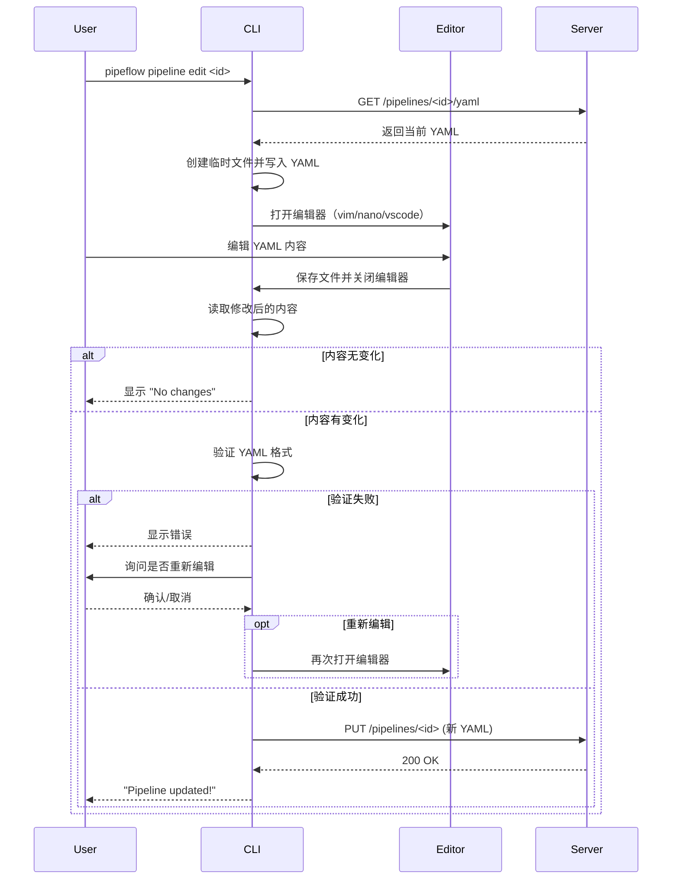

在CLI中实现YAML文件的交互式编辑，需要结合**临时文件操作**和**系统默认编辑器**，提供类似`git commit`的编辑体验。以下是具体实现方案：


### 核心思路
1. **提取当前YAML**：从数据库获取指定Pipeline的YAML定义  
2. **临时文件中转**：将YAML内容写入临时文件  
3. **调用系统编辑器**：使用用户默认编辑器（如`vi`、`nano`）打开临时文件  
4. **读取编辑结果**：用户保存退出后，读取临时文件内容  
5. **验证与更新**：校验YAML格式有效性，更新数据库  


### 实现方案（基于Go的CLI）

#### 1. 添加CLI命令：`pipeline edit`
在现有CLI中新增`edit`子命令，用于触发YAML编辑流程：
```go
// 在handlePipelineCommand函数中添加
case "edit":
    handleEditPipeline(args)
```


#### 2. 核心实现：交互式编辑逻辑
```go
// handleEditPipeline 处理YAML交互式编辑
func handleEditPipeline(args []string) {
    // 解析参数：获取要编辑的Pipeline ID
    editFlags := flag.NewFlagSet("edit", flag.ExitOnError)
    pipelineID := editFlags.Int("i", 0, "Pipeline ID (required)")
    editFlags.Parse(args)
    
    if *pipelineID == 0 {
        fmt.Println("Pipeline ID is required")
        editFlags.Usage()
        return
    }

    // 1. 获取当前Pipeline的YAML定义
    currentYAML, err := getCurrentPipelineYAML(*pipelineID)
    if err != nil {
        fmt.Printf("Failed to get pipeline: %v\n", err)
        return
    }

    // 2. 创建临时文件
    tmpFile, err := os.CreateTemp("", "pipeline-edit-*.yaml")
    if err != nil {
        fmt.Printf("Failed to create temp file: %v\n", err)
        return
    }
    tmpFileName := tmpFile.Name()
    defer os.Remove(tmpFileName) // 确保临时文件被清理

    // 3. 写入当前YAML内容到临时文件
    if _, err := tmpFile.WriteString(currentYAML); err != nil {
        fmt.Printf("Failed to write to temp file: %v\n", err)
        return
    }
    tmpFile.Close()

    // 4. 调用系统默认编辑器打开临时文件
    editor := getEditor()
    cmd := exec.Command(editor, tmpFileName)
    cmd.Stdin = os.Stdin
    cmd.Stdout = os.Stdout
    cmd.Stderr = os.Stderr
    
    if err := cmd.Run(); err != nil {
        fmt.Printf("Editor exited with error: %v\n", err)
        return
    }

    // 5. 读取编辑后的内容
    editedContent, err := os.ReadFile(tmpFileName)
    if err != nil {
        fmt.Printf("Failed to read edited file: %v\n", err)
        return
    }

    // 6. 验证YAML格式
    if err := validateYAML(string(editedContent)); err != nil {
        fmt.Printf("Invalid YAML format: %v\n", err)
        fmt.Println("Edit aborted. Please try again.")
        return
    }

    // 7. 更新数据库
    if err := updatePipelineYAML(*pipelineID, string(editedContent)); err != nil {
        fmt.Printf("Failed to update pipeline: %v\n", err)
        return
    }

    fmt.Println("Pipeline YAML updated successfully")
}
```


#### 3. 辅助函数实现

##### （1）获取系统默认编辑器
```go
// getEditor 优先使用环境变量EDITOR，默认使用vi
func getEditor() string {
    editor := os.Getenv("EDITOR")
    if editor != "" {
        return editor
    }

    // 跨平台默认编辑器
    if runtime.GOOS == "windows" {
        return "notepad.exe"
    }
    return "vi"
}
```

##### （2）YAML格式验证
```go
// validateYAML 验证YAML格式是否符合Pipeline定义规范
func validateYAML(yamlContent string) error {
    var pipeline model.PipelineDefinition
    if err := yaml.Unmarshal([]byte(yamlContent), &pipeline); err != nil {
        return fmt.Errorf("YAML parse error: %v", err)
    }

    // 额外验证必填字段
    if pipeline.Name == "" {
        return fmt.Errorf("missing required field: name")
    }
    if len(pipeline.Tasks) == 0 {
        return fmt.Errorf("no tasks defined")
    }

    // 验证任务依赖是否存在
    taskNames := make(map[string]bool)
    for _, task := range pipeline.Tasks {
        if task.Name == "" {
            return fmt.Errorf("task missing name")
        }
        if taskNames[task.Name] {
            return fmt.Errorf("duplicate task name: %s", task.Name)
        }
        taskNames[task.Name] = true
    }

    for _, task := range pipeline.Tasks {
        for _, dep := range task.DependsOn {
            if !taskNames[dep] {
                return fmt.Errorf("task %s depends on undefined task: %s", task.Name, dep)
            }
        }
    }

    return nil
}
```

##### （3）数据库交互函数
```go
// getCurrentPipelineYAML 从数据库获取当前YAML
func getCurrentPipelineYAML(pipelineID int) (string, error) {
    // 实现数据库查询逻辑（根据pipelineID获取yaml_def）
    // ...
}

// updatePipelineYAML 更新数据库中的YAML
func updatePipelineYAML(pipelineID int, yamlContent string) error {
    // 实现数据库更新逻辑（更新指定pipelineID的yaml_def）
    // ...
}
```


### 使用流程
1. **触发编辑**：执行命令打开编辑器
```bash
pipeline-cli pipeline edit -i 1  # 编辑ID为1的Pipeline
```

2. **编辑内容**：系统自动打开默认编辑器（如`vi`），展示当前YAML内容：
```yaml
name: sample-pipeline
description: A sample pipeline with dependencies
tasks:
  - name: task1
    command: mkdir test && echo "Task 1 done" > test/file1.txt
    depends_on: []
  
  - name: task2
    command: mkdir test && echo "Task 2 done" > test/file2.txt
    depends_on: []
```

3. **保存退出**：编辑完成后，按编辑器流程保存退出（如`vi`中执行`:wq`）

4. **自动验证与更新**：CLI自动验证YAML格式，若有效则更新数据库，否则提示错误并终止更新


### 增强体验的优化点
1. **语法高亮**：依赖系统编辑器的YAML语法高亮（大多数编辑器默认支持）  
2. **编辑前备份**：保存编辑前的YAML内容，支持“放弃修改”功能  
3. **行号提示**：验证失败时，显示错误所在行号（结合`yaml.v3`的行号信息）  
4. **默认模板**：新Pipeline编辑时，提供带注释的YAML模板  
5. **编辑器选择**：支持通过`--editor`参数临时指定编辑器（如`pipeline edit -i 1 --editor nano`）  


通过这种方式，既能利用用户熟悉的系统编辑器提供友好的编辑体验，又能通过CLI的逻辑确保YAML格式的有效性，实现“展示-编辑-验证-更新”的完整流程。


# CLI 交互式 YAML 编辑方案

在 CLI 中实现交互式 YAML 编辑功能，需要结合临时文件、外部编辑器调用和内容差异检测技术。以下是完整的实现方案：

## 核心设计思路

1. **临时文件机制**：将 YAML 内容写入临时文件
2. **编辑器调用**：调用用户默认编辑器打开文件
3. **内容差异检测**：比较编辑前后的内容变化
4. **验证与更新**：验证修改后的 YAML 并更新到服务器

## 实现代码 (`cli/commands/pipeline_edit.go`)

```go
package commands

import (
	"bytes"
	"context"
	"fmt"
	"io/ioutil"
	"os"
	"os/exec"
	"path/filepath"
	"runtime"
	"strings"

	"github.com/urfave/cli/v2"
)

func EditPipelineCommand() *cli.Command {
	return &cli.Command{
		Name:  "edit",
		Usage: "Edit a pipeline's YAML configuration interactively",
		Flags: []cli.Flag{
			&cli.StringFlag{
				Name:    "editor",
				Aliases: []string{"e"},
				Usage:   "Specify editor to use (e.g., vim, nano, code)",
			},
		},
		Action: func(c *cli.Context) error {
			if c.Args().Len() < 1 {
				return cli.Exit("Pipeline ID is required", 1)
			}
			pipelineID := c.Args().First()
			
			// 1. 从服务器获取当前 YAML
			currentYAML, err := fetchPipelineYAML(pipelineID)
			if err != nil {
				return cli.Exit(fmt.Sprintf("Failed to fetch pipeline: %v", err), 1)
			}
			
			// 2. 创建临时文件
			tmpFile, err := createTempFile(currentYAML, "pipeline-*.yaml")
			if err != nil {
				return cli.Exit(fmt.Sprintf("Failed to create temp file: %v", err), 1)
			}
			defer os.Remove(tmpFile.Name())
			
			// 3. 打开编辑器
			editor := determineEditor(c.String("editor"))
			if err := openEditor(editor, tmpFile.Name()); err != nil {
				return cli.Exit(fmt.Sprintf("Failed to open editor: %v", err), 1)
			}
			
			// 4. 读取编辑后的内容
			modifiedYAML, err := ioutil.ReadFile(tmpFile.Name())
			if err != nil {
				return cli.Exit(fmt.Sprintf("Failed to read modified file: %v", err), 1)
			}
			
			// 5. 检查是否修改
			if bytes.Equal(currentYAML, modifiedYAML) {
				fmt.Println("No changes detected. Pipeline not updated.")
				return nil
			}
			
			// 6. 验证 YAML 格式
			if err := validateYAML(modifiedYAML); err != nil {
				fmt.Printf("YAML validation failed: %v\n", err)
				if !confirm("Do you want to try editing again?") {
					return nil
				}
				return openEditor(editor, tmpFile.Name())
			}
			
			// 7. 更新到服务器
			if err := updatePipelineYAML(pipelineID, modifiedYAML); err != nil {
				return cli.Exit(fmt.Sprintf("Failed to update pipeline: %v", err), 1)
			}
			
			fmt.Println("Pipeline updated successfully!")
			return nil
		},
	}
}

// 确定使用的编辑器
func determineEditor(userSpecified string) string {
	// 1. 用户指定编辑器优先
	if userSpecified != "" {
		return userSpecified
	}
	
	// 2. 检查环境变量
	if envEditor := os.Getenv("EDITOR"); envEditor != "" {
		return envEditor
	}
	
	// 3. 平台默认编辑器
	switch runtime.GOOS {
	case "windows":
		return "notepad"
	case "darwin":
		return "open -t" // 打开文本编辑
	default: // Linux/Unix
		// 尝试常见编辑器
		for _, editor := range []string{"nano", "vim", "vi"} {
			if _, err := exec.LookPath(editor); err == nil {
				return editor
			}
		}
		return "vi" // 最后手段
	}
}

// 创建临时文件并写入内容
func createTempFile(content []byte, pattern string) (*os.File, error) {
	tmpFile, err := ioutil.TempFile("", pattern)
	if err != nil {
		return nil, err
	}
	
	if _, err := tmpFile.Write(content); err != nil {
		tmpFile.Close()
		os.Remove(tmpFile.Name())
		return nil, err
	}
	
	if err := tmpFile.Close(); err != nil {
		os.Remove(tmpFile.Name())
		return nil, err
	}
	
	return tmpFile, nil
}

// 打开编辑器
func openEditor(editor, filePath string) error {
	ctx := context.Background()
	
	// 处理带参数的编辑器命令
	parts := strings.Fields(editor)
	cmd := exec.CommandContext(ctx, parts[0], append(parts[1:], filePath)...)
	
	// 连接到当前终端
	cmd.Stdin = os.Stdin
	cmd.Stdout = os.Stdout
	cmd.Stderr = os.Stderr
	
	return cmd.Run()
}

// 验证 YAML 格式
func validateYAML(data []byte) error {
	// 这里可以实现更复杂的验证逻辑
	if len(data) == 0 {
		return fmt.Errorf("YAML content is empty")
	}
	
	// 简单检查是否为有效 YAML
	if !bytes.Contains(data, []byte("tasks:")) {
		return fmt.Errorf("invalid YAML structure: missing 'tasks' section")
	}
	
	return nil
}

// 用户确认
func confirm(prompt string) bool {
	fmt.Printf("%s [y/N]: ", prompt)
	
	var response string
	fmt.Scanln(&response)
	
	response = strings.ToLower(strings.TrimSpace(response))
	return response == "y" || response == "yes"
}

// API 函数
func fetchPipelineYAML(pipelineID string) ([]byte, error) {
	// 调用后端 API 获取 YAML
	// 实现细节省略
	return []byte(`name: "Sample Pipeline"
tasks:
  - name: task1
    command: "echo Hello"
`), nil
}

func updatePipelineYAML(pipelineID string, yamlData []byte) error {
	// 调用后端 API 更新 YAML
	// 实现细节省略
	return nil
}
```

## 使用示例

```bash
# 基本用法（使用默认编辑器）
$ pipeflow pipeline edit pipeline-123

# 指定编辑器
$ pipeflow pipeline edit pipeline-123 --editor=code
$ pipeflow pipeline edit pipeline-123 -e "vim"

# 在 Windows 上使用 VS Code
$ pipeflow pipeline edit pipeline-123 -e "code -w"
```

## 编辑流程



## 高级功能扩展

### 1. 差异预览功能

在更新前显示修改前后的差异：

```go
func showDiff(original, modified []byte) {
	// 使用 diff 工具显示差异
	cmd := exec.Command("diff", "-u", "--color=always", 
		"-L", "Original", "-L", "Modified",
		"/dev/fd/3", "/dev/fd/4")
	
	// 创建管道传递内容
	cmd.ExtraFiles = []*os.File{
		os.NewFile(3, "original"),
		os.NewFile(4, "modified"),
	}
	
	// 写入内容
	go func() {
		cmd.ExtraFiles[0].Write(original)
		cmd.ExtraFiles[1].Write(modified)
		cmd.ExtraFiles[0].Close()
		cmd.ExtraFiles[1].Close()
	}()
	
	cmd.Stdout = os.Stdout
	cmd.Stderr = os.Stderr
	cmd.Run()
}
```

### 2. 多编辑器支持增强

```go
func openEditor(editor, filePath string) error {
	switch editor {
	case "code", "vscode":
		return openVSCode(filePath)
	case "subl":
		return openSublimeText(filePath)
	default:
		// 通用编辑器处理
	}
}

func openVSCode(filePath string) error {
	// 检查是否已安装 VS Code
	if _, err := exec.LookPath("code"); err == nil {
		cmd := exec.Command("code", "-w", filePath)
		cmd.Stdin = os.Stdin
		cmd.Stdout = os.Stdout
		cmd.Stderr = os.Stderr
		return cmd.Run()
	}
	return fmt.Errorf("VS Code not found")
}
```

### 3. 自动恢复功能

```go
// 在 main 函数中注册信号处理
func main() {
	// 创建恢复目录
	recoveryDir := filepath.Join(os.TempDir(), "pipeflow_recovery")
	os.MkdirAll(recoveryDir, 0700)
	
	// 注册信号处理
	signalChan := make(chan os.Signal, 1)
	signal.Notify(signalChan, os.Interrupt, syscall.SIGTERM)
	
	go func() {
		<-signalChan
		fmt.Println("\nRecovery files preserved at:", recoveryDir)
		os.Exit(1)
	}()
	
	// 在创建临时文件时使用恢复目录
	func createTempFile(content []byte, pattern string) (*os.File, error) {
		return ioutil.TempFile(recoveryDir, pattern)
	}
}
```

### 4. YAML 验证增强

```go
import (
	"github.com/go-yaml/yaml"
)

type PipelineConfig struct {
	Name        string `yaml:"name"`
	Description string `yaml:"description,omitempty"`
	Tasks       []Task `yaml:"tasks"`
	Triggers    []Trigger `yaml:"triggers,omitempty"`
}

type Task struct {
	Name     string   `yaml:"name"`
	Command  string   `yaml:"command"`
	DependsOn []string `yaml:"depends_on,omitempty"`
}

type Trigger struct {
	Type   string `yaml:"type"`
	Config string `yaml:"config,omitempty"`
}

func validateYAML(data []byte) error {
	var config PipelineConfig
	if err := yaml.Unmarshal(data, &config); err != nil {
		return fmt.Errorf("invalid YAML format: %v", err)
	}
	
	// 验证必填字段
	if config.Name == "" {
		return fmt.Errorf("pipeline name is required")
	}
	
	if len(config.Tasks) == 0 {
		return fmt.Errorf("at least one task is required")
	}
	
	// 验证任务依赖关系
	taskNames := make(map[string]bool)
	for _, task := range config.Tasks {
		if task.Name == "" {
			return fmt.Errorf("task name is required")
		}
		
		if task.Command == "" {
			return fmt.Errorf("command is required for task '%s'", task.Name)
		}
		
		// 检查任务名称唯一性
		if _, exists := taskNames[task.Name]; exists {
			return fmt.Errorf("duplicate task name: %s", task.Name)
		}
		taskNames[task.Name] = true
	}
	
	// 检查依赖是否存在
	for _, task := range config.Tasks {
		for _, dep := range task.DependsOn {
			if !taskNames[dep] {
				return fmt.Errorf("task '%s' depends on unknown task '%s'", task.Name, dep)
			}
		}
	}
	
	return nil
}
```

## 用户界面优化

### 编辑前提示信息

```go
// 在打开编辑器前显示提示
fmt.Println("Opening pipeline in editor...")
fmt.Println("Temporary file:", tmpFile.Name())
fmt.Println("Make your changes and save the file to update the pipeline.")
fmt.Println("Close the editor to continue.")
fmt.Println("Note: Comments and formatting will be preserved.")
```

### 编辑后总结

```go
// 更新成功后显示修改摘要
func showUpdateSummary(original, modified []byte) {
	var origConfig, modConfig PipelineConfig
	yaml.Unmarshal(original, &origConfig)
	yaml.Unmarshal(modified, &modConfig)
	
	fmt.Println("\nUpdate Summary:")
	fmt.Printf("  Name: %s → %s\n", origConfig.Name, modConfig.Name)
	
	// 任务变更
	origTasks := make(map[string]Task)
	for _, t := range origConfig.Tasks {
		origTasks[t.Name] = t
	}
	
	fmt.Println("\nTasks:")
	for _, t := range modConfig.Tasks {
		if origT, exists := origTasks[t.Name]; exists {
			if origT.Command != t.Command {
				fmt.Printf("  [MODIFIED] %s\n", t.Name)
				fmt.Printf("    Command: %s → %s\n", origT.Command, t.Command)
			}
		} else {
			fmt.Printf("  [ADDED] %s\n", t.Name)
		}
	}
	
	// 检查删除的任务
	for name := range origTasks {
		found := false
		for _, t := range modConfig.Tasks {
			if t.Name == name {
				found = true
				break
			}
		}
		if !found {
			fmt.Printf("  [REMOVED] %s\n", name)
		}
	}
}
```

## 安全考虑

1. **临时文件权限**：
   ```go
   // 确保只有当前用户可以访问
   tmpFile, err := ioutil.TempFile("", "pipeline-*.yaml")
   if err == nil {
       os.Chmod(tmpFile.Name(), 0600) // rw-------
   }
   ```

2. **编辑器命令注入防护**：
   ```go
   func sanitizeEditorCommand(editor string) string {
       // 移除危险字符
       return strings.ReplaceAll(editor, ";", "")
   }
   ```

3. **内容大小限制**：
   ```go
   // 防止超大文件导致内存问题
   const maxYAMLLength = 1024 * 1024 // 1MB
   if len(modifiedYAML) > maxYAMLLength {
       return fmt.Errorf("YAML file exceeds maximum size of 1MB")
   }
   ```

## 跨平台支持策略

| 平台      | 默认编辑器 | 备选方案             | 特殊处理                     |
|-----------|------------|----------------------|------------------------------|
| Linux     | nano       | vim, gedit           | 检查 $EDITOR 环境变量        |
| macOS     | nano       | vim, TextEdit, BBEdit| 使用 `open -t` 打开文本编辑   |
| Windows   | notepad    | Notepad++, VS Code   | 处理路径空格和扩展名         |

**Windows 特殊处理：**
```go
func openEditorWindows(editor, filePath string) error {
	// 处理带空格的路径
	if strings.Contains(filePath, " ") {
		filePath = `"` + filePath + `"`
	}
	
	cmd := exec.Command("cmd", "/C", "start", "/wait", editor, filePath)
	return cmd.Run()
}
```

## 完整集成方案

1. 在 CLI 主程序中注册命令：
   ```go
   func main() {
       app := &cli.App{
           Commands: []*cli.Command{
               {
                   Name: "pipeline",
                   Subcommands: []*cli.Command{
                       EditPipelineCommand(),
                       // 其他 pipeline 命令...
                   },
               },
           },
       }
       app.Run(os.Args)
   }
   ```

2. 在后端添加 API 端点：
   ```go
   // backend/internal/handlers/pipeline.go
   func SetupPipelineRoutes(r *gin.RouterGroup, db *gorm.DB) {
       r.GET("/:id/yaml", getPipelineYAMLHandler(db))
       r.PUT("/:id", updatePipelineHandler(db))
   }
   
   func getPipelineYAMLHandler(db *gorm.DB) gin.HandlerFunc {
       return func(c *gin.Context) {
           pipelineID := c.Param("id")
           var pipeline models.Pipeline
           if err := db.First(&pipeline, "id = ?", pipelineID).Error; err != nil {
               c.JSON(404, gin.H{"error": "Pipeline not found"})
               return
           }
           c.Header("Content-Type", "text/yaml")
           c.String(200, pipeline.YAMLConfig)
       }
   }
   ```

## 使用场景示例

1. **简单编辑**：
   ```
   $ pipeflow pipeline edit pipeline-123
   # 在 nano 中编辑并保存
   # 自动验证并更新
   ```

2. **复杂编辑（使用 VS Code）**：
   ```
   $ pipeflow pipeline edit pipeline-123 -e "code -w"
   # 在 VS Code 中编辑并保存
   # 关闭窗口后自动更新
   ```

3. **编辑失败恢复**：
   ```
   $ pipeflow pipeline edit pipeline-123
   # 编辑过程中按 Ctrl+C
   # CLI 显示：Recovery files preserved at: /tmp/pipeflow_recovery/pipeline-123-XXXXXX.yaml
   # 用户可以手动恢复文件
   ```

这种实现方案提供了强大的交互式编辑功能，同时保持了 CLI 应用的简洁性和跨平台兼容性。用户可以灵活选择编辑器，系统会自动处理内容验证和更新流程，大大简化了 pipeline 的维护工作。